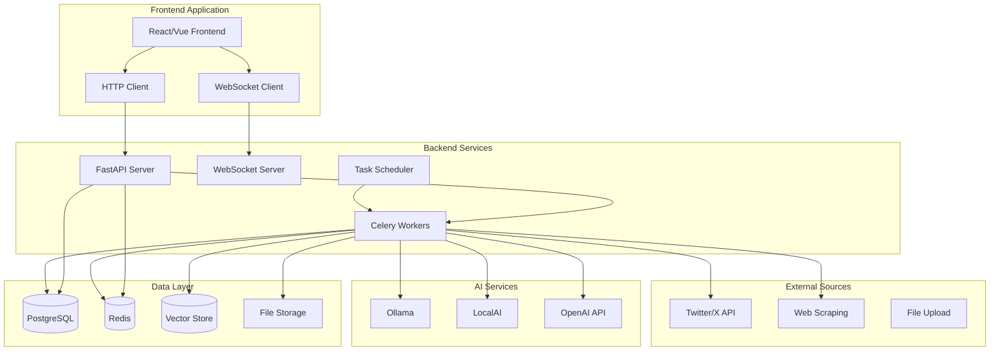

# AI Agent Rebuild - Design Document

## Overview

This design document outlines the architecture for rebuilding the Knowledge Base AI Agent as two separate, modern applications: a Python backend API service and a JavaScript frontend application. The design emphasizes clean separation of concerns, scalability, maintainability, and modern development practices.

## Architecture

### High-Level System Architecture



### Technology Stack Decisions

#### Backend Technology Stack

**Web Framework: FastAPI**
- **Rationale**: Modern, fast, automatic API documentation, excellent async support, type hints
- **Alternatives Considered**: Flask (too basic), Django (too heavy), Starlette (less features)
- **Benefits**: Built-in OpenAPI docs, excellent performance, modern Python features

**Task Queue: Celery with Redis**
- **Rationale**: Mature, scalable, excellent monitoring tools, Redis provides both broker and result backend
- **Alternatives Considered**: RQ (simpler but less features), Dramatiq (newer but less ecosystem)
- **Benefits**: Proven at scale, comprehensive monitoring, flexible routing

**Database: PostgreSQL with SQLAlchemy**
- **Rationale**: ACID compliance, JSON support, full-text search, vector extensions available
- **Alternatives Considered**: MongoDB (less structured), SQLite (not scalable)
- **Benefits**: Mature ecosystem, excellent performance, extensible

**WebSocket: FastAPI WebSockets with Redis PubSub**
- **Rationale**: Native FastAPI support, Redis provides scalable message distribution
- **Alternatives Considered**: Socket.IO (more complex), raw WebSockets (less features)
- **Benefits**: Simple implementation, scales horizontally, integrates with existing Redis

**Vector Store: pgvector or Qdrant**
- **Rationale**: pgvector integrates with PostgreSQL, Qdrant offers advanced features
- **Decision**: Start with pgvector for simplicity, migrate to Qdrant if needed
- **Benefits**: Unified database, simpler deployment, good performance

#### Frontend Technology Stack

**Framework: React with TypeScript**
- **Rationale**: Large ecosystem, excellent tooling, strong typing, component reusability
- **Alternatives Considered**: Vue.js (smaller ecosystem), Svelte (newer, less mature)
- **Benefits**: Industry standard, extensive libraries, excellent developer experience

**State Management: Zustand**
- **Rationale**: Simple, lightweight, TypeScript-first, less boilerplate than Redux
- **Alternatives Considered**: Redux Toolkit (more complex), Context API (not scalable)
- **Benefits**: Minimal boilerplate, excellent TypeScript support, easy testing

**UI Framework: Tailwind CSS with Headless UI**
- **Rationale**: Utility-first, highly customizable, excellent performance
- **Alternatives Considered**: Material-UI (opinionated), Chakra UI (less flexible)
- **Benefits**: Design flexibility, small bundle size, consistent design system

**Build Tool: Vite**
- **Rationale**: Fast development server, excellent HMR, modern build optimizations
- **Alternatives Considered**: Create React App (slower), Webpack (more complex)
- **Benefits**: Fast development, optimized builds, excellent plugin ecosystem

**Real-time Communication: Native WebSocket API**
- **Rationale**: Simple, lightweight, sufficient for our needs
- **Alternatives Considered**: Socket.IO client (more features but heavier)
- **Benefits**: No additional dependencies, direct control, better performance

## Components and Interfaces

### Backend Components

#### 1. API Layer (`/api`)

**FastAPI Application Structure:**
```
backend/
├── app/
│   ├── main.py              # FastAPI app initialization
│   ├── config.py            # Configuration management
│   ├── dependencies.py      # Dependency injection
│   └── middleware.py        # Custom middleware
├── api/
│   ├── v1/
│   │   ├── __init__.py
│   │   ├── agent.py         # Agent control endpoints
│   │   ├── content.py       # Content management
│   │   ├── chat.py          # Chat interface
│   │   ├── knowledge.py     # Knowledge base operations
│   │   └── system.py        # System monitoring
│   └── websocket.py         # WebSocket handlers
├── core/
│   ├── models/              # SQLAlchemy models
│   ├── schemas/             # Pydantic schemas
│   ├── services/            # Business logic
│   └── utils/               # Utility functions
├── tasks/                   # Celery tasks
├── ai/                      # AI backend integrations
└── tests/                   # Test suite
```

**Key API Endpoints:**
```python
# Agent Control
POST   /api/v1/agent/start
GET    /api/v1/agent/status/{task_id}
POST   /api/v1/agent/stop/{task_id}
GET    /api/v1/agent/history

# Content Management
GET    /api/v1/content/items
POST   /api/v1/content/items
GET    /api/v1/content/items/{id}
PUT    /api/v1/content/items/{id}
DELETE /api/v1/content/items/{id}
POST   /api/v1/content/search

# Knowledge Base
GET    /api/v1/knowledge/categories
GET    /api/v1/knowledge/synthesis
POST   /api/v1/knowledge/synthesis/generate
GET    /api/v1/knowledge/embeddings/search

# Chat Interface
POST   /api/v1/chat/sessions
GET    /api/v1/chat/sessions
GET    /api/v1/chat/sessions/{id}/messages
POST   /api/v1/chat/sessions/{id}/messages

# System Monitoring
GET    /api/v1/system/health
GET    /api/v1/system/metrics
GET    /api/v1/system/logs
```

#### 2. Task Processing Layer

**Celery Task Organization:**
```python
# tasks/content_processing.py
@celery_app.task(bind=True)
def fetch_content_task(self, source_config: dict) -> dict:
    """Fetch content from various sources."""
    pass

@celery_app.task(bind=True)
def process_content_task(self, content_id: str) -> dict:
    """Process individual content item through AI pipeline."""
    pass

@celery_app.task(bind=True)
def generate_synthesis_task(self, category: str) -> dict:
    """Generate synthesis document for category."""
    pass

# Task workflow orchestration
@celery_app.task(bind=True)
def run_agent_pipeline(self, config: dict) -> dict:
    """Orchestrate the complete processing pipeline."""
    workflow = chain(
        fetch_content_task.s(config['sources']),
        group([
            process_content_task.s(item_id) 
            for item_id in content_ids
        ]),
        generate_synthesis_task.s(config['categories'])
    )
    return workflow.apply_async()
```

#### 3. AI Backend Abstraction

**Unified AI Interface:**
```python
from abc import ABC, abstractmethod
from typing import Dict, Any, AsyncGenerator

class AIBackend(ABC):
    @abstractmethod
    async def generate_text(
        self, 
        prompt: str, 
        model: str, 
        **kwargs
    ) -> str:
        pass
    
    @abstractmethod
    async def generate_stream(
        self, 
        prompt: str, 
        model: str, 
        **kwargs
    ) -> AsyncGenerator[str, None]:
        pass
    
    @abstractmethod
    async def generate_embeddings(
        self, 
        texts: list[str], 
        model: str
    ) -> list[list[float]]:
        pass

class OllamaBackend(AIBackend):
    # Implementation for Ollama
    pass

class LocalAIBackend(AIBackend):
    # Implementation for LocalAI
    pass

class OpenAIBackend(AIBackend):
    # Implementation for OpenAI-compatible APIs
    pass
```

#### 4. Data Models

**Unified Database Schema:**
```python
# Core content model
class ContentItem(Base):
    __tablename__ = "content_items"
    
    id: Mapped[str] = mapped_column(String, primary_key=True)
    source_type: Mapped[str] = mapped_column(String, nullable=False)
    source_id: Mapped[str] = mapped_column(String, nullable=False)
    title: Mapped[str] = mapped_column(String, nullable=False)
    content: Mapped[str] = mapped_column(Text, nullable=False)
    raw_data: Mapped[dict] = mapped_column(JSON)
    
    # Processing state
    processing_state: Mapped[str] = mapped_column(String, default="pending")
    processed_at: Mapped[datetime] = mapped_column(DateTime, nullable=True)
    
    # Categorization
    main_category: Mapped[str] = mapped_column(String, nullable=True)
    sub_category: Mapped[str] = mapped_column(String, nullable=True)
    tags: Mapped[list[str]] = mapped_column(JSON, default=list)
    
    # Media and files
    media_files: Mapped[list[dict]] = mapped_column(JSON, default=list)
    generated_files: Mapped[list[str]] = mapped_column(JSON, default=list)
    
    # Timestamps
    created_at: Mapped[datetime] = mapped_column(DateTime, default=datetime.utcnow)
    updated_at: Mapped[datetime] = mapped_column(DateTime, default=datetime.utcnow, onupdate=datetime.utcnow)

# Knowledge base item (processed content)
class KnowledgeItem(Base):
    __tablename__ = "knowledge_items"
    
    id: Mapped[str] = mapped_column(String, primary_key=True)
    content_item_id: Mapped[str] = mapped_column(String, ForeignKey("content_items.id"))
    
    # Generated content
    display_title: Mapped[str] = mapped_column(String, nullable=False)
    summary: Mapped[str] = mapped_column(Text, nullable=True)
    enhanced_content: Mapped[str] = mapped_column(Text, nullable=False)
    
    # File paths
    markdown_path: Mapped[str] = mapped_column(String, nullable=True)
    media_paths: Mapped[list[str]] = mapped_column(JSON, default=list)
    
    # Relationships
    content_item: Mapped["ContentItem"] = relationship("ContentItem", back_populates="knowledge_item")
    embeddings: Mapped[list["Embedding"]] = relationship("Embedding", back_populates="knowledge_item")

# Vector embeddings
class Embedding(Base):
    __tablename__ = "embeddings"
    
    id: Mapped[str] = mapped_column(String, primary_key=True)
    knowledge_item_id: Mapped[str] = mapped_column(String, ForeignKey("knowledge_items.id"))
    
    # Vector data
    embedding: Mapped[list[float]] = mapped_column(Vector(1536))  # Using pgvector
    model: Mapped[str] = mapped_column(String, nullable=False)
    chunk_index: Mapped[int] = mapped_column(Integer, default=0)
    
    # Relationships
    knowledge_item: Mapped["KnowledgeItem"] = relationship("KnowledgeItem", back_populates="embeddings")
```

### Frontend Components

#### 1. Application Structure

**React Application Organization:**
```
frontend/
├── src/
│   ├── components/          # Reusable UI components
│   │   ├── ui/             # Basic UI components
│   │   ├── forms/          # Form components
│   │   ├── layout/         # Layout components
│   │   └── charts/         # Data visualization
│   ├── pages/              # Page components
│   │   ├── Dashboard.tsx
│   │   ├── KnowledgeBase.tsx
│   │   ├── Chat.tsx
│   │   ├── Settings.tsx
│   │   └── Monitoring.tsx
│   ├── hooks/              # Custom React hooks
│   ├── services/           # API and WebSocket services
│   ├── stores/             # Zustand stores
│   ├── types/              # TypeScript type definitions
│   ├── utils/              # Utility functions
│   └── styles/             # Global styles
├── public/
└── tests/
```

#### 2. State Management Architecture

**Zustand Store Structure:**
```typescript
// stores/agentStore.ts
interface AgentState {
  // Agent status
  isRunning: boolean;
  currentTask: Task | null;
  progress: number;
  currentPhase: string;
  
  // Actions
  startAgent: (config: AgentConfig) => Promise<void>;
  stopAgent: () => Promise<void>;
  updateProgress: (progress: ProgressUpdate) => void;
}

// stores/knowledgeStore.ts
interface KnowledgeState {
  // Content data
  items: KnowledgeItem[];
  categories: Category[];
  currentItem: KnowledgeItem | null;
  
  // Search and filtering
  searchQuery: string;
  filters: FilterState;
  searchResults: SearchResult[];
  
  // Actions
  loadItems: () => Promise<void>;
  searchItems: (query: string) => Promise<void>;
  createItem: (item: CreateItemRequest) => Promise<void>;
  updateItem: (id: string, updates: UpdateItemRequest) => Promise<void>;
  deleteItem: (id: string) => Promise<void>;
}

// stores/chatStore.ts
interface ChatState {
  // Chat sessions
  sessions: ChatSession[];
  currentSession: ChatSession | null;
  messages: ChatMessage[];
  
  // Chat state
  isTyping: boolean;
  isConnected: boolean;
  
  // Actions
  createSession: () => Promise<ChatSession>;
  sendMessage: (content: string) => Promise<void>;
  loadSessions: () => Promise<void>;
  switchSession: (sessionId: string) => Promise<void>;
}
```

#### 3. Real-time Communication

**WebSocket Service:**
```typescript
class WebSocketService {
  private ws: WebSocket | null = null;
  private reconnectAttempts = 0;
  private maxReconnectAttempts = 5;
  private eventHandlers = new Map<string, Function[]>();
  
  connect(url: string): Promise<void> {
    return new Promise((resolve, reject) => {
      this.ws = new WebSocket(url);
      
      this.ws.onopen = () => {
        this.reconnectAttempts = 0;
        resolve();
      };
      
      this.ws.onmessage = (event) => {
        const data = JSON.parse(event.data);
        this.handleMessage(data);
      };
      
      this.ws.onclose = () => {
        this.handleReconnect();
      };
      
      this.ws.onerror = (error) => {
        reject(error);
      };
    });
  }
  
  subscribe(event: string, handler: Function): void {
    if (!this.eventHandlers.has(event)) {
      this.eventHandlers.set(event, []);
    }
    this.eventHandlers.get(event)!.push(handler);
  }
  
  private handleMessage(data: any): void {
    const handlers = this.eventHandlers.get(data.type) || [];
    handlers.forEach(handler => handler(data.payload));
  }
  
  private handleReconnect(): void {
    if (this.reconnectAttempts < this.maxReconnectAttempts) {
      setTimeout(() => {
        this.reconnectAttempts++;
        this.connect(this.ws!.url);
      }, Math.pow(2, this.reconnectAttempts) * 1000);
    }
  }
}
```

## Data Models

### Unified Database Schema

The new system uses a simplified, unified schema that eliminates the complexity of the current dual-table architecture:

```sql
-- Core content storage
CREATE TABLE content_items (
    id VARCHAR PRIMARY KEY,
    source_type VARCHAR NOT NULL,  -- 'twitter', 'url', 'file', etc.
    source_id VARCHAR NOT NULL,
    title VARCHAR NOT NULL,
    content TEXT NOT NULL,
    raw_data JSONB,
    
    -- Processing state
    processing_state VARCHAR DEFAULT 'pending',
    processed_at TIMESTAMP,
    
    -- Categorization
    main_category VARCHAR,
    sub_category VARCHAR,
    tags JSONB DEFAULT '[]',
    
    -- Media and files
    media_files JSONB DEFAULT '[]',
    generated_files JSONB DEFAULT '[]',
    
    -- Timestamps
    created_at TIMESTAMP DEFAULT NOW(),
    updated_at TIMESTAMP DEFAULT NOW()
);

-- Processed knowledge base items
CREATE TABLE knowledge_items (
    id VARCHAR PRIMARY KEY,
    content_item_id VARCHAR REFERENCES content_items(id),
    
    -- Generated content
    display_title VARCHAR NOT NULL,
    summary TEXT,
    enhanced_content TEXT NOT NULL,
    
    -- File paths
    markdown_path VARCHAR,
    media_paths JSONB DEFAULT '[]',
    
    -- Timestamps
    created_at TIMESTAMP DEFAULT NOW(),
    updated_at TIMESTAMP DEFAULT NOW()
);

-- Vector embeddings using pgvector
CREATE TABLE embeddings (
    id VARCHAR PRIMARY KEY,
    knowledge_item_id VARCHAR REFERENCES knowledge_items(id),
    
    -- Vector data
    embedding vector(1536),
    model VARCHAR NOT NULL,
    chunk_index INTEGER DEFAULT 0,
    
    created_at TIMESTAMP DEFAULT NOW()
);

-- Synthesis documents
CREATE TABLE synthesis_documents (
    id VARCHAR PRIMARY KEY,
    main_category VARCHAR NOT NULL,
    sub_category VARCHAR NOT NULL,
    
    title VARCHAR NOT NULL,
    content TEXT NOT NULL,
    item_count INTEGER DEFAULT 0,
    
    -- Dependency tracking
    source_item_ids JSONB DEFAULT '[]',
    content_hash VARCHAR,
    is_stale BOOLEAN DEFAULT FALSE,
    
    created_at TIMESTAMP DEFAULT NOW(),
    updated_at TIMESTAMP DEFAULT NOW(),
    
    UNIQUE(main_category, sub_category)
);

-- Task management
CREATE TABLE tasks (
    id VARCHAR PRIMARY KEY,
    task_type VARCHAR NOT NULL,
    status VARCHAR DEFAULT 'pending',
    
    -- Configuration
    config JSONB,
    
    -- Progress tracking
    current_phase VARCHAR,
    progress_percentage INTEGER DEFAULT 0,
    
    -- Results and errors
    result_data JSONB,
    error_message TEXT,
    
    -- Timestamps
    created_at TIMESTAMP DEFAULT NOW(),
    started_at TIMESTAMP,
    completed_at TIMESTAMP
);

-- Chat system
CREATE TABLE chat_sessions (
    id VARCHAR PRIMARY KEY,
    title VARCHAR,
    message_count INTEGER DEFAULT 0,
    is_archived BOOLEAN DEFAULT FALSE,
    
    created_at TIMESTAMP DEFAULT NOW(),
    last_updated TIMESTAMP DEFAULT NOW()
);

CREATE TABLE chat_messages (
    id VARCHAR PRIMARY KEY,
    session_id VARCHAR REFERENCES chat_sessions(id),
    role VARCHAR NOT NULL,  -- 'user' or 'assistant'
    content TEXT NOT NULL,
    
    -- AI metadata
    model_used VARCHAR,
    sources JSONB DEFAULT '[]',
    context_stats JSONB,
    
    created_at TIMESTAMP DEFAULT NOW()
);

-- Indexes for performance
CREATE INDEX idx_content_items_source ON content_items(source_type, source_id);
CREATE INDEX idx_content_items_category ON content_items(main_category, sub_category);
CREATE INDEX idx_content_items_processing ON content_items(processing_state);
CREATE INDEX idx_embeddings_vector ON embeddings USING ivfflat (embedding vector_cosine_ops);
CREATE INDEX idx_tasks_status ON tasks(status, created_at);
CREATE INDEX idx_chat_messages_session ON chat_messages(session_id, created_at);
```

## Error Handling

### Backend Error Handling Strategy

**Structured Error Responses:**
```python
from enum import Enum
from pydantic import BaseModel

class ErrorCode(str, Enum):
    VALIDATION_ERROR = "validation_error"
    NOT_FOUND = "not_found"
    PERMISSION_DENIED = "permission_denied"
    AI_SERVICE_ERROR = "ai_service_error"
    PROCESSING_ERROR = "processing_error"
    SYSTEM_ERROR = "system_error"

class ErrorResponse(BaseModel):
    success: bool = False
    error_code: ErrorCode
    message: str
    details: dict = {}
    timestamp: datetime
    request_id: str

# Custom exception classes
class AIAgentException(Exception):
    def __init__(self, message: str, error_code: ErrorCode, details: dict = None):
        self.message = message
        self.error_code = error_code
        self.details = details or {}
        super().__init__(message)

# Global exception handler
@app.exception_handler(AIAgentException)
async def ai_agent_exception_handler(request: Request, exc: AIAgentException):
    return JSONResponse(
        status_code=400,
        content=ErrorResponse(
            error_code=exc.error_code,
            message=exc.message,
            details=exc.details,
            timestamp=datetime.utcnow(),
            request_id=str(uuid.uuid4())
        ).dict()
    )
```

**Task Error Handling:**
```python
@celery_app.task(bind=True, autoretry_for=(Exception,), retry_kwargs={'max_retries': 3})
def process_content_task(self, content_id: str):
    try:
        # Processing logic
        pass
    except AIServiceError as e:
        # Log error and update task status
        logger.error(f"AI service error for content {content_id}: {e}")
        self.update_state(
            state='FAILURE',
            meta={
                'error_code': 'ai_service_error',
                'message': str(e),
                'content_id': content_id
            }
        )
        raise
    except Exception as e:
        # Unexpected error - retry or fail
        logger.exception(f"Unexpected error processing content {content_id}")
        raise self.retry(countdown=60, exc=e)
```

### Frontend Error Handling

**Error Boundary Component:**
```typescript
class ErrorBoundary extends React.Component<Props, State> {
  constructor(props: Props) {
    super(props);
    this.state = { hasError: false, error: null };
  }

  static getDerivedStateFromError(error: Error): State {
    return { hasError: true, error };
  }

  componentDidCatch(error: Error, errorInfo: React.ErrorInfo) {
    // Log error to monitoring service
    console.error('Error caught by boundary:', error, errorInfo);
  }

  render() {
    if (this.state.hasError) {
      return <ErrorFallback error={this.state.error} />;
    }

    return this.props.children;
  }
}
```

**API Error Handling:**
```typescript
class APIService {
  private async handleResponse<T>(response: Response): Promise<T> {
    if (!response.ok) {
      const errorData = await response.json();
      throw new APIError(
        errorData.message,
        errorData.error_code,
        response.status,
        errorData.details
      );
    }
    return response.json();
  }

  async get<T>(url: string): Promise<T> {
    try {
      const response = await fetch(url);
      return this.handleResponse<T>(response);
    } catch (error) {
      if (error instanceof APIError) {
        throw error;
      }
      throw new APIError('Network error', 'network_error', 0);
    }
  }
}
```

## Testing Strategy

### Backend Testing

**Test Structure:**
```
tests/
├── unit/                   # Unit tests
│   ├── test_models.py
│   ├── test_services.py
│   └── test_utils.py
├── integration/            # Integration tests
│   ├── test_api.py
│   ├── test_tasks.py
│   └── test_ai_backends.py
├── e2e/                    # End-to-end tests
│   └── test_workflows.py
└── fixtures/               # Test data
    ├── sample_content.json
    └── mock_responses.json
```

**Testing Tools:**
- **pytest**: Test framework
- **pytest-asyncio**: Async test support
- **httpx**: HTTP client for API testing
- **factory-boy**: Test data generation
- **pytest-mock**: Mocking utilities

**Example Test:**
```python
@pytest.mark.asyncio
async def test_process_content_workflow():
    # Arrange
    content_item = ContentItemFactory()
    ai_backend = MockAIBackend()
    
    # Act
    result = await process_content_task(content_item.id)
    
    # Assert
    assert result['status'] == 'completed'
    knowledge_item = await KnowledgeItem.get(content_item.id)
    assert knowledge_item is not None
    assert knowledge_item.display_title is not None
```

### Frontend Testing

**Testing Tools:**
- **Vitest**: Fast test runner
- **React Testing Library**: Component testing
- **MSW**: API mocking
- **Playwright**: E2E testing

**Test Structure:**
```
src/
├── components/
│   └── __tests__/
├── pages/
│   └── __tests__/
├── hooks/
│   └── __tests__/
├── services/
│   └── __tests__/
└── utils/
    └── __tests__/
```

**Example Component Test:**
```typescript
import { render, screen, waitFor } from '@testing-library/react';
import { KnowledgeBase } from '../KnowledgeBase';
import { server } from '../../mocks/server';

test('displays knowledge base items', async () => {
  render(<KnowledgeBase />);
  
  await waitFor(() => {
    expect(screen.getByText('Sample Knowledge Item')).toBeInTheDocument();
  });
  
  expect(screen.getByRole('searchbox')).toBeInTheDocument();
});
```

## Deployment Architecture

### Backend Deployment

**Docker Configuration:**
```dockerfile
# Dockerfile
FROM python:3.11-slim

WORKDIR /app

# Install system dependencies
RUN apt-get update && apt-get install -y \
    build-essential \
    curl \
    && rm -rf /var/lib/apt/lists/*

# Install Python dependencies
COPY requirements.txt .
RUN pip install --no-cache-dir -r requirements.txt

# Copy application code
COPY . .

# Run application
CMD ["uvicorn", "app.main:app", "--host", "0.0.0.0", "--port", "8000"]
```

**Docker Compose for Development:**
```yaml
version: '3.8'

services:
  api:
    build: .
    ports:
      - "8000:8000"
    environment:
      - DATABASE_URL=postgresql://user:pass@db:5432/aiagent
      - REDIS_URL=redis://redis:6379
    depends_on:
      - db
      - redis
    volumes:
      - ./app:/app/app
      - ./data:/app/data

  worker:
    build: .
    command: celery -A app.tasks.celery_app worker --loglevel=info
    environment:
      - DATABASE_URL=postgresql://user:pass@db:5432/aiagent
      - REDIS_URL=redis://redis:6379
    depends_on:
      - db
      - redis
    volumes:
      - ./data:/app/data

  scheduler:
    build: .
    command: celery -A app.tasks.celery_app beat --loglevel=info
    environment:
      - DATABASE_URL=postgresql://user:pass@db:5432/aiagent
      - REDIS_URL=redis://redis:6379
    depends_on:
      - db
      - redis

  db:
    image: pgvector/pgvector:pg15
    environment:
      - POSTGRES_DB=aiagent
      - POSTGRES_USER=user
      - POSTGRES_PASSWORD=pass
    volumes:
      - postgres_data:/var/lib/postgresql/data
    ports:
      - "5432:5432"

  redis:
    image: redis:7-alpine
    ports:
      - "6379:6379"

volumes:
  postgres_data:
```

### Frontend Deployment

**Build Configuration (Vite):**
```typescript
// vite.config.ts
import { defineConfig } from 'vite';
import react from '@vitejs/plugin-react';

export default defineConfig({
  plugins: [react()],
  build: {
    outDir: 'dist',
    sourcemap: true,
    rollupOptions: {
      output: {
        manualChunks: {
          vendor: ['react', 'react-dom'],
          ui: ['@headlessui/react', '@heroicons/react'],
        },
      },
    },
  },
  server: {
    proxy: {
      '/api': {
        target: 'http://localhost:8000',
        changeOrigin: true,
      },
      '/ws': {
        target: 'ws://localhost:8000',
        ws: true,
      },
    },
  },
});
```

**Production Deployment (Nginx):**
```nginx
server {
    listen 80;
    server_name your-domain.com;

    # Frontend static files
    location / {
        root /var/www/frontend/dist;
        try_files $uri $uri/ /index.html;
        
        # Cache static assets
        location ~* \.(js|css|png|jpg|jpeg|gif|ico|svg)$ {
            expires 1y;
            add_header Cache-Control "public, immutable";
        }
    }

    # Backend API
    location /api/ {
        proxy_pass http://backend:8000;
        proxy_set_header Host $host;
        proxy_set_header X-Real-IP $remote_addr;
        proxy_set_header X-Forwarded-For $proxy_add_x_forwarded_for;
        proxy_set_header X-Forwarded-Proto $scheme;
    }

    # WebSocket
    location /ws/ {
        proxy_pass http://backend:8000;
        proxy_http_version 1.1;
        proxy_set_header Upgrade $http_upgrade;
        proxy_set_header Connection "upgrade";
        proxy_set_header Host $host;
    }
}
```

This comprehensive design provides a solid foundation for building a modern, scalable AI Agent system with clean separation between backend and frontend concerns.