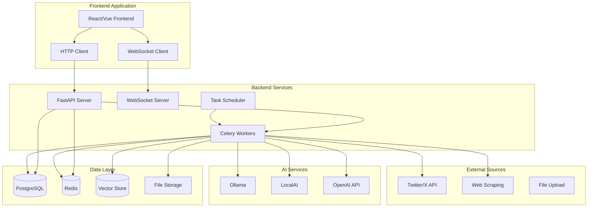

# AI Agent Rebuild - Design Document

## Overview

This design document outlines the architecture for rebuilding the Knowledge Base AI Agent as two separate, modern applications: a Python backend API service and a JavaScript frontend application. The design emphasizes clean separation of concerns, scalability, maintainability, and modern development practices.

## Architecture

### High-Level System Architecture



### Technology Stack Decisions

#### Backend Technology Stack

**Web Framework: FastAPI**
- **Rationale**: Modern, fast, automatic API documentation, excellent async support, type hints
- **Alternatives Considered**: Flask (too basic), Django (too heavy), Starlette (less features)
- **Benefits**: Built-in OpenAPI docs, excellent performance, modern Python features

**Task Queue: Celery with Redis**
- **Rationale**: Mature, scalable, excellent monitoring tools, Redis provides both broker and result backend
- **Alternatives Considered**: RQ (simpler but less features), Dramatiq (newer but less ecosystem)
- **Benefits**: Proven at scale, comprehensive monitoring, flexible routing

**Database: PostgreSQL with SQLAlchemy**
- **Rationale**: ACID compliance, JSON support, full-text search, vector extensions available
- **Alternatives Considered**: MongoDB (less structured), SQLite (not scalable)
- **Benefits**: Mature ecosystem, excellent performance, extensible

**WebSocket: FastAPI WebSockets with Redis PubSub**
- **Rationale**: Native FastAPI support, Redis provides scalable message distribution
- **Alternatives Considered**: Socket.IO (more complex), raw WebSockets (less features)
- **Benefits**: Simple implementation, scales horizontally, integrates with existing Redis

**Vector Store: pgvector or Qdrant**
- **Rationale**: pgvector integrates with PostgreSQL, Qdrant offers advanced features
- **Decision**: Start with pgvector for simplicity, migrate to Qdrant if needed
- **Benefits**: Unified database, simpler deployment, good performance

#### Frontend Technology Stack

**Framework: React with TypeScript**
- **Rationale**: Large ecosystem, excellent tooling, strong typing, component reusability
- **Alternatives Considered**: Vue.js (smaller ecosystem), Svelte (newer, less mature)
- **Benefits**: Industry standard, extensive libraries, excellent developer experience

**State Management: Zustand**
- **Rationale**: Simple, lightweight, TypeScript-first, less boilerplate than Redux
- **Alternatives Considered**: Redux Toolkit (more complex), Context API (not scalable)
- **Benefits**: Minimal boilerplate, excellent TypeScript support, easy testing

**UI Framework: Tailwind CSS with Headless UI**
- **Rationale**: Utility-first, highly customizable, excellent performance
- **Alternatives Considered**: Material-UI (opinionated), Chakra UI (less flexible)
- **Benefits**: Design flexibility, small bundle size, consistent design system

**Build Tool: Vite**
- **Rationale**: Fast development server, excellent HMR, modern build optimizations
- **Alternatives Considered**: Create React App (slower), Webpack (more complex)
- **Benefits**: Fast development, optimized builds, excellent plugin ecosystem

**Real-time Communication: Native WebSocket API**
- **Rationale**: Simple, lightweight, sufficient for our needs
- **Alternatives Considered**: Socket.IO client (more features but heavier)
- **Benefits**: No additional dependencies, direct control, better performance

## Components and Interfaces

### Backend Components

#### 1. API Layer (`/api`)

**FastAPI Application Structure:**
```
backend/
├── app/
│   ├── main.py              # FastAPI app initialization
│   ├── config.py            # Configuration management
│   ├── dependencies.py      # Dependency injection
│   └── middleware.py        # Custom middleware
├── api/
│   ├── v1/
│   │   ├── __init__.py
│   │   ├── agent.py         # Agent control endpoints
│   │   ├── content.py       # Content management
│   │   ├── chat.py          # Chat interface
│   │   ├── knowledge.py     # Knowledge base operations
│   │   └── system.py        # System monitoring
│   └── websocket.py         # WebSocket handlers
├── core/
│   ├── models/              # SQLAlchemy models
│   ├── schemas/             # Pydantic schemas
│   ├── services/            # Business logic
│   └── utils/               # Utility functions
├── tasks/                   # Celery tasks
├── ai/                      # AI backend integrations
└── tests/                   # Test suite
```

**Key API Endpoints:**
```python
# Agent Control
POST   /api/v1/agent/start
GET    /api/v1/agent/status/{task_id}
POST   /api/v1/agent/stop/{task_id}
GET    /api/v1/agent/history

# Content Management
GET    /api/v1/content/items
POST   /api/v1/content/items
GET    /api/v1/content/items/{id}
PUT    /api/v1/content/items/{id}
DELETE /api/v1/content/items/{id}
POST   /api/v1/content/search

# Knowledge Base
GET    /api/v1/knowledge/categories
GET    /api/v1/knowledge/synthesis
POST   /api/v1/knowledge/synthesis/generate
GET    /api/v1/knowledge/embeddings/search

# Chat Interface
POST   /api/v1/chat/sessions
GET    /api/v1/chat/sessions
GET    /api/v1/chat/sessions/{id}/messages
POST   /api/v1/chat/sessions/{id}/messages

# System Monitoring
GET    /api/v1/system/health
GET    /api/v1/system/metrics
GET    /api/v1/system/logs

# AI Models and Settings
GET    /api/v1/system/models/available          # List models by backend and capability
GET    /api/v1/system/models/config             # Get phase->model configuration
PUT    /api/v1/system/models/config             # Update phase->model configuration
```

"Agent start" accepts optional per-phase model overrides:
```json
{
  "config": { /* existing agent config */ },
  "models": {
    "vision": { "backend": "ollama", "model": "llava:13b", "params": {"temperature": 0.1} },
    "kb_generation": { "backend": "localai", "model": "mixtral:8x7b" },
    "synthesis": { "backend": "ollama", "model": "qwen2.5:7b" },
    "chat": { "backend": "ollama", "model": "llama3.1:8b-instruct" },
    "embeddings": { "backend": "openai", "model": "text-embedding-3-small" }
  }
}
```

#### 2. Task Processing Layer

**Seven-Phase Pipeline with Sub-Phases Task Organization:**
```python
# tasks/pipeline_phases.py
@celery_app.task(bind=True)
def phase_1_initialization(self, config: dict) -> dict:
    """Phase 1: Initialize all components and validate configuration."""
    pass

@celery_app.task(bind=True)
def phase_2_fetch_bookmarks(self, config: dict) -> dict:
    """Phase 2: Fetch bookmarks from Twitter/X API."""
    pass

@celery_app.task(bind=True)
def phase_2_1_bookmark_caching(self, bookmark_ids: list[str]) -> dict:
    """Phase 2.1: Cache bookmark content, detect threads, and store media."""
    pass

@celery_app.task(bind=True)
def phase_3_content_processing(self, content_ids: list[str], models_override: dict = None) -> dict:
    """Phase 3: Orchestrate content processing sub-phases."""
    pass

@celery_app.task(bind=True)
def phase_3_1_media_analysis(self, content_ids: list[str], models_override: dict = None) -> dict:
    """Phase 3.1: Analyze media content using vision models."""
    pass

@celery_app.task(bind=True)
def phase_3_2_ai_content_understanding(self, content_ids: list[str], models_override: dict = None) -> dict:
    """Phase 3.2: Generate collective understanding of bookmark content."""
    pass

@celery_app.task(bind=True)
def phase_3_3_ai_categorization(self, content_ids: list[str], models_override: dict = None) -> dict:
    """Phase 3.3: Generate categories and sub-categories with existing category intelligence."""
    pass

@celery_app.task(bind=True)
def phase_4_synthesis_generation(self, categories: list[str], models_override: dict = None) -> dict:
    """Phase 4: Generate synthesis documents for categories with 3+ bookmarks."""
    pass

@celery_app.task(bind=True)
def phase_5_embedding_generation(self, content_ids: list[str], models_override: dict = None) -> dict:
    """Phase 5: Generate embeddings for knowledge base items and synthesis documents."""
    pass

@celery_app.task(bind=True)
def phase_6_readme_generation(self, config: dict, models_override: dict = None) -> dict:
    """Phase 6: Generate Root README.md with navigation tree view."""
    pass

@celery_app.task(bind=True)
def phase_7_git_sync(self, config: dict) -> dict:
    """Phase 7: Export markdown files and push to GitHub repository."""
    pass

# Complete pipeline orchestration with sub-phases
@celery_app.task(bind=True)
def run_seven_phase_pipeline(self, config: dict, models_override: dict = None) -> dict:
    """Orchestrate the complete seven-phase processing pipeline with sub-phases."""
    workflow = chain(
        phase_1_initialization.s(config),
        phase_2_fetch_bookmarks.s(config),
        phase_2_1_bookmark_caching.s(),
        group([
            phase_3_1_media_analysis.s(models_override=models_override),
            phase_3_2_ai_content_understanding.s(models_override=models_override),
            phase_3_3_ai_categorization.s(models_override=models_override)
        ]),
        phase_4_synthesis_generation.s(models_override=models_override),
        phase_5_embedding_generation.s(models_override=models_override),
        phase_6_readme_generation.s(config, models_override=models_override),
        phase_7_git_sync.s(config)
    )
    return workflow.apply_async()
```

#### 3. AI Backend Abstraction

**Unified AI Interface:**
```python
from abc import ABC, abstractmethod
from typing import Dict, Any, AsyncGenerator

class AIBackend(ABC):
    @abstractmethod
    async def generate_text(
        self, 
        prompt: str, 
        model: str, 
        **kwargs
    ) -> str:
        pass
    
    @abstractmethod
    async def generate_stream(
        self, 
        prompt: str, 
        model: str, 
        **kwargs
    ) -> AsyncGenerator[str, None]:
        pass
    
    @abstractmethod
    async def generate_embeddings(
        self, 
        texts: list[str], 
        model: str
    ) -> list[list[float]]:
        pass

class OllamaBackend(AIBackend):
    # Implementation for Ollama
    pass

class LocalAIBackend(AIBackend):
    # Implementation for LocalAI
    pass

class OpenAIBackend(AIBackend):
    # Implementation for OpenAI-compatible APIs
    pass
```

#### 5. XML-Based Prompting System

**Structured Prompt Architecture:**
```python
# prompts/base.py
from abc import ABC, abstractmethod
from typing import Dict, Any, Optional
from xml.etree.ElementTree import Element, SubElement, tostring

class BasePromptTemplate(ABC):
    """Base class for XML-structured prompts."""
    
    def __init__(self, task: str, model_type: str = "text"):
        self.task = task
        self.model_type = model_type
    
    @abstractmethod
    def build_prompt(self, **kwargs) -> str:
        """Build the XML prompt structure."""
        pass
    
    def create_xml_element(self, tag: str, text: str = None, **attrs) -> Element:
        """Helper to create XML elements."""
        element = Element(tag, **attrs)
        if text:
            element.text = text
        return element

# prompts/media_analysis.py
class MediaAnalysisPrompt(BasePromptTemplate):
    """XML prompt for vision model media analysis."""
    
    def build_prompt(self, media_items: list, tweet_context: str = "") -> str:
        prompt = Element("prompt")
        
        # Task definition
        task_elem = SubElement(prompt, "task")
        task_elem.text = "Analyze media content and generate detailed understanding"
        
        # Input specification
        input_elem = SubElement(prompt, "input")
        for i, media in enumerate(media_items):
            media_elem = SubElement(input_elem, "media", id=str(i), type=media.get("type", "image"))
            media_elem.text = media.get("url", "")
        
        if tweet_context:
            context_elem = SubElement(input_elem, "context")
            context_elem.text = tweet_context
        
        # Instructions
        instructions = SubElement(prompt, "instructions")
        instructions.text = """
        For each media item, provide:
        1. Visual description of what is shown
        2. Technical analysis of content/concepts
        3. Relationship to accompanying text
        4. Key insights or knowledge conveyed
        """
        
        # Output schema
        schema = SubElement(prompt, "output_schema")
        SubElement(schema, "field", name="media_id", type="string", required="true")
        SubElement(schema, "field", name="description", type="string", required="true")
        SubElement(schema, "field", name="technical_analysis", type="string", required="true")
        SubElement(schema, "field", name="key_insights", type="array", required="true")
        SubElement(schema, "field", name="confidence_score", type="float", required="true")
        
        return tostring(prompt, encoding='unicode')

# prompts/content_understanding.py
class ContentUnderstandingPrompt(BasePromptTemplate):
    """XML prompt for AI content understanding."""
    
    def build_prompt(self, tweet_text: str, media_analysis: list, thread_context: str = "") -> str:
        prompt = Element("prompt")
        
        task_elem = SubElement(prompt, "task")
        task_elem.text = "Generate collective understanding of bookmark content"
        
        input_elem = SubElement(prompt, "input")
        
        # Tweet content
        text_elem = SubElement(input_elem, "tweet_text")
        text_elem.text = tweet_text
        
        # Media analysis results
        media_elem = SubElement(input_elem, "media_analysis")
        for analysis in media_analysis:
            item_elem = SubElement(media_elem, "analysis_item")
            item_elem.text = str(analysis)
        
        # Thread context if applicable
        if thread_context:
            thread_elem = SubElement(input_elem, "thread_context")
            thread_elem.text = thread_context
        
        # Instructions
        instructions = SubElement(prompt, "instructions")
        instructions.text = """
        Synthesize the tweet text and media analysis to create a comprehensive understanding.
        Focus on:
        1. Core knowledge or insights being shared
        2. Technical concepts and their applications
        3. Broader implications and context
        4. Actionable information or learnings
        """
        
        # Constraints
        constraints = SubElement(prompt, "constraints")
        constraints.text = "Output should be 200-500 words, technical but accessible"
        
        # Output schema
        schema = SubElement(prompt, "output_schema")
        SubElement(schema, "field", name="collective_understanding", type="string", required="true")
        SubElement(schema, "field", name="key_concepts", type="array", required="true")
        SubElement(schema, "field", name="technical_domain", type="string", required="true")
        SubElement(schema, "field", name="actionable_insights", type="array", required="true")
        
        return tostring(prompt, encoding='unicode')

# prompts/categorization.py
class CategorizationPrompt(BasePromptTemplate):
    """XML prompt for AI categorization with existing category intelligence."""
    
    def build_prompt(self, content_understanding: str, existing_categories: list) -> str:
        prompt = Element("prompt")
        
        task_elem = SubElement(prompt, "task")
        task_elem.text = "Categorize content using existing category intelligence"
        
        input_elem = SubElement(prompt, "input")
        
        # Content to categorize
        content_elem = SubElement(input_elem, "content_understanding")
        content_elem.text = content_understanding
        
        # Existing categories for reference
        categories_elem = SubElement(input_elem, "existing_categories")
        for category in existing_categories:
            cat_elem = SubElement(categories_elem, "category", 
                                name=category.get("name", ""), 
                                count=str(category.get("count", 0)))
            if category.get("subcategories"):
                for subcat in category["subcategories"]:
                    SubElement(cat_elem, "subcategory", 
                             name=subcat.get("name", ""), 
                             count=str(subcat.get("count", 0)))
        
        # Instructions
        instructions = SubElement(prompt, "instructions")
        instructions.text = """
        Analyze the content and assign appropriate category and subcategory.
        Rules:
        1. Use existing categories when content fits (prefer consistency)
        2. Create new categories only when content doesn't fit existing ones
        3. Keep names short (max 3 words), technical domain focused
        4. Use kebab-case formatting (e.g., "machine-learning", "web-development")
        """
        
        # Examples
        examples = SubElement(prompt, "examples")
        
        example1 = SubElement(examples, "example")
        ex1_input = SubElement(example1, "input")
        ex1_input.text = "Content about neural network architectures and training techniques"
        ex1_output = SubElement(example1, "output")
        SubElement(ex1_output, "category").text = "machine-learning"
        SubElement(ex1_output, "subcategory").text = "neural-networks"
        
        # Output schema
        schema = SubElement(prompt, "output_schema")
        SubElement(schema, "field", name="category", type="string", required="true")
        SubElement(schema, "field", name="subcategory", type="string", required="true")
        SubElement(schema, "field", name="reasoning", type="string", required="true")
        SubElement(schema, "field", name="is_new_category", type="boolean", required="true")
        SubElement(schema, "field", name="confidence_score", type="float", required="true")
        
        return tostring(prompt, encoding='unicode')
```

#### 6. Phase-Specific Model Routing and Configuration

Different phases benefit from different models (size, modality, context length). We introduce a routing layer and settings to choose optimal models per phase, with backend capability detection and safe fallbacks.

Phases: `vision`, `kb_generation`, `synthesis`, `chat`, `embeddings`.

Settings and router:
```python
from enum import Enum
from pydantic import BaseModel, BaseSettings, Field
from typing import Dict, Optional, Tuple

class ModelPhase(str, Enum):
    vision = "vision"
    kb_generation = "kb_generation"
    synthesis = "synthesis"
    chat = "chat"
    embeddings = "embeddings"

class ModelParams(BaseModel):
    temperature: Optional[float] = None
    top_p: Optional[float] = None
    max_tokens: Optional[int] = None

class PhaseModelSelector(BaseModel):
    backend: str  # "ollama" | "localai" | "openai"
    model: str
    params: ModelParams = Field(default_factory=ModelParams)

class ModelSelectionSettings(BaseSettings):
    default_backend: str = "ollama"
    per_phase: Dict[ModelPhase, PhaseModelSelector] = Field(default_factory=dict)

class ModelRouter:
    def __init__(self, settings: ModelSelectionSettings, backends: Dict[str, AIBackend]):
        self.settings = settings
        self.backends = backends

    async def resolve(self, phase: ModelPhase, override: Optional[PhaseModelSelector] = None) -> Tuple[AIBackend, str, dict]:
        selection = override or self.settings.per_phase.get(phase)
        if not selection:
            selection = await self._fallback_selection_for_phase(phase)
        backend = self.backends[selection.backend]
        self._validate_capability(backend, phase, selection.model)
        return backend, selection.model, selection.params.dict(exclude_none=True)

    def _validate_capability(self, backend: AIBackend, phase: ModelPhase, model: str) -> None:
        # Each backend exposes advertised capabilities for models
        # Raise AIAgentException if model cannot serve the phase (e.g., no vision)
        pass

    async def _fallback_selection_for_phase(self, phase: ModelPhase) -> PhaseModelSelector:
        # Inspect backends for available models with required capability
        # Return sensible defaults (e.g., embeddings -> text-embedding model)
        pass
```

Backend capability discovery:
- Ollama: query `GET /api/tags` or `GET /api/models` to determine modalities, context length, and family; derive capabilities: text_generation, vision, embeddings.
- LocalAI: inspect model registry and metadata endpoints; fallback to configured capabilities if metadata is limited.
- OpenAI-compatible: static map by model prefix.

Task integration: Each Celery task requests a model via `ModelRouter.resolve(phase, override)` and passes `(backend, model, params)` into the unified AI interface call.

```python
# tasks/content_processing.py
@celery_app.task(bind=True)
def process_content_task(self, content_id: str, models_override: dict | None = None):
    # vision example
    backend, model, params = await model_router.resolve(ModelPhase.vision, models_override and models_override.get("vision"))
    vision_text = await backend.generate_text(prompt=prompt_from_image(...), model=model, **params)

    # kb generation example
    backend, model, params = await model_router.resolve(ModelPhase.kb_generation, models_override and models_override.get("kb_generation"))
    enhanced = await backend.generate_text(prompt=kb_prompt, model=model, **params)
```

#### 4. Data Models

**Unified Database Schema:**
```python
# Core content model
class ContentItem(Base):
    __tablename__ = "content_items"
    
    id: Mapped[str] = mapped_column(String, primary_key=True)
    source_type: Mapped[str] = mapped_column(String, nullable=False)
    source_id: Mapped[str] = mapped_column(String, nullable=False)
    title: Mapped[str] = mapped_column(String, nullable=False)
    content: Mapped[str] = mapped_column(Text, nullable=False)
    raw_data: Mapped[dict] = mapped_column(JSON)
    
    # Processing state
    processing_state: Mapped[str] = mapped_column(String, default="pending")
    processed_at: Mapped[datetime] = mapped_column(DateTime, nullable=True)
    
    # Categorization
    main_category: Mapped[str] = mapped_column(String, nullable=True)
    sub_category: Mapped[str] = mapped_column(String, nullable=True)
    tags: Mapped[list[str]] = mapped_column(JSON, default=list)
    
    # Media content (stored in database)
    media_content: Mapped[list[dict]] = mapped_column(JSON, default=list)  # Contains media data, descriptions, metadata
    
    # Timestamps
    created_at: Mapped[datetime] = mapped_column(DateTime, default=datetime.utcnow)
    updated_at: Mapped[datetime] = mapped_column(DateTime, default=datetime.utcnow, onupdate=datetime.utcnow)

    # Provenance
    vision_model_used: Mapped[str] = mapped_column(String, nullable=True)

# Knowledge base item (processed content)
class KnowledgeItem(Base):
    __tablename__ = "knowledge_items"
    
    id: Mapped[str] = mapped_column(String, primary_key=True)
    content_item_id: Mapped[str] = mapped_column(String, ForeignKey("content_items.id"))
    
    # Generated content (all stored in database)
    display_title: Mapped[str] = mapped_column(String, nullable=False)
    summary: Mapped[str] = mapped_column(Text, nullable=True)
    enhanced_content: Mapped[str] = mapped_column(Text, nullable=False)
    
    # Generated markdown content (for Git export)
    markdown_content: Mapped[str] = mapped_column(Text, nullable=True)
    readme_section: Mapped[str] = mapped_column(Text, nullable=True)  # Content for README generation

    # Provenance
    generation_model_used: Mapped[str] = mapped_column(String, nullable=True)
    
    # Relationships
    content_item: Mapped["ContentItem"] = relationship("ContentItem", back_populates="knowledge_item")
    embeddings: Mapped[list["Embedding"]] = relationship("Embedding", back_populates="knowledge_item")

# Vector embeddings
class Embedding(Base):
    __tablename__ = "embeddings"
    
    id: Mapped[str] = mapped_column(String, primary_key=True)
    knowledge_item_id: Mapped[str] = mapped_column(String, ForeignKey("knowledge_items.id"))
    
    # Vector data
    embedding: Mapped[list[float]] = mapped_column(Vector(1536))  # Using pgvector
    model: Mapped[str] = mapped_column(String, nullable=False)
    chunk_index: Mapped[int] = mapped_column(Integer, default=0)
    
    # Relationships
    knowledge_item: Mapped["KnowledgeItem"] = relationship("KnowledgeItem", back_populates="embeddings")
```

```python
# Synthesis documents
class SynthesisDocument(Base):
    __tablename__ = "synthesis_documents"

    id: Mapped[str] = mapped_column(String, primary_key=True)
    main_category: Mapped[str] = mapped_column(String, nullable=False)
    sub_category: Mapped[str] = mapped_column(String, nullable=False)
    title: Mapped[str] = mapped_column(String, nullable=False)
    content: Mapped[str] = mapped_column(Text, nullable=False)
    item_count: Mapped[int] = mapped_column(Integer, default=0)
    source_item_ids: Mapped[list[str]] = mapped_column(JSON, default=list)
    content_hash: Mapped[str] = mapped_column(String, nullable=True)
    is_stale: Mapped[bool] = mapped_column(Boolean, default=False)
    created_at: Mapped[datetime] = mapped_column(DateTime, default=datetime.utcnow)
    updated_at: Mapped[datetime] = mapped_column(DateTime, default=datetime.utcnow, onupdate=datetime.utcnow)

    # Provenance
    synthesis_model_used: Mapped[str] = mapped_column(String, nullable=True)

## Dynamic Content Rendering

### Frontend Knowledge Base Item Generation

The frontend dynamically generates beautiful, well-structured knowledge base items by combining:

1. **Ground-truth bookmark data** (original tweet text, metadata, timestamps)
2. **Media analysis results** (vision model descriptions and insights)
3. **AI content understanding** (collective understanding and key concepts)
4. **Categorization data** (category, subcategory, technical domain)

**Rendering Pipeline:**
```typescript
interface KnowledgeBaseItem {
  id: string;
  title: string;
  content: {
    originalTweet: TweetData;
    mediaAnalysis: MediaAnalysisResult[];
    collectiveUnderstanding: string;
    keyInsights: string[];
    technicalDomain: string;
  };
  category: string;
  subcategory: string;
  formattedContent: string; // Generated markdown with proper structure
  displayHtml: string; // Rendered HTML with embedded media
}

// Dynamic generation service
class KnowledgeItemRenderer {
  generateFormattedContent(item: KnowledgeBaseItem): string {
    // Creates beautiful markdown with:
    // - Professional headings and structure
    // - Embedded media with captions
    // - Technical analysis sections
    // - Source attribution and metadata
    // - Cross-references to related items
  }
  
  generateDisplayHtml(item: KnowledgeBaseItem): string {
    // Renders to HTML with:
    // - Responsive media embedding
    // - Syntax highlighting for code
    // - Interactive elements
    // - Professional typography
  }
}
```

### Git Export Formatting

When exporting to Git repository, the system generates markdown files with:

- **Professional structure** with clear headings and sections
- **Embedded media** with proper alt text and captions
- **Technical analysis** formatted with appropriate emphasis
- **Source references** with links back to original tweets
- **Category navigation** with breadcrumbs and related items
- **Metadata sections** with timestamps and provenance information

# README and index content
class ReadmeContent(Base):
    __tablename__ = "readme_content"
    
    id: Mapped[str] = mapped_column(String, primary_key=True)
    content_type: Mapped[str] = mapped_column(String, nullable=False)  # 'main_readme', 'category_index', 'subcategory_index'
    category: Mapped[str] = mapped_column(String, nullable=True)
    subcategory: Mapped[str] = mapped_column(String, nullable=True)
    
    # Generated content
    title: Mapped[str] = mapped_column(String, nullable=False)
    content: Mapped[str] = mapped_column(Text, nullable=False)
    item_count: Mapped[int] = mapped_column(Integer, default=0)
    
    # Git sync metadata
    file_path: Mapped[str] = mapped_column(String, nullable=False)  # Target path for Git export
    content_hash: Mapped[str] = mapped_column(String, nullable=True)
    is_stale: Mapped[bool] = mapped_column(Boolean, default=False)
    
    created_at: Mapped[datetime] = mapped_column(DateTime, default=datetime.utcnow)
    updated_at: Mapped[datetime] = mapped_column(DateTime, default=datetime.utcnow, onupdate=datetime.utcnow)

# Git sync operations tracking
class GitSyncOperation(Base):
    __tablename__ = "git_sync_operations"
    
    id: Mapped[str] = mapped_column(String, primary_key=True)
    operation_type: Mapped[str] = mapped_column(String, nullable=False)  # 'commit', 'push', 'pull'
    
    # Operation details
    commit_message: Mapped[str] = mapped_column(String, nullable=True)
    commit_hash: Mapped[str] = mapped_column(String, nullable=True)
    files_changed: Mapped[list[str]] = mapped_column(JSON, default=list)
    
    # Status
    status: Mapped[str] = mapped_column(String, default="pending")  # 'pending', 'success', 'failed'
    error_message: Mapped[str] = mapped_column(Text, nullable=True)
    
    created_at: Mapped[datetime] = mapped_column(DateTime, default=datetime.utcnow)
    completed_at: Mapped[datetime] = mapped_column(DateTime, nullable=True)

# Pipeline execution tracking
class PipelineExecution(Base):
    __tablename__ = "pipeline_executions"
    
    id: Mapped[str] = mapped_column(String, primary_key=True)
    
    # Configuration
    config: Mapped[dict] = mapped_column(JSON, nullable=False)
    models_override: Mapped[dict] = mapped_column(JSON, nullable=True)
    
    # Phase tracking
    current_phase: Mapped[int] = mapped_column(Integer, default=1)
    phase_status: Mapped[dict] = mapped_column(JSON, default=dict)  # {phase_num: {status, start_time, end_time, error}}
    
    # Overall status
    status: Mapped[str] = mapped_column(String, default="running")  # 'running', 'completed', 'failed', 'paused'
    progress_percentage: Mapped[int] = mapped_column(Integer, default=0)
    
    # Results
    items_processed: Mapped[int] = mapped_column(Integer, default=0)
    synthesis_generated: Mapped[int] = mapped_column(Integer, default=0)
    embeddings_created: Mapped[int] = mapped_column(Integer, default=0)
    
    created_at: Mapped[datetime] = mapped_column(DateTime, default=datetime.utcnow)
    started_at: Mapped[datetime] = mapped_column(DateTime, nullable=True)
    completed_at: Mapped[datetime] = mapped_column(DateTime, nullable=True)
```

### Frontend Components

#### 1. Application Structure

**React Application Organization:**
```
frontend/
├── src/
│   ├── components/          # Reusable UI components
│   │   ├── ui/             # Basic UI components
│   │   ├── forms/          # Form components
│   │   ├── layout/         # Layout components
│   │   └── charts/         # Data visualization
│   ├── pages/              # Page components
│   │   ├── Dashboard.tsx
│   │   ├── KnowledgeBase.tsx
│   │   ├── Chat.tsx
│   │   ├── Settings.tsx
│   │   └── Monitoring.tsx
│   ├── hooks/              # Custom React hooks
│   ├── services/           # API and WebSocket services
│   ├── stores/             # Zustand stores
│   ├── types/              # TypeScript type definitions
│   ├── utils/              # Utility functions
│   └── styles/             # Global styles
├── public/
└── tests/
```

#### 2. State Management Architecture

**Zustand Store Structure:**
```typescript
// stores/agentStore.ts
interface AgentState {
  // Agent status
  isRunning: boolean;
  currentTask: Task | null;
  progress: number;
  currentPhase: string;
  
  // Actions
  startAgent: (config: AgentConfig) => Promise<void>;
  stopAgent: () => Promise<void>;
  updateProgress: (progress: ProgressUpdate) => void;
}

// stores/knowledgeStore.ts
interface KnowledgeState {
  // Content data
  items: KnowledgeItem[];
  categories: Category[];
  currentItem: KnowledgeItem | null;
  
  // Search and filtering
  searchQuery: string;
  filters: FilterState;
  searchResults: SearchResult[];
  
  // Actions
  loadItems: () => Promise<void>;
  searchItems: (query: string) => Promise<void>;
  createItem: (item: CreateItemRequest) => Promise<void>;
  updateItem: (id: string, updates: UpdateItemRequest) => Promise<void>;
  deleteItem: (id: string) => Promise<void>;
}

// stores/chatStore.ts
interface ChatState {
  // Chat sessions
  sessions: ChatSession[];
  currentSession: ChatSession | null;
  messages: ChatMessage[];
  
  // Chat state
  isTyping: boolean;
  isConnected: boolean;
  
  // Actions
  createSession: () => Promise<ChatSession>;
  sendMessage: (content: string) => Promise<void>;
  loadSessions: () => Promise<void>;
  switchSession: (sessionId: string) => Promise<void>;
}
```

#### 3. Real-time Communication

**WebSocket Service:**
```typescript
class WebSocketService {
  private ws: WebSocket | null = null;
  private reconnectAttempts = 0;
  private maxReconnectAttempts = 5;
  private eventHandlers = new Map<string, Function[]>();
  
  connect(url: string): Promise<void> {
    return new Promise((resolve, reject) => {
      this.ws = new WebSocket(url);
      
      this.ws.onopen = () => {
        this.reconnectAttempts = 0;
        resolve();
      };
      
      this.ws.onmessage = (event) => {
        const data = JSON.parse(event.data);
        this.handleMessage(data);
      };
      
      this.ws.onclose = () => {
        this.handleReconnect();
      };
      
      this.ws.onerror = (error) => {
        reject(error);
      };
    });
  }
  
  subscribe(event: string, handler: Function): void {
    if (!this.eventHandlers.has(event)) {
      this.eventHandlers.set(event, []);
    }
    this.eventHandlers.get(event)!.push(handler);
  }
  
  private handleMessage(data: any): void {
    const handlers = this.eventHandlers.get(data.type) || [];
    handlers.forEach(handler => handler(data.payload));
  }
  
  private handleReconnect(): void {
    if (this.reconnectAttempts < this.maxReconnectAttempts) {
      setTimeout(() => {
        this.reconnectAttempts++;
        this.connect(this.ws!.url);
      }, Math.pow(2, this.reconnectAttempts) * 1000);
    }
  }
}
```

New events:
- `settings.updated`: emitted when model configuration changes
- `agent.models_applied`: emitted when an agent run starts with explicit model overrides

## Data Models

### Unified Database Schema

The new system uses a simplified, unified schema that eliminates the complexity of the current dual-table architecture:

```sql
-- Core content storage
CREATE TABLE content_items (
    id VARCHAR PRIMARY KEY,
    source_type VARCHAR NOT NULL,  -- 'twitter', 'url', 'file', etc.
    source_id VARCHAR NOT NULL,
    title VARCHAR NOT NULL,
    content TEXT NOT NULL,
    raw_data JSONB,
    
    -- Processing state
    processing_state VARCHAR DEFAULT 'pending',
    processed_at TIMESTAMP,
    
    -- Categorization
    main_category VARCHAR,
    sub_category VARCHAR,
    tags JSONB DEFAULT '[]',
    
    -- Media and files
    media_files JSONB DEFAULT '[]',
    generated_files JSONB DEFAULT '[]',
    
    -- Timestamps
    created_at TIMESTAMP DEFAULT NOW(),
    updated_at TIMESTAMP DEFAULT NOW(),
    -- Provenance
    vision_model_used VARCHAR
);

-- Processed knowledge base items
CREATE TABLE knowledge_items (
    id VARCHAR PRIMARY KEY,
    content_item_id VARCHAR REFERENCES content_items(id),
    
    -- Generated content
    display_title VARCHAR NOT NULL,
    summary TEXT,
    enhanced_content TEXT NOT NULL,
    
    -- File paths
    markdown_path VARCHAR,
    media_paths JSONB DEFAULT '[]',
    
    -- Timestamps
    created_at TIMESTAMP DEFAULT NOW(),
    updated_at TIMESTAMP DEFAULT NOW(),
    -- Provenance
    generation_model_used VARCHAR
);

-- Vector embeddings using pgvector
CREATE TABLE embeddings (
    id VARCHAR PRIMARY KEY,
    knowledge_item_id VARCHAR REFERENCES knowledge_items(id),
    
    -- Vector data
    embedding vector(1536),
    model VARCHAR NOT NULL,
    chunk_index INTEGER DEFAULT 0,
    
    created_at TIMESTAMP DEFAULT NOW()
);

-- Synthesis documents
CREATE TABLE synthesis_documents (
    id VARCHAR PRIMARY KEY,
    main_category VARCHAR NOT NULL,
    sub_category VARCHAR NOT NULL,
    
    title VARCHAR NOT NULL,
    content TEXT NOT NULL,
    item_count INTEGER DEFAULT 0,
    
    -- Dependency tracking
    source_item_ids JSONB DEFAULT '[]',
    content_hash VARCHAR,
    is_stale BOOLEAN DEFAULT FALSE,
    
    created_at TIMESTAMP DEFAULT NOW(),
    updated_at TIMESTAMP DEFAULT NOW(),
    
    -- Provenance
    synthesis_model_used VARCHAR,
    UNIQUE(main_category, sub_category)
);

-- Task management
CREATE TABLE tasks (
    id VARCHAR PRIMARY KEY,
    task_type VARCHAR NOT NULL,
    status VARCHAR DEFAULT 'pending',
    
    -- Configuration
    config JSONB,
    
    -- Progress tracking
    current_phase VARCHAR,
    progress_percentage INTEGER DEFAULT 0,
    
    -- Results and errors
    result_data JSONB,
    error_message TEXT,
    
    -- Timestamps
    created_at TIMESTAMP DEFAULT NOW(),
    started_at TIMESTAMP,
    completed_at TIMESTAMP
);

-- Chat system
CREATE TABLE chat_sessions (
    id VARCHAR PRIMARY KEY,
    title VARCHAR,
    message_count INTEGER DEFAULT 0,
    is_archived BOOLEAN DEFAULT FALSE,
    
    created_at TIMESTAMP DEFAULT NOW(),
    last_updated TIMESTAMP DEFAULT NOW()
);

CREATE TABLE chat_messages (
    id VARCHAR PRIMARY KEY,
    session_id VARCHAR REFERENCES chat_sessions(id),
    role VARCHAR NOT NULL,  -- 'user' or 'assistant'
    content TEXT NOT NULL,
    
    -- AI metadata
    model_used VARCHAR,
    sources JSONB DEFAULT '[]',
    context_stats JSONB,
    
    created_at TIMESTAMP DEFAULT NOW()
);

-- Indexes for performance
CREATE INDEX idx_content_items_source ON content_items(source_type, source_id);
CREATE INDEX idx_content_items_category ON content_items(main_category, sub_category);
CREATE INDEX idx_content_items_processing ON content_items(processing_state);
CREATE INDEX idx_embeddings_vector ON embeddings USING ivfflat (embedding vector_cosine_ops);
CREATE INDEX idx_tasks_status ON tasks(status, created_at);
CREATE INDEX idx_chat_messages_session ON chat_messages(session_id, created_at);
```

## Error Handling

### Backend Error Handling Strategy

**Structured Error Responses:**
```python
from enum import Enum
from pydantic import BaseModel

class ErrorCode(str, Enum):
    VALIDATION_ERROR = "validation_error"
    NOT_FOUND = "not_found"
    PERMISSION_DENIED = "permission_denied"
    AI_SERVICE_ERROR = "ai_service_error"
    PROCESSING_ERROR = "processing_error"
    SYSTEM_ERROR = "system_error"

class ErrorResponse(BaseModel):
    success: bool = False
    error_code: ErrorCode
    message: str
    details: dict = {}
    timestamp: datetime
    request_id: str

# Custom exception classes
class AIAgentException(Exception):
    def __init__(self, message: str, error_code: ErrorCode, details: dict = None):
        self.message = message
        self.error_code = error_code
        self.details = details or {}
        super().__init__(message)

# Global exception handler
@app.exception_handler(AIAgentException)
async def ai_agent_exception_handler(request: Request, exc: AIAgentException):
    return JSONResponse(
        status_code=400,
        content=ErrorResponse(
            error_code=exc.error_code,
            message=exc.message,
            details=exc.details,
            timestamp=datetime.utcnow(),
            request_id=str(uuid.uuid4())
        ).dict()
    )
```

**Task Error Handling:**
```python
@celery_app.task(bind=True, autoretry_for=(Exception,), retry_kwargs={'max_retries': 3})
def process_content_task(self, content_id: str):
    try:
        # Processing logic
        pass
    except AIServiceError as e:
        # Log error and update task status
        logger.error(f"AI service error for content {content_id}: {e}")
        self.update_state(
            state='FAILURE',
            meta={
                'error_code': 'ai_service_error',
                'message': str(e),
                'content_id': content_id
            }
        )
        raise
    except Exception as e:
        # Unexpected error - retry or fail
        logger.exception(f"Unexpected error processing content {content_id}")
        raise self.retry(countdown=60, exc=e)
```

### Frontend Error Handling

**Error Boundary Component:**
```typescript
class ErrorBoundary extends React.Component<Props, State> {
  constructor(props: Props) {
    super(props);
    this.state = { hasError: false, error: null };
  }

  static getDerivedStateFromError(error: Error): State {
    return { hasError: true, error };
  }

  componentDidCatch(error: Error, errorInfo: React.ErrorInfo) {
    // Log error to monitoring service
    console.error('Error caught by boundary:', error, errorInfo);
  }

  render() {
    if (this.state.hasError) {
      return <ErrorFallback error={this.state.error} />;
    }

    return this.props.children;
  }
}
```

**API Error Handling:**
```typescript
class APIService {
  private async handleResponse<T>(response: Response): Promise<T> {
    if (!response.ok) {
      const errorData = await response.json();
      throw new APIError(
        errorData.message,
        errorData.error_code,
        response.status,
        errorData.details
      );
    }
    return response.json();
  }

  async get<T>(url: string): Promise<T> {
    try {
      const response = await fetch(url);
      return this.handleResponse<T>(response);
    } catch (error) {
      if (error instanceof APIError) {
        throw error;
      }
      throw new APIError('Network error', 'network_error', 0);
    }
  }
}
```

## Testing Strategy

### Backend Testing

**Test Structure:**
```
tests/
├── unit/                   # Unit tests
│   ├── test_models.py
│   ├── test_services.py
│   └── test_utils.py
├── integration/            # Integration tests
│   ├── test_api.py
│   ├── test_tasks.py
│   └── test_ai_backends.py
├── e2e/                    # End-to-end tests
│   └── test_workflows.py
└── fixtures/               # Test data
    ├── sample_content.json
    └── mock_responses.json
```

**Testing Tools:**
- **pytest**: Test framework
- **pytest-asyncio**: Async test support
- **httpx**: HTTP client for API testing
- **factory-boy**: Test data generation
- **pytest-mock**: Mocking utilities

**Example Test:**
```python
@pytest.mark.asyncio
async def test_process_content_workflow():
    # Arrange
    content_item = ContentItemFactory()
    ai_backend = MockAIBackend()
    
    # Act
    result = await process_content_task(content_item.id)
    
    # Assert
    assert result['status'] == 'completed'
    knowledge_item = await KnowledgeItem.get(content_item.id)
    assert knowledge_item is not None
    assert knowledge_item.display_title is not None
```

### Frontend Testing

**Testing Tools:**
- **Vitest**: Fast test runner
- **React Testing Library**: Component testing
- **MSW**: API mocking
- **Playwright**: E2E testing

**Test Structure:**
```
src/
├── components/
│   └── __tests__/
├── pages/
│   └── __tests__/
├── hooks/
│   └── __tests__/
├── services/
│   └── __tests__/
└── utils/
    └── __tests__/
```

**Example Component Test:**
```typescript
import { render, screen, waitFor } from '@testing-library/react';
import { KnowledgeBase } from '../KnowledgeBase';
import { server } from '../../mocks/server';

test('displays knowledge base items', async () => {
  render(<KnowledgeBase />);
  
  await waitFor(() => {
    expect(screen.getByText('Sample Knowledge Item')).toBeInTheDocument();
  });
  
  expect(screen.getByRole('searchbox')).toBeInTheDocument();
});
```

## Deployment Architecture

### Backend Deployment

**Docker Configuration:**
```dockerfile
# Dockerfile
FROM python:3.11-slim

WORKDIR /app

# Install system dependencies
RUN apt-get update && apt-get install -y \
    build-essential \
    curl \
    && rm -rf /var/lib/apt/lists/*

# Install Python dependencies
COPY requirements.txt .
RUN pip install --no-cache-dir -r requirements.txt

# Copy application code
COPY . .

# Run application
CMD ["uvicorn", "app.main:app", "--host", "0.0.0.0", "--port", "8000"]
```

**Docker Compose for Development:**
```yaml
version: '3.8'

services:
  api:
    build: .
    ports:
      - "8000:8000"
    environment:
      - DATABASE_URL=postgresql://user:pass@db:5432/aiagent
      - REDIS_URL=redis://redis:6379
    depends_on:
      - db
      - redis
    volumes:
      - ./app:/app/app
      - ./data:/app/data

  worker:
    build: .
    command: celery -A app.tasks.celery_app worker --loglevel=info
    environment:
      - DATABASE_URL=postgresql://user:pass@db:5432/aiagent
      - REDIS_URL=redis://redis:6379
    depends_on:
      - db
      - redis
    volumes:
      - ./data:/app/data

  scheduler:
    build: .
    command: celery -A app.tasks.celery_app beat --loglevel=info
    environment:
      - DATABASE_URL=postgresql://user:pass@db:5432/aiagent
      - REDIS_URL=redis://redis:6379
    depends_on:
      - db
      - redis

  db:
    image: pgvector/pgvector:pg15
    environment:
      - POSTGRES_DB=aiagent
      - POSTGRES_USER=user
      - POSTGRES_PASSWORD=pass
    volumes:
      - postgres_data:/var/lib/postgresql/data
    ports:
      - "5432:5432"

  redis:
    image: redis:7-alpine
    ports:
      - "6379:6379"

volumes:
  postgres_data:
```

### Frontend Deployment

**Build Configuration (Vite):**
```typescript
// vite.config.ts
import { defineConfig } from 'vite';
import react from '@vitejs/plugin-react';

export default defineConfig({
  plugins: [react()],
  build: {
    outDir: 'dist',
    sourcemap: true,
    rollupOptions: {
      output: {
        manualChunks: {
          vendor: ['react', 'react-dom'],
          ui: ['@headlessui/react', '@heroicons/react'],
        },
      },
    },
  },
  server: {
    proxy: {
      '/api': {
        target: 'http://localhost:8000',
        changeOrigin: true,
      },
      '/ws': {
        target: 'ws://localhost:8000',
        ws: true,
      },
    },
  },
});
```

**Production Deployment (Nginx):**
```nginx
server {
    listen 80;
    server_name your-domain.com;

    # Frontend static files
    location / {
        root /var/www/frontend/dist;
        try_files $uri $uri/ /index.html;
        
        # Cache static assets
        location ~* \.(js|css|png|jpg|jpeg|gif|ico|svg)$ {
            expires 1y;
            add_header Cache-Control "public, immutable";
        }
    }

    # Backend API
    location /api/ {
        proxy_pass http://backend:8000;
        proxy_set_header Host $host;
        proxy_set_header X-Real-IP $remote_addr;
        proxy_set_header X-Forwarded-For $proxy_add_x_forwarded_for;
        proxy_set_header X-Forwarded-Proto $scheme;
    }

    # WebSocket
    location /ws/ {
        proxy_pass http://backend:8000;
        proxy_http_version 1.1;
        proxy_set_header Upgrade $http_upgrade;
        proxy_set_header Connection "upgrade";
        proxy_set_header Host $host;
    }
}
```

This comprehensive design provides a solid foundation for building a modern, scalable AI Agent system with clean separation between backend and frontend concerns.

## Frontend Visual Design System

### Liquid Glass Design Language

Adopt a “liquid glass” aesthetic inspired by Apple’s guidance, emphasizing translucency, depth, motion, and tactility while preserving accessibility.

- Visual principles:
  - Translucent layers with frosted blur backdrops and subtle gradients
  - Depth via shadows, parallax, and layered panels; restrained motion for focus
  - High contrast and legibility controls when content appears beneath glass
  - Reduced motion and increased contrast modes for accessibility

- Tailwind setup:
  - Extend theme tokens for colors, blur, opacity, shadows, radii, and transitions
  - Use CSS variables to enable live theming and light/dark modes
  - Utilities: `backdrop-blur-*`, `bg-opacity`, `bg-gradient-to-*`, `shadow-*`, `ring-*`

- Component patterns (glass-ready variants):
  - Page layout surfaces (primary/secondary panels) with layered translucency
  - Cards and sheets with `backdrop-blur`, gradient overlays, and soft shadows
  - Toolbars, modals, drawers using glass surfaces and focus rings
  - Buttons, inputs, dropdowns with clear focus, hover and pressed states
  - Charts/metrics over glass with legibility layers (scrims) and dynamic contrast

- Responsiveness and motion:
  - Mobile-first; ensure glass layers degrade gracefully on low-power devices
  - Respect `prefers-reduced-motion`; avoid parallax when reduced motion is enabled
  - Use GPU-friendly transitions; limit heavy blurs on constrained devices

- Accessibility:
  - Maintain WCAG contrast ratios for foreground text on translucent backgrounds
  - Provide a “Reduce transparency” setting that switches to solid surfaces
  - Keyboard focus rings and logical tab order across glass layers

- Implementation notes:
  - Centralize tokens in `tailwind.config.ts` and a `styles/tokens.css` file
  - Provide a `GlassPanel` wrapper component to standardize surface behavior
  - Add a `useTheme` hook for toggling transparency, motion, and color theme