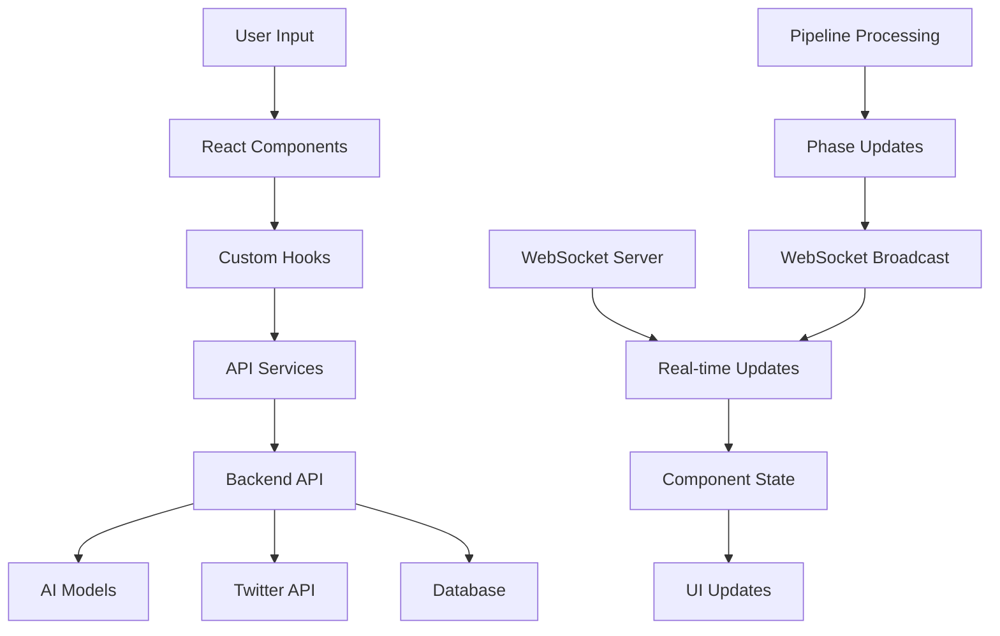

# Frontend AI Dashboard Design

## Overview

The Frontend AI Dashboard is a React-based web application that provides comprehensive visualization and control of the seven-phase Twitter/X bookmark processing pipeline. The dashboard integrates with the tested backend API to provide real-time monitoring, AI model configuration, and knowledge base management.

## Architecture

### Component Architecture

```
src/
├── components/
│   ├── pipeline/
│   │   ├── PipelineDashboard.tsx          # Main pipeline visualization
│   │   ├── PhaseCard.tsx                  # Individual phase status
│   │   ├── ProgressIndicator.tsx          # Real-time progress bars
│   │   └── ProcessingStats.tsx            # Pipeline statistics
│   ├── ai-models/
│   │   ├── ModelConfiguration.tsx         # AI model settings
│   │   ├── ModelSelector.tsx              # Model selection interface
│   │   ├── ModelTester.tsx                # Test model connectivity
│   │   └── ModelStatus.tsx                # Model availability status
│   ├── tweet-processing/
│   │   ├── TweetInput.tsx                 # Tweet ID input interface
│   │   ├── TweetDisplay.tsx               # Display fetched tweet data
│   │   ├── ProcessingResults.tsx          # Show AI analysis results
│   │   └── ComparisonView.tsx             # Compare AI vs simulated results
│   ├── knowledge-base/
│   │   ├── KnowledgeBrowser.tsx           # Browse categorized content
│   │   ├── SearchInterface.tsx            # Vector and text search
│   │   ├── ContentViewer.tsx              # Display processed tweets
│   │   └── CategoryExplorer.tsx           # Explore AI-generated categories
│   ├── monitoring/
│   │   ├── SystemMonitor.tsx              # System health dashboard
│   │   ├── MetricsDisplay.tsx             # Performance metrics
│   │   ├── ErrorLog.tsx                   # Error tracking and display
│   │   └── DiagnosticTools.tsx            # System diagnostic utilities
│   └── ui/
│       ├── Card.tsx                       # Reusable card component
│       ├── Button.tsx                     # Enhanced button component
│       ├── LoadingSpinner.tsx             # Loading indicators
│       ├── ProgressBar.tsx                # Progress visualization
│       ├── StatusBadge.tsx                # Status indicators
│       └── WebSocketIndicator.tsx         # Connection status
├── hooks/
│   ├── useWebSocket.ts                    # WebSocket connection management
│   ├── usePipeline.ts                     # Pipeline state management
│   ├── useAIModels.ts                     # AI model configuration
│   └── useRealTimeUpdates.ts              # Real-time update handling
├── services/
│   ├── pipelineService.ts                 # Pipeline API integration
│   ├── aiModelService.ts                  # AI model management
│   ├── tweetService.ts                    # Tweet processing API
│   └── knowledgeService.ts                # Knowledge base API
└── stores/
    ├── pipelineStore.ts                   # Pipeline state management
    ├── aiModelStore.ts                    # AI model configuration state
    └── systemStore.ts                     # System monitoring state
```

### Data Flow Architecture



## Components and Interfaces

### 1. Pipeline Dashboard Component

**Purpose:** Main interface for visualizing and controlling the seven-phase pipeline.

**Key Features:**
- Real-time phase status visualization
- Progress indicators with percentage completion
- Processing statistics and metrics
- Error handling and recovery options
- Tweet input and processing controls

**State Management:**
```typescript
interface PipelineState {
  phases: PhaseStatus[];
  currentPhase: number | null;
  isProcessing: boolean;
  processingStats: ProcessingStats;
  errors: ProcessingError[];
  tweetData: TweetData | null;
}

interface PhaseStatus {
  id: string;
  name: string;
  status: 'pending' | 'running' | 'completed' | 'failed';
  progress: number;
  duration?: number;
  error?: string;
  aiModelUsed?: string;
  isRealAI: boolean;
}
```

**WebSocket Integration:**
- Connect to `/ws/pipeline` endpoint
- Receive real-time phase updates
- Handle connection failures gracefully
- Broadcast updates to multiple components

### 2. AI Model Configuration Component

**Purpose:** Interface for configuring AI models for each processing phase.

**Key Features:**
- Phase-specific model selection
- Model availability testing
- Configuration validation
- Fallback model setup
- Performance monitoring

**Configuration Schema:**
```typescript
interface AIModelConfig {
  phase: ModelPhase;
  backend: 'ollama' | 'localai' | 'openai';
  model: string;
  params: Record<string, any>;
  fallbackModel?: string;
  isAvailable: boolean;
  lastTested: Date;
}

enum ModelPhase {
  VISION = 'vision',
  KB_GENERATION = 'kb_generation',
  SYNTHESIS = 'synthesis',
  CHAT = 'chat',
  EMBEDDINGS = 'embeddings'
}
```

### 3. Tweet Processing Interface

**Purpose:** Dedicated interface for processing individual tweets with detailed analysis.

**Key Features:**
- Tweet ID input with validation
- Real Twitter API data display
- Sub-phase processing visualization
- AI analysis results comparison
- Media analysis with vision models
- Content understanding display

**Processing Flow:**
1. User inputs tweet ID
2. Fetch real tweet data from Twitter API
3. Display tweet content, media, and metadata
4. Start seven-phase processing with real-time updates
5. Show AI analysis results vs simulated fallbacks
6. Provide detailed comparison and insights

### 4. Knowledge Base Browser

**Purpose:** Interface for exploring and searching processed content.

**Key Features:**
- Category-based content browsing
- Vector similarity search
- AI-generated vs Twitter categorization comparison
- Thread visualization and collective understanding
- Content export and sharing
- Advanced filtering and sorting

**Search Integration:**
```typescript
interface SearchQuery {
  query: string;
  searchType: 'vector' | 'text' | 'hybrid';
  filters: {
    category?: string;
    dateRange?: [Date, Date];
    engagementLevel?: 'low' | 'medium' | 'high';
    hasMedia?: boolean;
    isThread?: boolean;
  };
  limit: number;
  offset: number;
}
```

### 5. System Monitoring Dashboard

**Purpose:** Comprehensive system health and performance monitoring.

**Key Features:**
- Real-time system status indicators
- AI model performance metrics
- Pipeline processing statistics
- Error tracking and alerting
- Diagnostic tools and testing utilities
- Resource usage monitoring

**Metrics Collection:**
```typescript
interface SystemMetrics {
  pipelineStats: {
    totalProcessed: number;
    successRate: number;
    averageProcessingTime: number;
    activeProcesses: number;
  };
  aiModelStats: {
    [model: string]: {
      responseTime: number;
      successRate: number;
      lastUsed: Date;
      isAvailable: boolean;
    };
  };
  systemHealth: {
    database: 'healthy' | 'degraded' | 'down';
    twitterAPI: 'healthy' | 'degraded' | 'down';
    aiServices: 'healthy' | 'degraded' | 'down';
    websocket: 'connected' | 'disconnected';
  };
}
```

## Data Models

### Pipeline Processing Models

```typescript
interface TweetData {
  id: string;
  text: string;
  author: {
    id: string;
    username: string;
    name: string;
  };
  createdAt: Date;
  publicMetrics: {
    likeCount: number;
    retweetCount: number;
    replyCount: number;
    quoteCount: number;
  };
  media: MediaItem[];
  contextAnnotations: ContextAnnotation[];
  threadInfo?: ThreadInfo;
}

interface ProcessingResult {
  tweetId: string;
  phaseResults: {
    [phase: string]: {
      status: 'completed' | 'failed';
      duration: number;
      aiModelUsed?: string;
      isRealAI: boolean;
      result: any;
      error?: string;
    };
  };
  overallStatus: 'completed' | 'failed' | 'partial';
  totalDuration: number;
  createdAt: Date;
}
```

### AI Analysis Models

```typescript
interface MediaAnalysisResult {
  mediaId: string;
  mediaType: 'photo' | 'video' | 'gif';
  analysis: {
    description: string;
    keyElements: string[];
    relevanceToTweet: string;
    technicalDetails?: string;
    emotionalTone?: string;
  };
  modelUsed: string;
  isRealAI: boolean;
  confidence?: number;
}

interface ContentUnderstandingResult {
  mainTopic: string;
  sentiment: 'positive' | 'negative' | 'neutral';
  keyInsights: string[];
  technicalLevel: 'beginner' | 'intermediate' | 'advanced';
  targetAudience: string;
  actionableItems: string[];
  relevanceScore: number;
  modelUsed: string;
  isRealAI: boolean;
}

interface CategorizationResult {
  mainCategory: string;
  subCategory: string;
  confidence: 'high' | 'medium' | 'low';
  reasoning: string;
  alternativeCategories: string[];
  modelUsed: string;
  isRealAI: boolean;
  comparisonWithTwitter?: {
    twitterCategory: string;
    similarity: number;
    differences: string[];
  };
}
```

## Error Handling

### Error Types and Recovery

```typescript
enum ErrorType {
  TWITTER_API_ERROR = 'twitter_api_error',
  AI_MODEL_UNAVAILABLE = 'ai_model_unavailable',
  PROCESSING_TIMEOUT = 'processing_timeout',
  WEBSOCKET_DISCONNECTED = 'websocket_disconnected',
  VALIDATION_ERROR = 'validation_error',
  NETWORK_ERROR = 'network_error'
}

interface ProcessingError {
  type: ErrorType;
  phase?: string;
  message: string;
  details?: any;
  timestamp: Date;
  recoveryOptions: RecoveryOption[];
}

interface RecoveryOption {
  label: string;
  action: () => Promise<void>;
  description: string;
}
```

### Error Recovery Strategies

1. **AI Model Unavailable:**
   - Show fallback to simulated processing
   - Provide model configuration link
   - Display model status and testing options

2. **Twitter API Errors:**
   - Show specific error message
   - Provide retry with exponential backoff
   - Suggest alternative tweet IDs

3. **Processing Timeouts:**
   - Allow manual retry of specific phases
   - Show processing queue status
   - Provide option to restart pipeline

4. **WebSocket Disconnection:**
   - Attempt automatic reconnection
   - Show connection status indicator
   - Fall back to polling for updates

## Testing Strategy

### Component Testing

1. **Unit Tests:**
   - Individual component rendering
   - State management logic
   - API service functions
   - Custom hooks behavior

2. **Integration Tests:**
   - Component interaction flows
   - WebSocket connection handling
   - API integration scenarios
   - Error handling workflows

3. **End-to-End Tests:**
   - Complete pipeline processing flow
   - AI model configuration workflow
   - Knowledge base browsing scenarios
   - System monitoring functionality

### Performance Testing

1. **Real-time Updates:**
   - WebSocket message handling performance
   - UI update responsiveness
   - Memory usage during long processing

2. **Large Dataset Handling:**
   - Knowledge base browsing with many items
   - Search performance with large result sets
   - Pagination and virtual scrolling

3. **Mobile Performance:**
   - Responsive design on various devices
   - Touch interaction responsiveness
   - Network usage optimization

## Deployment Considerations

### Build Configuration

- Vite-based build system for fast development
- TypeScript strict mode for type safety
- Tailwind CSS for consistent styling
- Bundle optimization for production

### Environment Configuration

```typescript
interface EnvironmentConfig {
  API_BASE_URL: string;
  WEBSOCKET_URL: string;
  TWITTER_API_ENABLED: boolean;
  AI_MODELS_ENABLED: boolean;
  DEBUG_MODE: boolean;
  SENTRY_DSN?: string;
}
```

### Monitoring and Analytics

- Error tracking with Sentry integration
- Performance monitoring with Web Vitals
- User interaction analytics
- System usage metrics collection

This design provides a comprehensive foundation for building a sophisticated Frontend AI Dashboard that integrates seamlessly with your tested backend pipeline while providing clear visibility into real vs simulated AI processing.