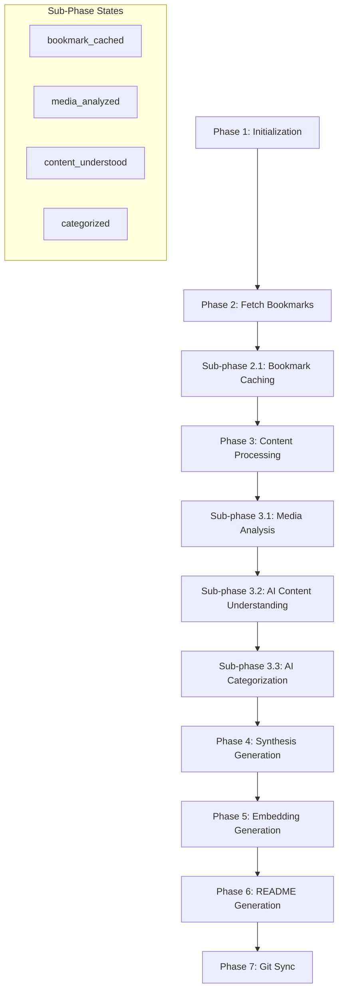

# Seven-Phase Pipeline Architecture

This document defines the architecture and implementation patterns for the seven-phase Twitter/X bookmark processing pipeline.

## Pipeline Overview

The seven-phase pipeline systematically transforms Twitter/X bookmarks into a comprehensive knowledge base through controlled, testable phases with intelligent processing logic.

### Phase Architecture



## Phase Definitions

### Phase 1: Initialization
**Purpose**: System setup, configuration validation, environment preparation

**Implementation Pattern**:
```python
@celery_app.task(bind=True, base=BaseTask)
def phase_1_initialization(self: Task, config: Dict[str, Any]) -> Dict[str, Any]:
    """Phase 1: Initialize system and validate configuration."""
    self.update_state(
        state="PROGRESS",
        meta={"phase": "1", "message": "Initializing system components"}
    )
    
    try:
        # Validate AI model configurations
        await validate_ai_models()
        
        # Check database connectivity
        await validate_database_connection()
        
        # Verify Twitter/X API credentials
        await validate_twitter_api()
        
        # Initialize vector database
        await initialize_vector_store()
        
        return {
            "phase": "1",
            "status": "completed",
            "message": "System initialization completed successfully"
        }
    except Exception as e:
        self.update_state(
            state="FAILURE",
            meta={"phase": "1", "error": str(e)}
        )
        raise
```

**Validation Requirements**:
- AI model availability and capability validation
- Database schema verification
- Twitter/X API authentication
- Vector store connectivity
- File system permissions

### Phase 2: Fetch Bookmarks
**Purpose**: Retrieve bookmarks from Twitter/X API

**Implementation Pattern**:
```python
@celery_app.task(bind=True, base=BaseTask)
def phase_2_fetch_bookmarks(self: Task, config: Dict[str, Any]) -> Dict[str, Any]:
    """Phase 2: Fetch bookmarks from Twitter/X API."""
    self.update_state(
        state="PROGRESS",
        meta={"phase": "2", "message": "Fetching bookmarks from Twitter/X API"}
    )
    
    try:
        # Fetch bookmarks using Twitter/X API
        bookmarks = await twitter_client.fetch_bookmarks(
            bookmark_url=config.get("bookmark_url"),
            max_results=config.get("max_results", 100)
        )
        
        # Store new bookmarks in database
        new_bookmarks = []
        updated_bookmarks = []
        
        for bookmark in bookmarks:
            existing = await content_repo.get_by_tweet_id(bookmark["tweet_id"])
            if existing:
                if has_engagement_changed(existing, bookmark):
                    update_engagement_metrics(existing, bookmark)
                    await content_repo.update(existing)
                    updated_bookmarks.append(existing.id)
            else:
                content_item = create_content_item_from_bookmark(bookmark)
                await content_repo.create(content_item)
                new_bookmarks.append(content_item.id)
        
        # Trigger sub-phase 2.1
        if new_bookmarks or updated_bookmarks:
            phase_2_1_bookmark_caching.delay(new_bookmarks + updated_bookmarks)
        
        return {
            "phase": "2",
            "status": "completed",
            "bookmarks_fetched": len(bookmarks),
            "new_bookmarks": len(new_bookmarks),
            "updated_bookmarks": len(updated_bookmarks)
        }
    except Exception as e:
        self.update_state(
            state="FAILURE",
            meta={"phase": "2", "error": str(e)}
        )
        raise
```

#### Sub-phase 2.1: Bookmark Caching
**Purpose**: Thread detection, media caching, ground-truth data storage

**Implementation Pattern**:
```python
@celery_app.task(bind=True, base=BaseTask)
def phase_2_1_bookmark_caching(self: Task, content_ids: List[str]) -> Dict[str, Any]:
    """Sub-phase 2.1: Cache bookmark content and detect threads."""
    self.update_state(
        state="PROGRESS",
        meta={"phase": "2.1", "sub_phase": "bookmark_caching"}
    )
    
    try:
        threads_detected = 0
        media_cached = 0
        
        for content_id in content_ids:
            content_item = await content_repo.get(content_id)
            
            # Detect thread information
            thread_info = await thread_detector.detect_thread(
                tweet_id=content_item.tweet_id,
                author_id=content_item.author_id
            )
            
            if thread_info:
                content_item.thread_id = thread_info["thread_id"]
                content_item.is_thread_root = thread_info["is_root"]
                content_item.position_in_thread = thread_info["position"]
                content_item.thread_length = thread_info["length"]
                
                if thread_info["is_root"]:
                    threads_detected += 1
            
            # Cache media content
            if content_item.media_content:
                cached_media = await media_cache.cache_media_list(
                    media_list=content_item.media_content,
                    content_id=content_item.id
                )
                content_item.media_content = cached_media
                media_cached += len(cached_media)
            
            # Mark as cached
            content_item.bookmark_cached = True
            content_item.processing_state = "cached"
            await content_repo.update(content_item)
        
        return {
            "phase": "2.1",
            "sub_phase": "bookmark_caching",
            "status": "completed",
            "items_processed": len(content_ids),
            "threads_detected": threads_detected,
            "media_cached": media_cached
        }
    except Exception as e:
        self.update_state(
            state="FAILURE",
            meta={"phase": "2.1", "sub_phase": "bookmark_caching", "error": str(e)}
        )
        raise
```

### Phase 3: Content Processing
**Purpose**: Multi-stage AI analysis with three sub-phases

#### Sub-phase 3.1: Media Analysis
**Purpose**: Vision model analysis of images/videos

**Implementation Pattern**:
```python
@celery_app.task(bind=True, base=BaseTask)
def phase_3_1_media_analysis(self: Task, content_ids: List[str]) -> Dict[str, Any]:
    """Sub-phase 3.1: Analyze media content using vision models."""
    self.update_state(
        state="PROGRESS",
        meta={"phase": "3.1", "sub_phase": "media_analysis"}
    )
    
    try:
        items_analyzed = 0
        media_items_processed = 0
        
        for content_id in content_ids:
            content_item = await content_repo.get(content_id)
            
            # Skip if no media or already analyzed
            if not content_item.media_content or content_item.media_analyzed:
                continue
            
            # Get vision model
            backend, model, params = await model_router.resolve(ModelPhase.vision)
            
            # Analyze each media item
            media_analyses = []
            for media_item in content_item.media_content:
                prompt = xml_prompts.build_media_analysis_prompt(
                    media_item=media_item,
                    tweet_context=content_item.content
                )
                
                analysis = await backend.generate_text(prompt, model=model, **params)
                media_analyses.append({
                    'media_id': media_item['id'],
                    'analysis': analysis,
                    'model_used': model
                })
                media_items_processed += 1
            
            # Store results
            content_item.media_analysis_results = media_analyses
            content_item.vision_model_used = model
            content_item.media_analyzed = True
            await content_repo.update(content_item)
            items_analyzed += 1
        
        return {
            "phase": "3.1",
            "sub_phase": "media_analysis",
            "status": "completed",
            "items_analyzed": items_analyzed,
            "media_items_processed": media_items_processed
        }
    except Exception as e:
        self.update_state(
            state="FAILURE",
            meta={"phase": "3.1", "sub_phase": "media_analysis", "error": str(e)}
        )
        raise
```

#### Sub-phase 3.2: AI Content Understanding
**Purpose**: Generate collective understanding of bookmark content

**Implementation Pattern**:
```python
@celery_app.task(bind=True, base=BaseTask)
def phase_3_2_ai_content_understanding(self: Task, content_ids: List[str]) -> Dict[str, Any]:
    """Sub-phase 3.2: Generate collective understanding of content."""
    self.update_state(
        state="PROGRESS",
        meta={"phase": "3.2", "sub_phase": "ai_content_understanding"}
    )
    
    try:
        items_processed = 0
        
        for content_id in content_ids:
            content_item = await content_repo.get(content_id)
            
            # Skip if already processed
            if content_item.content_understood:
                continue
            
            # Get knowledge generation model
            backend, model, params = await model_router.resolve(ModelPhase.kb_generation)
            
            # Build understanding prompt with media analysis if available
            media_analysis = None
            if content_item.media_analysis_results:
                media_analysis = extract_media_analysis_text(content_item.media_analysis_results)
            
            prompt = xml_prompts.build_content_understanding_prompt(
                content=content_item.content,
                media_analysis=media_analysis,
                thread_context=await get_thread_context(content_item) if content_item.thread_id else None
            )
            
            understanding = await backend.generate_text(prompt, model=model, **params)
            
            # Store results
            content_item.collective_understanding = understanding
            content_item.understanding_model_used = model
            content_item.content_understood = True
            content_item.has_collective_understanding = True
            await content_repo.update(content_item)
            items_processed += 1
        
        return {
            "phase": "3.2",
            "sub_phase": "ai_content_understanding",
            "status": "completed",
            "items_processed": items_processed
        }
    except Exception as e:
        self.update_state(
            state="FAILURE",
            meta={"phase": "3.2", "sub_phase": "ai_content_understanding", "error": str(e)}
        )
        raise
```

#### Sub-phase 3.3: AI Categorization
**Purpose**: Generate categories and sub-categories with existing category intelligence

**Implementation Pattern**:
```python
@celery_app.task(bind=True, base=BaseTask)
def phase_3_3_ai_categorization(self: Task, content_ids: List[str]) -> Dict[str, Any]:
    """Sub-phase 3.3: Categorize content with AI intelligence."""
    self.update_state(
        state="PROGRESS",
        meta={"phase": "3.3", "sub_phase": "ai_categorization"}
    )
    
    try:
        items_categorized = 0
        new_categories_created = 0
        existing_categories_used = 0
        
        # Get existing categories for intelligence
        existing_categories = await category_service.get_category_intelligence()
        
        for content_id in content_ids:
            content_item = await content_repo.get(content_id)
            
            # Skip if already categorized
            if content_item.categorized:
                continue
            
            # Get knowledge generation model
            backend, model, params = await model_router.resolve(ModelPhase.kb_generation)
            
            # Build categorization prompt with existing category intelligence
            prompt = xml_prompts.build_categorization_prompt(
                content=content_item.content,
                collective_understanding=content_item.collective_understanding,
                existing_categories=existing_categories
            )
            
            categorization = await backend.generate_text(prompt, model=model, **params)
            category_data = parse_categorization_response(categorization)
            
            # Check if category exists or create new one
            main_category = await category_service.get_or_create_category(
                category_data["main_category"]
            )
            
            if main_category.is_new:
                new_categories_created += 1
            else:
                existing_categories_used += 1
            
            # Store categorization results
            content_item.main_category = main_category.name
            content_item.sub_category = category_data.get("sub_category")
            content_item.categorization_model_used = model
            content_item.categorized = True
            await content_repo.update(content_item)
            items_categorized += 1
        
        return {
            "phase": "3.3",
            "sub_phase": "ai_categorization",
            "status": "completed",
            "items_categorized": items_categorized,
            "new_categories_created": new_categories_created,
            "existing_categories_used": existing_categories_used
        }
    except Exception as e:
        self.update_state(
            state="FAILURE",
            meta={"phase": "3.3", "sub_phase": "ai_categorization", "error": str(e)}
        )
        raise
```

## Intelligent Processing Logic

### 1. Dependency Validation
Each phase validates its dependencies before execution:

```python
class PhaseValidator:
    async def validate_phase_dependencies(self, phase: int) -> ValidationResult:
        """Validate that all dependencies for a phase are met."""
        if phase == 3:  # Content Processing
            # Check that Phase 2 is complete
            incomplete_bookmarks = await content_repo.count_incomplete_bookmarks()
            if incomplete_bookmarks > 0:
                return ValidationResult(
                    valid=False,
                    message=f"{incomplete_bookmarks} bookmarks not cached from Phase 2"
                )
        
        elif phase == 4:  # Synthesis Generation
            # Check that Phase 3 sub-phases are complete
            uncategorized_items = await content_repo.count_uncategorized_items()
            if uncategorized_items > 0:
                return ValidationResult(
                    valid=False,
                    message=f"{uncategorized_items} items not categorized from Phase 3"
                )
        
        return ValidationResult(valid=True)
```

### 2. Incremental Processing
Avoid reprocessing unchanged content:

```python
class IncrementalProcessor:
    async def get_items_needing_processing(self, phase: str, sub_phase: Optional[str] = None) -> List[str]:
        """Get content items that need processing for a specific phase/sub-phase."""
        if phase == "3.1":  # Media Analysis
            return await content_repo.get_items_needing_media_analysis()
        elif phase == "3.2":  # Content Understanding
            return await content_repo.get_items_needing_understanding()
        elif phase == "3.3":  # Categorization
            return await content_repo.get_items_needing_categorization()
        
        return []
    
    async def should_reprocess_item(self, content_id: str, phase: str, force: bool = False) -> bool:
        """Determine if an item should be reprocessed."""
        if force:
            return True
        
        content_item = await content_repo.get(content_id)
        
        # Check if content has changed since last processing
        if phase == "3.1" and content_item.media_analyzed:
            return content_item.updated_at > content_item.media_analysis_timestamp
        elif phase == "3.2" and content_item.content_understood:
            return content_item.updated_at > content_item.understanding_timestamp
        elif phase == "3.3" and content_item.categorized:
            return content_item.updated_at > content_item.categorization_timestamp
        
        return True
```

### 3. Error Recovery and Rollback
Handle failures gracefully with rollback capabilities:

```python
class PhaseErrorHandler:
    async def handle_phase_failure(self, phase: int, sub_phase: Optional[str], error: Exception):
        """Handle phase failure with appropriate recovery actions."""
        error_info = {
            "phase": phase,
            "sub_phase": sub_phase,
            "error": str(error),
            "timestamp": datetime.utcnow(),
            "recovery_actions": []
        }
        
        if phase == 3 and sub_phase == "3.1":  # Media Analysis failure
            # Reset media_analyzed flags for failed items
            await content_repo.reset_media_analysis_flags()
            error_info["recovery_actions"].append("Reset media analysis flags")
        
        elif phase == 3 and sub_phase == "3.2":  # Content Understanding failure
            # Reset content_understood flags for failed items
            await content_repo.reset_understanding_flags()
            error_info["recovery_actions"].append("Reset content understanding flags")
        
        # Log error for monitoring
        await error_logger.log_phase_error(error_info)
        
        # Send notification to administrators
        await notification_service.send_phase_failure_alert(error_info)
```

## Command-Line Testing Support

### 1. CLI Phase Execution
```bash
# Execute specific phase
python cli_test_phases.py --phase 2 --config '{"max_results": 50}'

# Execute sub-phase
python cli_test_phases.py --phase 3 --sub-phase 1 --content-ids "id1,id2,id3"

# Force reprocessing
python cli_test_phases.py --phase 3 --force-reprocess

# Get phase status
python cli_test_phases.py --status --phase 2
```

### 2. CLI Implementation Pattern
```python
class CLIPhaseRunner:
    async def execute_phase_cli(self, phase: int, sub_phase: Optional[int] = None, **kwargs):
        """Execute phase from command line with proper logging."""
        print(f"Starting Phase {phase}" + (f".{sub_phase}" if sub_phase else ""))
        
        try:
            if phase == 2:
                if sub_phase == 1:
                    result = await self.execute_bookmark_caching(**kwargs)
                else:
                    result = await self.execute_fetch_bookmarks(**kwargs)
            elif phase == 3:
                if sub_phase == 1:
                    result = await self.execute_media_analysis(**kwargs)
                elif sub_phase == 2:
                    result = await self.execute_content_understanding(**kwargs)
                elif sub_phase == 3:
                    result = await self.execute_categorization(**kwargs)
                else:
                    result = await self.execute_content_processing(**kwargs)
            
            print(f"✅ Phase {phase}" + (f".{sub_phase}" if sub_phase else "") + " completed successfully")
            print(f"Result: {json.dumps(result, indent=2)}")
            
        except Exception as e:
            print(f"❌ Phase {phase}" + (f".{sub_phase}" if sub_phase else "") + f" failed: {str(e)}")
            raise
```

## Performance and Monitoring

### 1. Phase Metrics Collection
```python
class PhaseMetrics:
    async def record_phase_execution(self, phase: int, sub_phase: Optional[str], duration: float, items_processed: int):
        """Record phase execution metrics."""
        await metrics_service.record_histogram(
            "phase_execution_duration_seconds",
            duration,
            tags={"phase": str(phase), "sub_phase": sub_phase or "main"}
        )
        
        await metrics_service.increment_counter(
            "phase_executions_total",
            tags={"phase": str(phase), "sub_phase": sub_phase or "main", "status": "success"}
        )
        
        await metrics_service.record_gauge(
            "phase_items_processed",
            items_processed,
            tags={"phase": str(phase), "sub_phase": sub_phase or "main"}
        )
```

### 2. Real-time Progress Updates
```python
class PhaseProgressTracker:
    async def update_phase_progress(self, phase: int, sub_phase: Optional[str], progress: float, message: str):
        """Update phase progress and broadcast to WebSocket clients."""
        progress_data = {
            "phase": phase,
            "sub_phase": sub_phase,
            "progress": progress,
            "message": message,
            "timestamp": datetime.utcnow().isoformat()
        }
        
        # Update database
        await pipeline_status_repo.update_phase_progress(phase, sub_phase, progress_data)
        
        # Broadcast to WebSocket clients
        await websocket_manager.broadcast_phase_progress(progress_data)
        
        # Update Celery task state
        if hasattr(self, 'task'):
            self.task.update_state(state="PROGRESS", meta=progress_data)
```

This seven-phase pipeline architecture provides a robust, testable, and scalable foundation for processing Twitter/X bookmarks into a comprehensive knowledge base system.