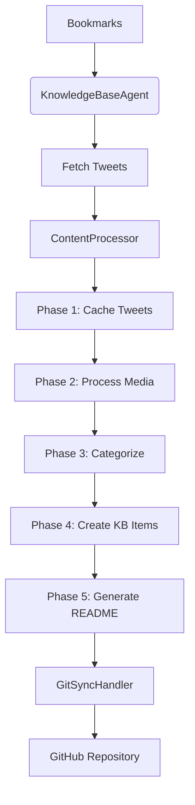

# Knowledge Base Agent 🤖📚

An intelligent, AI-powered agent designed to automatically build and
maintain a structured technical knowledge base from Twitter/X bookmarks.
The agent fetches tweets, processes their content using advanced AI
models, organizes them into a hierarchical Markdown-based repository,
and synchronizes the output with GitHub for version control and
collaboration.

------------------------------------------------------------------------

## Key Features ✨

### Automated Content Processing

-   **AI-Driven Analysis**: Leverages Ollama models for text
    categorization and media description generation.
-   **Media Handling**: Downloads and processes images, generating
    descriptive captions using vision models.
-   **Tweet Processing**: Extracts text, media, and metadata from
    Twitter/X bookmarks for structured storage.

### Intelligent Organization

-   **Hierarchical Structure**: Organizes content into a two-level
    category system (e.g., `programming/python`).
-   **Dynamic Categorization**: Uses AI to suggest and validate
    categories based on content.
-   **Centralized Index**: Automatically generates a root `README.md`
    with navigation and summaries.

### Enterprise-Grade Operations

-   **State Management**: Tracks processing state with atomic file
    operations for reliability.
-   **GitHub Sync**: Commits changes to a GitHub repository with
    customizable commit messages.
-   **Error Resilience**: Implements retries, logging, and recovery
    mechanisms for robust operation.

### Advanced Capabilities

-   **Processing Stats**: Tracks metrics like tweets processed, media
    items handled, and errors encountered.
-   **Idempotency**: Caches tweet data to avoid redundant processing.
-   **Markdown Generation**: Produces clean, semantic Markdown files
    with links and media references.

------------------------------------------------------------------------

## Core Functionality

### 1. Bookmark Ingestion

-   Fetches Twitter/X bookmarks using Playwright for headless browser
    automation.
-   Parses tweet URLs and IDs, caching data to avoid reprocessing.

### 2. Content Extraction & Processing

-   Extracts tweet text, metadata, and media (images).
-   Uses AI models (e.g., LLaVA for vision, Mistral for text) to analyze
    content.
-   Generates summaries and descriptions for inclusion in the knowledge
    base.

### 3. Knowledge Organization

-   Categorizes content into main categories and subcategories using
    AI-driven analysis.
-   Creates a directory structure:
    `KNOWLEDGE_BASE_DIR/<main_category>/<sub_category>/<item_name>`.
-   Writes Markdown files (`README.md` or `content.md`) with processed
    content and media.

### 4. Index Generation

-   Builds a root `README.md` with:

-   -   Overview statistics (total items, categories, media).
    -   Navigation links to categories and subcategories.
    -   Recent updates and detailed category tables.

### 5. Synchronization

-   Commits changes to a GitHub repository for version control and
    sharing.

------------------------------------------------------------------------

## Technical Requirements

### Prerequisites

-   **Python**: 3.8 or higher.
-   **Ollama**: For AI inference (text and vision models).
-   **Playwright**: For fetching Twitter/X bookmarks via headless
    browser.
-   **Git**: For repository synchronization.

### Core Dependencies

Listed in `requirements.txt`:

-   `aiofiles`: Asynchronous file operations.
-   `playwright`: Web scraping and automation.
-   `pathlib`: File system path handling.
-   Additional libraries for HTTP requests, logging, and JSON handling.

------------------------------------------------------------------------

## Installation

1.  **Clone the Repository**:

        git clone https://github.com/yourusername/knowledge-base-agent.git
        cd knowledge-base-agent

2.  **Install Dependencies**:

        python -m pip install -r requirements.txt
        python -m playwright install

3.  **Set Up Ollama**:
    -   Install Ollama (see [Ollama documentation](https://ollama.ai/)).

    -   Ensure the text model (e.g., `llama3.3:70b-instruct-q4_0`) and
        vision model (e.g., `llava:latest`) are pulled:

            ollama pull llama3.3:70b-instruct-q4_0
            ollama pull llava:latest

4.  **Configure Environment Variables**:
    -   Create a `.env` file in the project root (see [Environment
        Variables](#environment-variables) below).

    -   Example `.env`:

            OLLAMA_URL=http://localhost:11434
            TEXT_MODEL=llama3.3:70b-instruct-q4_0
            VISION_MODEL=llava:latest
            GITHUB_TOKEN=your_personal_access_token
            GITHUB_REPO_URL=https://github.com/yourusername/your-knowledge-base.git
            KNOWLEDGE_BASE_DIR=kb-generated

------------------------------------------------------------------------

## Usage

### Running the Agent

Run the agent interactively:

    python -m knowledge_base_agent.main

-   **Prompts**:
    -   \"Fetch new bookmarks? (y/n)\": Updates bookmarks if `y`.
    -   \"Re-review previously processed tweets? (y/n)\": Reprocesses
        cached tweets if `y`.
-   **Output**: Logs processing steps and a summary of results.

### Example Workflow

1.  Start Ollama server:

        ollama serve

2.  Run the agent:

        python -m knowledge_base_agent.main

3.  Respond to prompts (e.g., `n` for no bookmarks update, `n` for no
    reprocessing).

4.  Check `KNOWLEDGE_BASE_DIR` for generated Markdown files and GitHub
    for synced changes.

------------------------------------------------------------------------

## Environment Variables

### Required Variables

  Variable            Description                                 Example Value
  ------------------- ------------------------------------------- ------------------------------------
  `OLLAMA_URL`        URL of the Ollama server for AI inference   `http://localhost:11434`
  `GITHUB_TOKEN`      GitHub Personal Access Token for sync       `ghp_yourtoken`
  `GITHUB_REPO_URL`   URL of the target GitHub repository         `https://github.com/user/repo.git`

### Optional Variables

  Variable                    Description                                 Default Value                    Usage
  --------------------------- ------------------------------------------- -------------------------------- ---------------------------------------
  `TEXT_MODEL`                Ollama text model for categorization        `mistral:latest`                 Text analysis and Markdown generation
  `VISION_MODEL`              Ollama vision model for media description   `llava:latest`                   Image analysis
  `KNOWLEDGE_BASE_DIR`        Directory for generated knowledge base      `kb-generated`                   Output location for Markdown files
  `DATA_PROCESSING_DIR`       Directory for temporary processing files    `data`                           Cache and state storage
  `MEDIA_CACHE_DIR`           Directory for downloaded media              `data/media_cache`               Media storage
  `PROCESSED_TWEETS_FILE`     File for tracking processed tweets          `data/processed_tweets.json`     State management
  `UNPROCESSED_TWEETS_FILE`   File for unprocessed tweet IDs              `data/unprocessed_tweets.json`   State management
  `TWEET_CACHE_FILE`          File for cached tweet data                  `data/tweet_cache.json`          Caching for efficiency
  `BOOKMARKS_FILE`            File for storing fetched bookmarks          `data/bookmarks.json`            Bookmark storage
  `LOG_FILE`                  Log file location                           `logs/kb_agent.log`              Detailed logging
  `GITHUB_USER_NAME`          GitHub username for commit authorship       None (required if syncing)       Git commit metadata
  `GITHUB_USER_EMAIL`         GitHub email for commit authorship          None (required if syncing)       Git commit metadata
  `REGENERATE_ROOT_README`    Force regeneration of root README           `false`                          Triggers README rebuild
  `REPROCESS_MEDIA`           Reprocess media even if cached              `false`                          Forces media reanalysis
  `REPROCESS_CATEGORIES`      Reprocess categories even if cached         `false`                          Forces recategorization
  `REPROCESS_KB_ITEMS`        Rebuild KB items even if created            `false`                          Forces KB item regeneration
  `FORCE_UPDATE`              Force update of cached tweets               `false`                          Overrides cache for tweet data
  `MAX_CONTENT_LENGTH`        Max length for processed content            `5000`                           Limits content size in Markdown
  `BATCH_SIZE`                Number of tweets processed per batch        `1`                              Controls processing concurrency
  `SYNC_TO_GITHUB`            Enable GitHub synchronization               `true`                           Toggles GitHub sync

### Notes

-   Variables are loaded via the `Config` class in `config.py` (assumed
    based on your code structure).
-   Missing required variables will raise errors during initialization.

------------------------------------------------------------------------

## Architecture

### Core Components

-   **`KnowledgeBaseAgent`**: Orchestrates the pipeline, managing
    initialization, processing, and syncing.
-   **`ContentProcessor`**: Executes the five-phase processing pipeline
    (cache, media, categories, KB creation, README generation).
-   **`StateManager`**: Tracks processed/unprocessed tweets and caches
    data atomically.
-   **`CategoryManager`**: Manages category hierarchy and validation.
-   **`MarkdownWriter`**: Writes Markdown files for tweets and KB items.
-   **`HTTPClient`**: Interfaces with Ollama for AI inference.
-   **`GitSyncHandler`**: Handles GitHub repository synchronization.
-   **`BookmarksFetcher`**: Uses Playwright to fetch Twitter/X
    bookmarks.

### Processing Pipeline

1.  **Tweet Cache Initialization**: Fetches and caches tweet data.
2.  **Media Processing**: Downloads and analyzes images.
3.  **Category Processing**: Assigns categories using AI.
4.  **Knowledge Base Creation**: Generates Markdown files and
    directories.
5.  **README Generation**: Updates the root `README.md`.

### Flow Diagram

------------------------------------------------------------------------

## Knowledge Base Structure

    kb-generated/
    ├── README.md              # Root index with navigation
    ├── programming/           # Main category
    │   ├── python/            # Subcategory
    │   │   ├── cool-script/   # Item
    │   │   │   ├── README.md  # Item content
    │   │   │   └── image_1.jpg# Media file
    │   │   └── another-topic/
    │   └── javascript/
    └── machine_learning/

------------------------------------------------------------------------

## Configuration Details

### Example `.env`

    OLLAMA_URL=http://localhost:11434
    TEXT_MODEL=llama3.3:70b-instruct-q4_0
    VISION_MODEL=llava:latest
    GITHUB_TOKEN=ghp_yourtoken
    GITHUB_USER_NAME=yourusername
    GITHUB_USER_EMAIL=your@email.com
    GITHUB_REPO_URL=https://github.com/yourusername/your-knowledge-base.git
    KNOWLEDGE_BASE_DIR=kb-generated
    DATA_PROCESSING_DIR=data
    SYNC_TO_GITHUB=true
    REGENERATE_ROOT_README=true

### Customizing Categories

Modify categorization logic in `CategoryManager` or provide a
`categories.json` (if implemented) to define custom categories.

------------------------------------------------------------------------

## Advanced Usage

### Force Regeneration

-   Set `REGENERATE_ROOT_README=true` to rebuild the root README.
-   Use `REPROCESS_*` flags to reprocess specific components.

### Maintenance Commands

While not explicitly coded as CLI commands, you can simulate these via
environment variables:

    # Regenerate README
    REGENERATE_ROOT_README=true python -m knowledge_base_agent.main

    # Reprocess all tweets
    FORCE_UPDATE=true python -m knowledge_base_agent.main

------------------------------------------------------------------------

## Error Handling & Recovery

-   **Retries**: HTTPClient retries failed requests (max 5 attempts,
    500s timeout).
-   **Logging**: Detailed logs in `LOG_FILE` (e.g.,
    `logs/kb_agent.log`).
-   **State Recovery**: Atomic writes prevent partial state corruption.
-   **Manual Reset**: Delete `PROCESSED_TWEETS_FILE` or
    `TWEET_CACHE_FILE` to reset state (backup first!).

------------------------------------------------------------------------

## Security Considerations

-   **Secrets**: Store sensitive data (e.g., `GITHUB_TOKEN`) in `.env`,
    excluded from Git via `.gitignore`.
-   **Sanitization**: Markdown cells escape special characters; media
    files are validated for type.
-   **Permissions**: Ensure write access to `KNOWLEDGE_BASE_DIR` and
    `DATA_PROCESSING_DIR`.

------------------------------------------------------------------------

## Contributing

1.  Fork the repository.
2.  Create a feature branch: `git checkout -b feature/your-feature`.
3.  Make changes, adhering to PEP 8 and adding tests.
4.  Run tests: `pytest` (if tests exist).
5.  Submit a pull request with a clear description.

------------------------------------------------------------------------

## License

MIT License - see [LICENSE](LICENSE) file for details.

------------------------------------------------------------------------

## Acknowledgments

-   **Ollama**: Powers text and vision AI capabilities.
-   **Playwright**: Enables robust bookmark fetching.
-   **xAI**: Inspiration for this agent (Grok 3 context).