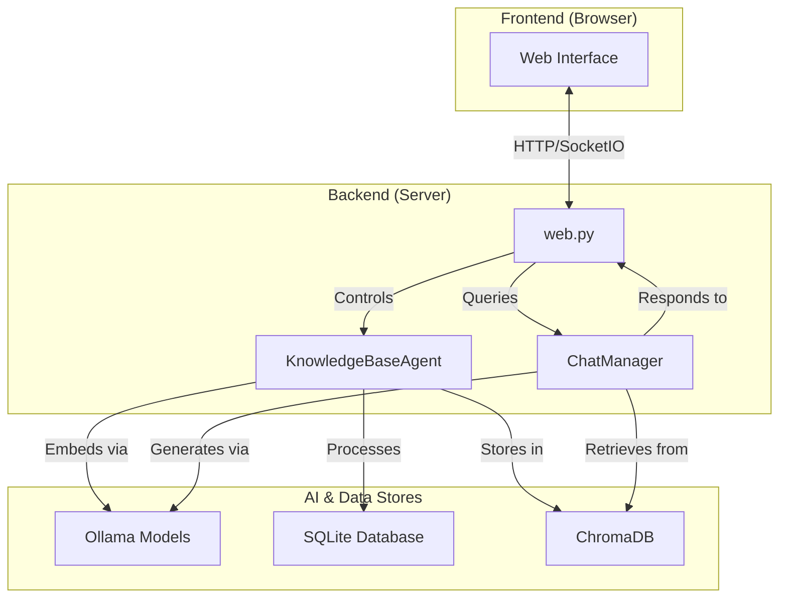

# Knowledge Base Agent 🤖📚

An intelligent, AI-powered agent designed to automatically build, maintain, and interact with a structured technical knowledge base from Twitter/X bookmarks. The agent features a dynamic, single-page web interface to control the processing pipeline, view logs, and chat with your generated knowledge base using a Retrieval-Augmented Generation (RAG) model.

------------------------------------------------------------------------

## Key Features ✨

-   **Single-Page Web UI**: A modern, responsive web interface for controlling the agent, monitoring its status in real-time, viewing generated content, and interacting with the chat. Built with Flask, SocketIO, and a dynamic AJAX-driven frontend.
-   **Conversational AI Chat (RAG)**: Ask questions about your knowledge base in natural language. The agent uses a RAG pipeline with ChromaDB and Ollama to provide contextually accurate answers based on your documents.
-   **Automated Content Pipeline**: Fetches Twitter/X bookmarks, processes text and media, and generates structured, categorized Markdown articles.
-   **AI-Driven Analysis**: Leverages local Ollama models for content categorization, media description, knowledge extraction, and synthesis.
-   **Pluggable Processing Phases**: Control the agent's workflow with toggleable phases, including fetching, content processing, synthesis, embedding generation, and Git synchronization.
-   **Synthesis Generation**: Automatically creates high-level synthesis documents that consolidate insights from multiple knowledge base items within a subcategory.
-   **Vector Search**: Generates and stores embeddings for all content in a ChromaDB vector database, enabling powerful semantic search for the RAG pipeline.

------------------------------------------------------------------------

## Core Functionality

1.  **Bookmark Ingestion**: Fetches Twitter/X bookmarks using Playwright for headless browser automation, parsing tweet URLs and IDs.
2.  **Content Processing**: A multi-phase pipeline that:
    -   **Caches** tweet data.
    -   **Processes Media**: Downloads images and generates descriptions with vision models.
    -   **Categorizes**: Uses LLMs to assign a main category and subcategory.
    -   **Generates KB Items**: Creates detailed Markdown articles from tweet content.
    -   **Syncs to Database**: Saves all generated content and metadata to a local SQLite database.
3.  **Synthesis Generation**: Analyzes all items within a category to generate a consolidated summary document.
4.  **Embedding Generation**: Creates vector embeddings for all knowledge base items and syntheses using a configurable embedding model and stores them in ChromaDB.
5.  **Conversational RAG**: The `ChatManager` uses the generated embeddings to retrieve relevant context from the vector store and generate informed answers to user queries via an LLM.
6.  **Git Synchronization**: Automatically commits the generated knowledge base to a GitHub repository for version control and sharing.

------------------------------------------------------------------------

## Technical Requirements

-   **Python**: 3.8 or higher.
-   **Ollama**: For local AI model inference (text, vision, and embedding models).
-   **Playwright**: For fetching Twitter/X bookmarks.
-   **Git**: For repository synchronization.
-   **Node.js/npm**: For installing frontend dependencies (if any are added).

### Core Dependencies

Listed in `requirements.txt`. Key libraries include:
-   `flask` & `flask-socketio`: Web framework and real-time communication.
-   `sqlalchemy`: Database ORM.
-   `pydantic`: Configuration management.
-   `chromadb`: Vector store for RAG.
-   `playwright`: Web automation.
-   `requests`, `aiohttp`: HTTP clients.

------------------------------------------------------------------------

## Installation

1.  **Clone the Repository**:
    ```bash
    git clone https://github.com/yourusername/knowledge-base-agent.git
    cd knowledge-base-agent
    ```

2.  **Set up Python Environment & Install Dependencies**:
    ```bash
    python3 -m venv venv
    source venv/bin/activate
    pip install -r requirements.txt
    playwright install
    ```

3.  **Set Up Ollama**:
    -   Install Ollama (see [Ollama documentation](https://ollama.ai/)).
    -   Pull the required models. The defaults are configured in your `.env` file. For example:
        ```bash
        ollama pull llama3.1:70b-instruct-q4_0  # Text/Chat Model
        ollama pull mxbai-embed-large           # Embedding Model
        ollama pull llava:latest                # Vision Model
        ```

4.  **Configure Environment Variables**:
    -   Copy the `.env.example` file to `.env` and customize it with your settings.
        ```bash
        cp .env.example .env
        ```
    -   Update the variables in the `.env` file, especially `OLLAMA_URL`, `GITHUB_TOKEN`, and `GITHUB_REPO_URL`.

------------------------------------------------------------------------

## Usage

### Running the Agent Web UI

The primary way to use the agent is through its web interface.

1.  **Start the Ollama Server** (in a separate terminal):
    ```bash
    ollama serve
    ```

2.  **Launch the Web Application**:
    ```bash
    # Option 1: Direct module execution
    python -m knowledge_base_agent.web
    
    # Option 2: Using virtual environment (recommended)
    venv/bin/python -m knowledge_base_agent.web
    
    # Option 3: Using systemctl (if configured)
    systemctl restart knowledge-base-agent
    ```

3.  **Access the UI**:
    -   Open your web browser and navigate to `http://localhost:5000`.
    -   From the "Agent Control" dashboard, you can select which processing phases to run and click "Run Agent".
    -   Use the sidebar to navigate to the "Chat" page to interact with your knowledge base, or to "View Past Logs".

------------------------------------------------------------------------

## Environment Variables

Create a `.env` file in the project root to configure the agent.

### Core Configuration

| Variable              | Description                                                              | Example Value                                  |
| --------------------- | ------------------------------------------------------------------------ | ---------------------------------------------- |
| `OLLAMA_URL`          | URL of the Ollama server for AI inference.                               | `http://localhost:11434`                       |
| `TEXT_MODEL`          | Default text model for categorization and content generation.            | `llama3.1:70b-instruct-q4_0`                   |
| `VISION_MODEL`        | Vision model for generating image descriptions.                          | `llava:latest`                                 |
| `CHAT_MODEL`          | The model used for the conversational RAG chat.                          | `llama3.1:70b-instruct-q4_0`                   |
| `EMBEDDING_MODEL`     | The model used to generate embeddings for the vector store.              | `mxbai-embed-large`                            |
| `KNOWLEDGE_BASE_DIR`  | Directory for the generated Markdown knowledge base.                     | `kb-generated`                                 |

### GitHub Synchronization (Optional)

| Variable              | Description                                        | Example Value                                |
| --------------------- | -------------------------------------------------- | -------------------------------------------- |
| `SYNC_TO_GITHUB`      | Set to `true` to enable GitHub synchronization.    | `true`                                       |
| `GITHUB_TOKEN`        | GitHub Personal Access Token for repository push.  | `ghp_yourtoken`                              |
| `GITHUB_REPO_URL`     | URL of the target GitHub repository.               | `https://github.com/user/your-kb-repo.git`   |
| `GITHUB_USER_NAME`    | GitHub username for commit authorship.             | `yourusername`                               |
| `GITHUB_USER_EMAIL`   | GitHub email for commit authorship.                | `your@email.com`                             |

------------------------------------------------------------------------

## Architecture

### Core Components

-   **`web.py`**: Flask application server that handles HTTP requests, WebSocket connections (SocketIO), and serves the frontend UI.
-   **`KnowledgeBaseAgent`**: The central orchestrator that manages the processing pipeline based on user preferences from the UI.
-   **`StreamlinedContentProcessor`**: Executes the main content processing phases (caching, media, categorization, etc.).
-   **`ChatManager`**: Manages the RAG pipeline for the conversational AI chat.
-   **`EmbeddingManager`**: Handles embedding generation and interaction with the ChromaDB vector store.
-   **`StateManager`**: Tracks the state of all processed and unprocessed items.
-   **`HTTPClient`**: A robust client for interfacing with the Ollama API.
-   **Frontend (`templates/` & `static/`)**: A set of Jinja2 templates, JavaScript files (`layout.js`, `chat.js`, etc.), and CSS that create the SPA-like user experience.

### Processing Pipeline

The agent's workflow is broken down into distinct, controllable phases:
1.  **Initialization**: Sets up all components.
2.  **Fetch Bookmarks**: Gets the latest bookmarks from Twitter/X.
3.  **Content Processing**: The core multi-step process of creating knowledge base articles.
4.  **Synthesis Generation**: Creates summary documents from existing articles.
5.  **Embedding Generation**: Populates the vector database for semantic search.
6.  **README Generation**: Updates the main README of the knowledge base repository.
7.  **Git Sync**: Pushes all changes to GitHub.

### Flow Diagram



------------------------------------------------------------------------

## Troubleshooting

### Common Issues and Solutions

#### Agent Not Starting / Empty Debug Logs
- **Issue**: Agent process starts but no logs appear, or debug logs are empty
- **Solution**: Check that environment variables `LOG_FILE` and `LOG_DIR` are set correctly in `.env`
- **Debug**: Look for agent debug logs in `logs/agent_debug_[PID].log` and error logs in `logs/agent_error_[PID].log`

#### Chat Widget Not Minimizing
- **Issue**: Chat popup doesn't minimize when clicking the minus button
- **Solution**: This has been fixed in recent updates. Ensure JavaScript is enabled and refresh the page.

#### Past Logs Page Not Loading Log Files
- **Issue**: Logs page shows "Found X log file(s)" but dropdown is empty
- **Solution**: This has been resolved. The page now properly populates the dropdown with available log files.

#### Live Logs Too Cluttered
- **Issue**: Live logs window shows too many GPU stats and debug messages
- **Solution**: Recent updates have filtered out noisy messages. Live logs now only show important INFO+ level messages.

#### Database Shows 0 Knowledge Base Items
- **Issue**: Sidebar shows 0 items even when database has content
- **Solution**: Check that the Flask app is using the correct database path. The system now uses `instance/knowledge_base.db` consistently.

#### Import Errors During Agent Run
- **Issue**: Agent subprocess fails with import errors
- **Solution**: The system now properly configures Python paths in subprocesses. Check `logs/agent_import_error_[PID].log` for details.

### Debug Information

The system creates detailed debug logs in the `logs/` directory:
- `agent_debug_[PID].log`: Full subprocess execution log
- `agent_import_error_[PID].log`: Import failure details
- `agent_error_[PID].log`: Runtime error information
- `web.log`: Main web server log

### Performance Notes

- **GPU Requirements**: The system works best with CUDA-compatible GPUs for faster AI model inference
- **Memory Usage**: LLM processing can be memory-intensive. Monitor system resources during runs
- **Disk Space**: Generated knowledge base and media files can accumulate over time

------------------------------------------------------------------------

## Security Considerations

-   **Secrets**: Store sensitive data (e.g., `GITHUB_TOKEN`) in the `.env` file, which is excluded from Git via `.gitignore`.
-   **File System Access**: The agent writes to the `KNOWLEDGE_BASE_DIR` and `data` directories. Ensure the process has appropriate permissions.
-   **Dependencies**: Regularly audit and update dependencies to patch security vulnerabilities.

------------------------------------------------------------------------

## License

MIT License - see the `LICENSE` file for details.