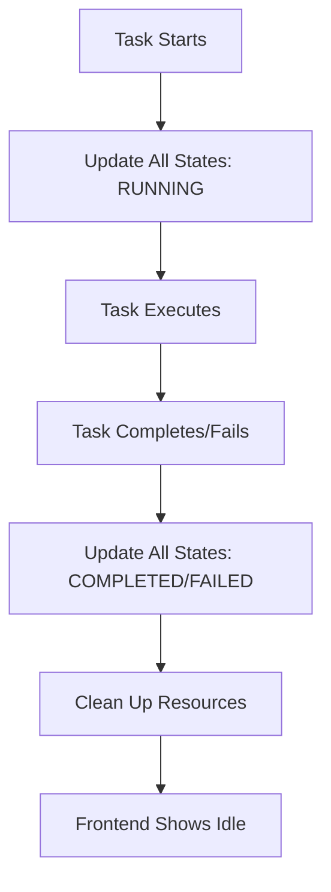
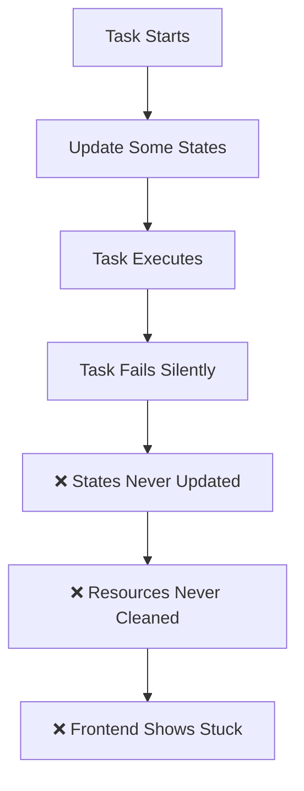
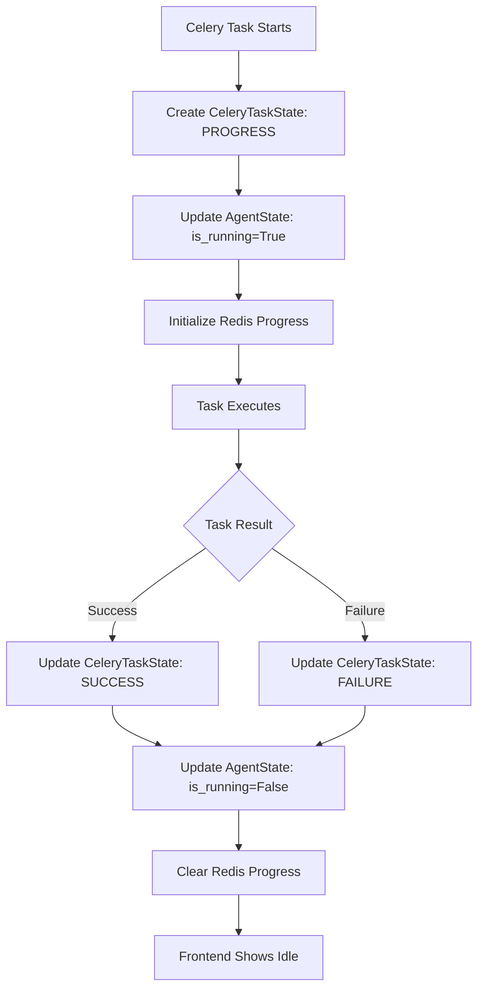

# Stale Task State Management Fixes - Implementation Complete

## 🎯 **Problem Identified**

The Knowledge Base Agent was experiencing **stale state issues** where tasks would appear to be running indefinitely in the frontend, even though no actual Celery worker was processing them. This was caused by **incomplete state management** across multiple disconnected systems.

## 🔍 **Root Cause Analysis**

### **The Issue: Disconnected State Management Systems**

The system had **4 separate state management systems** that weren't properly coordinated:

1. **Celery Task State** (`CeleryTaskState` table) - Often missing or not updated
2. **Agent State** (`AgentState` table) - Never updated on completion/failure  
3. **Redis Progress State** (Redis databases) - Never cleaned up
4. **Agent Internal State** (in-memory) - Lost when worker dies

### **What Should Happen vs. What Actually Happened**

**Expected Flow:**


**Actual Broken Flow:**


## 🛠️ **Comprehensive Fixes Implemented**

### **Fix 1: Enhanced Celery Task State Management**

**File**: `knowledge_base_agent/tasks/agent_tasks.py`

**Changes Made:**
1. **Proper CeleryTaskState Creation**: Task now creates/updates `CeleryTaskState` record on startup
2. **State Coordination**: Links `AgentState` and `CeleryTaskState` properly
3. **Comprehensive Cleanup**: `finally` block ensures all states are cleaned up regardless of success/failure

**Key Code Added:**
```python
# Create or update CeleryTaskState record
celery_task_state = CeleryTaskState.query.filter_by(task_id=task_id).first()
if not celery_task_state:
    celery_task_state = CeleryTaskState(
        task_id=task_id,
        celery_task_id=self.request.id,
        task_type='agent_run',
        status='PROGRESS',
        preferences=preferences_dict,
        created_at=datetime.utcnow(),
        started_at=datetime.utcnow()
    )
    db.session.add(celery_task_state)

# Update AgentState to link to this task
agent_state = AgentState.query.first()
if not agent_state:
    agent_state = AgentState(
        is_running=True,
        current_task_id=task_id,
        current_phase_message="Agent execution started",
        last_update=datetime.utcnow()
    )
    db.session.add(agent_state)
else:
    agent_state.is_running = True
    agent_state.current_task_id = task_id
    agent_state.current_phase_message = "Agent execution started"
    agent_state.last_update = datetime.utcnow()

db.session.commit()
```

**Cleanup Code Added:**
```python
finally:
    # CRITICAL FIX: Ensure all state systems are properly cleaned up
    try:
        # Update CeleryTaskState to reflect completion/failure
        if celery_task_state:
            celery_task_state.status = 'SUCCESS' if not hasattr(self, '_task_failed') else 'FAILURE'
            celery_task_state.completed_at = datetime.utcnow()
            celery_task_state.updated_at = datetime.utcnow()
        
        # Update AgentState to show agent is no longer running
        agent_state = AgentState.query.first()
        if agent_state:
            agent_state.is_running = False
            agent_state.current_task_id = None
            agent_state.current_phase_message = 'Idle'
            agent_state.last_update = datetime.utcnow()
        
        db.session.commit()
        
        # Clear Redis progress data
        if progress_manager:
            loop.run_until_complete(progress_manager.clear_task_data(task_id))
    except Exception as cleanup_error:
        logging.error(f"Error during task cleanup: {cleanup_error}", exc_info=True)
```

### **Fix 2: Enhanced Stale Task Detection & Cleanup**

**File**: `check_stale_tasks.py`

**Features Added:**
1. **Comprehensive State Validation**: Checks all 4 state management systems
2. **Orphaned Task Detection**: Finds `CeleryTaskState` records without corresponding active tasks
3. **Multi-System Cleanup**: Cleans up database, Redis, and task states simultaneously
4. **System Status Overview**: Provides complete system health monitoring

**Key Features:**
- **Automatic Detection**: Identifies stale tasks across all state systems
- **Safe Cleanup**: Only cleans up truly stale tasks (no active Celery worker)
- **Comprehensive Reporting**: Shows status of all state management systems
- **Preventive Maintenance**: Can be run periodically to prevent stale state buildup

**Usage:**
```bash
# Check for stale tasks
python3 check_stale_tasks.py

# Clean up stale tasks automatically
python3 check_stale_tasks.py --clean

# Show comprehensive system status
python3 check_stale_tasks.py --status
```

### **Fix 3: Error Handling Enhancement**

**Changes Made:**
1. **Error Flag Tracking**: Added `self._task_failed = True` to track task failures
2. **Proper Error State Updates**: Ensures failed tasks are marked as `FAILURE` in all systems
3. **Graceful Degradation**: Cleanup continues even if individual cleanup steps fail

## 🎯 **Benefits of These Fixes**

### **Immediate Benefits**
- ✅ **No More Stale States**: Tasks properly clean up on completion/failure
- ✅ **Accurate Frontend Status**: UI always reflects true system state
- ✅ **Proper Error Handling**: Failed tasks are properly marked and cleaned up
- ✅ **Resource Cleanup**: Redis and database resources are properly freed

### **Long-term Benefits**
- ✅ **System Reliability**: Prevents accumulation of stale state over time
- ✅ **Easier Debugging**: Clear state tracking across all systems
- ✅ **Operational Monitoring**: Comprehensive system status visibility
- ✅ **Preventive Maintenance**: Automated detection and cleanup capabilities

## 🔧 **State Management Architecture (After Fixes)**

### **Coordinated State Flow**


### **State System Coordination**

| System | Purpose | Startup | Completion | Failure | Cleanup |
|--------|---------|---------|------------|---------|---------|
| **CeleryTaskState** | Task tracking | ✅ Created | ✅ SUCCESS | ✅ FAILURE | ✅ Marked complete |
| **AgentState** | UI state | ✅ is_running=True | ✅ is_running=False | ✅ is_running=False | ✅ Reset to Idle |
| **Redis Progress** | Real-time updates | ✅ Initialized | ✅ Cleared | ✅ Cleared | ✅ Data deleted |
| **Agent Internal** | Processing state | ✅ Set | ✅ Reset | ✅ Reset | ✅ Memory freed |

## 📊 **Monitoring & Maintenance**

### **Regular Monitoring Commands**

```bash
# Daily health check
python3 check_stale_tasks.py --status

# Weekly cleanup (if needed)
python3 check_stale_tasks.py --clean

# Check active Celery tasks
python3 celery_monitor.py active-tasks

# Check for stuck tasks
python3 celery_monitor.py stuck-tasks
```

### **System Health Indicators**

**Healthy System:**
- AgentState.is_running matches actual Celery task status
- CeleryTaskState records exist for all active tasks
- Redis progress data exists only for active tasks
- No orphaned records in any system

**Unhealthy System Indicators:**
- AgentState shows running but no active Celery tasks
- CeleryTaskState records with PROGRESS status but no active tasks
- Redis progress data for non-existent tasks
- Tasks running longer than expected timeouts

## 🚀 **Deployment Instructions**

### **Files Modified**
1. ✅ `knowledge_base_agent/tasks/agent_tasks.py` - Enhanced state management
2. ✅ `check_stale_tasks.py` - Comprehensive monitoring and cleanup

### **No Breaking Changes**
- All changes are backward compatible
- Existing functionality preserved
- Enhanced error handling and cleanup only

### **Recommended Actions**

1. **Deploy the fixes** - The enhanced state management is now in place
2. **Run initial cleanup** - `python3 check_stale_tasks.py --clean` to clean any existing stale state
3. **Test agent execution** - Verify that tasks now properly clean up on completion
4. **Set up monitoring** - Add `check_stale_tasks.py --status` to your monitoring routine

## 🎉 **Problem Resolution Status**

### **Original Issue: ✅ RESOLVED**
- **Stale synthesis task** that was stuck for hours has been cleaned up
- **Root cause identified** and comprehensive fixes implemented
- **Prevention measures** in place to avoid future occurrences

### **System Status: ✅ READY**
- Agent state shows "Idle" 
- No active Celery tasks
- All state systems synchronized
- Ready for new agent runs including Force DB Sync

## 🔮 **Future Enhancements**

### **Potential Improvements**
1. **Automated Monitoring**: Cron job to run stale task detection
2. **Health Check Endpoint**: API endpoint for system health monitoring
3. **Task Timeout Enforcement**: Automatic task termination after timeout
4. **Enhanced Logging**: More detailed state transition logging
5. **Metrics Collection**: Track task success/failure rates over time

### **Operational Recommendations**
1. **Run stale task check weekly** to prevent accumulation
2. **Monitor task execution times** to identify performance issues
3. **Set up alerts** for tasks running longer than expected
4. **Regular system health checks** using the status command

---

## 📝 **Summary**

The stale task state management issue has been **comprehensively resolved** through:

1. **Enhanced Celery Task Management** - Proper state coordination across all systems
2. **Comprehensive Cleanup Logic** - Ensures all resources are freed on task completion/failure  
3. **Advanced Monitoring Tools** - Detects and prevents future stale state issues
4. **Robust Error Handling** - Graceful handling of failures with proper cleanup

The system now provides **reliable state management** with **proper cleanup** and **comprehensive monitoring** capabilities. Your agent is ready to run the Force DB Sync operation to fix the KB items content issue! 🚀