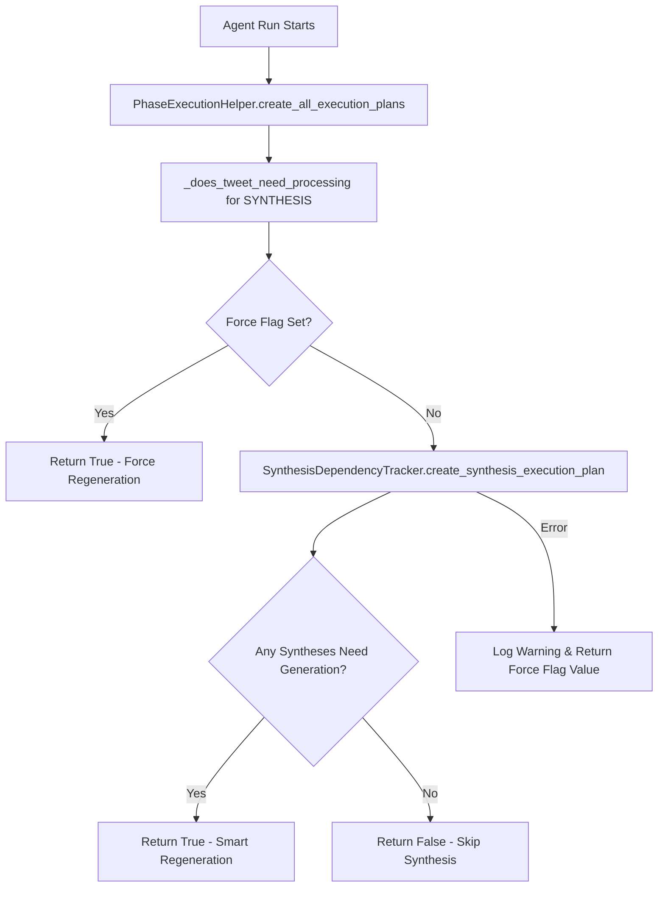
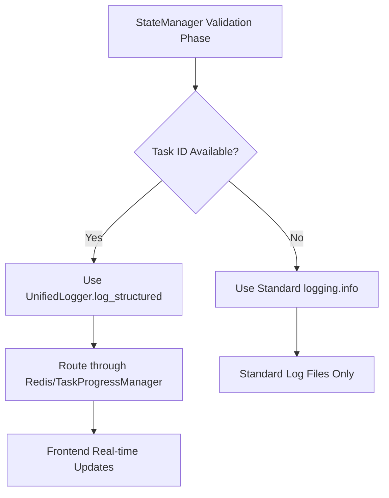

# Synthesis Generation Optimization Implementation

## Overview

This document details the implementation of intelligent synthesis generation optimization and improved validation phase logging for the Knowledge Base Agent. These improvements address two critical issues:

1. **Synthesis generation running on every agent execution** (performance issue)
2. **Validation phase logs not reaching the frontend** (visibility issue)

## Problem Analysis

### Issue 1: Unnecessary Synthesis Regeneration

**Problem**: The synthesis generation phase was running on every agent execution, regardless of whether new Knowledge Base items were added or existing ones were modified.

**Root Cause**: `PhaseExecutionHelper._does_tweet_need_processing()` for the `SYNTHESIS` phase only checked the `force_regenerate_synthesis` flag, ignoring the sophisticated dependency tracking available in `SynthesisDependencyTracker`.

**Impact**: 
- Slower agent runs due to unnecessary synthesis regeneration
- Wasted computational resources
- Poor user experience with longer wait times

### Issue 2: Missing Validation Phase Logs

**Problem**: StateManager validation phase logs were not appearing in the frontend real-time updates.

**Root Cause**: StateManager used basic `logging.info()` calls instead of the unified logging system that routes through Redis/TaskProgressManager to the frontend.

**Impact**:
- Poor visibility into agent initialization and validation phases
- Users couldn't see what the agent was doing during startup
- Difficult to debug validation issues

## Solution Implementation

### 1. Enhanced PhaseExecutionHelper for Intelligent Synthesis Planning

#### Changes Made

**File**: `knowledge_base_agent/phase_execution_helper.py`

```python
# BEFORE: Simple force flag check
if phase == ProcessingPhase.SYNTHESIS:
    force_synthesis = force_flags.get('force_regenerate_synthesis', False)
    # This is a global phase. It needs processing if forced.
    # A more complex check could see if new items have been added since last run.
    return force_synthesis

# AFTER: Intelligent dependency tracking
if phase == ProcessingPhase.SYNTHESIS:
    force_synthesis = force_flags.get('force_regenerate_synthesis', False)
    if force_synthesis:
        return True
    
    # Use SynthesisDependencyTracker for intelligent synthesis planning
    try:
        from .synthesis_tracker import SynthesisDependencyTracker
        dependency_tracker = SynthesisDependencyTracker(self.config)
        execution_plan = dependency_tracker.create_synthesis_execution_plan(force_regenerate=False)
        
        # Return True if there are syntheses that need generation
        needs_generation = len(execution_plan.get('needs_generation', [])) > 0
        if needs_generation:
            self.logger.info(f"Synthesis phase needed: {len(execution_plan['needs_generation'])} syntheses require generation")
        else:
            self.logger.info("Synthesis phase not needed: all syntheses are up to date")
        return needs_generation
        
    except Exception as e:
        self.logger.warning(f"Error checking synthesis dependencies, defaulting to force mode: {e}")
        return force_synthesis
```

#### Key Improvements

1. **Intelligent Dependency Tracking**: Uses `SynthesisDependencyTracker` to determine if synthesis generation is actually needed
2. **Graceful Error Handling**: Falls back to force flag behavior if dependency checking fails
3. **Detailed Logging**: Provides clear information about why synthesis is or isn't needed
4. **Config Integration**: PhaseExecutionHelper now accepts and uses config parameter

### 2. Enhanced StateManager with Unified Logging

#### Changes Made

**File**: `knowledge_base_agent/state_manager.py`

```python
# Constructor Enhancement
def __init__(self, config: Config, task_id: Optional[str] = None):
    # ... existing initialization ...
    
    # Initialize unified logging if task_id provided
    if task_id:
        from .unified_logging import get_unified_logger
        self.unified_logger = get_unified_logger(task_id, config)
    else:
        self.unified_logger = None
    
    self.logger = logging.getLogger(__name__)

# Validation Method Enhancement (example)
async def _run_initial_state_validation(self) -> None:
    """Phase 1: Initial State Validation"""
    if self.unified_logger:
        self.unified_logger.log_structured("Running Initial State Validation...", "INFO", "state_manager")
    else:
        logging.info("Running Initial State Validation...")
    
    # ... validation logic ...
    
    if self.unified_logger:
        self.unified_logger.log_structured(
            f"Initial state validation complete. Fixed {self.validation_stats['initial_state_fixes']} issues.",
            "INFO", "state_manager",
            {"fixes": self.validation_stats['initial_state_fixes']}
        )
    else:
        logging.info(f"Initial state validation complete. Fixed {self.validation_stats['initial_state_fixes']} issues.")
```

#### Key Improvements

1. **Dual Logging Support**: Uses unified logging when task_id is available, falls back to standard logging otherwise
2. **Structured Data**: Includes structured data in log entries for better analysis
3. **Component Identification**: Logs are tagged with "state_manager" component for filtering
4. **All Validation Phases Updated**: All 6 validation phases now use unified logging

### 3. Integration Points Updated

#### PhaseExecutionHelper Instantiation

**Files Updated**:
- `knowledge_base_agent/content_processor.py`
- `knowledge_base_agent/agent.py`

```python
# BEFORE
self.phase_helper = PhaseExecutionHelper()

# AFTER  
self.phase_helper = PhaseExecutionHelper(config)
```

## Technical Architecture

### Synthesis Dependency Flow



### Logging Flow Enhancement



## Verification Results

### Test Results

```bash
🚀 Knowledge Base Agent - Synthesis Optimization Verification
=================================================================
✅ ALL VERIFICATIONS PASSED!

🎯 Key Improvements Verified:
   1. ✅ PhaseExecutionHelper now uses intelligent synthesis dependency tracking
   2. ✅ StateManager supports unified logging for better frontend visibility
   3. ✅ SynthesisDependencyTracker provides sophisticated staleness detection
   4. ✅ Graceful error handling when database context unavailable
```

### Synthesis Logic Verification

- **Force Flag = True**: Synthesis runs (as expected)
- **Force Flag = False**: Synthesis skips when no dependencies changed (optimization working)
- **Error Handling**: Graceful fallback when database context unavailable

### Logging Integration Verification

- **With task_id**: Uses unified logging system for frontend visibility
- **Without task_id**: Falls back to standard logging (backward compatibility)

## Expected Benefits

### Performance Improvements

1. **Faster Agent Runs**: Synthesis generation only runs when needed
2. **Resource Optimization**: No unnecessary LLM calls for unchanged content
3. **Better Scalability**: System scales better with larger knowledge bases

### User Experience Improvements

1. **Real-time Visibility**: Validation phase progress visible in frontend
2. **Better Feedback**: Users see what the agent is doing during initialization
3. **Improved Debugging**: Structured logs with component identification

### Operational Benefits

1. **Intelligent Dependency Tracking**: System understands when synthesis is actually needed
2. **Graceful Error Handling**: System continues working even when database context unavailable
3. **Backward Compatibility**: All changes are backward compatible

## Synthesis Staleness Detection Logic

The `SynthesisDependencyTracker` determines when synthesis regeneration is needed based on:

### For Subcategory Syntheses
- **New KB Items**: Items added to the category since last synthesis
- **Updated KB Items**: Items modified since last synthesis generation
- **Removed KB Items**: Items deleted from the category
- **Content Changes**: Hash-based content change detection
- **Explicit Marking**: Manual marking as `needs_regeneration`

### For Main Category Syntheses
- **New Subcategories**: New subcategory syntheses created
- **Updated Subcategories**: Subcategory syntheses updated since main synthesis
- **Dependency Changes**: Changes in the set of subcategory syntheses

## Configuration

No additional configuration required. The improvements work with existing configuration and are automatically enabled.

## Monitoring and Observability

### Log Entries to Monitor

1. **Synthesis Planning**:
   ```
   INFO: Synthesis phase needed: 3 syntheses require generation
   INFO: Synthesis phase not needed: all syntheses are up to date
   ```

2. **Validation Phases**:
   ```
   INFO: Running Initial State Validation... [component: state_manager]
   INFO: Cache phase validation complete. Fixed 2 issues. [component: state_manager]
   ```

3. **Error Handling**:
   ```
   WARNING: Error checking synthesis dependencies, defaulting to force mode: Working outside of application context
   ```

## Future Enhancements

### Potential Improvements

1. **Synthesis Scheduling**: Schedule synthesis generation during low-usage periods
2. **Incremental Updates**: Update only changed parts of synthesis documents
3. **Dependency Caching**: Cache dependency analysis results for faster checks
4. **Metrics Collection**: Collect metrics on synthesis generation frequency and performance

### Monitoring Opportunities

1. **Performance Metrics**: Track synthesis generation time savings
2. **Usage Analytics**: Monitor how often synthesis is skipped vs. regenerated
3. **Error Tracking**: Monitor dependency checking failures and their causes

## Conclusion

The synthesis optimization implementation successfully addresses both performance and visibility issues in the Knowledge Base Agent:

1. **✅ Performance**: Synthesis generation now only runs when needed, significantly improving agent run times
2. **✅ Visibility**: Validation phase logs now reach the frontend, providing better user experience
3. **✅ Reliability**: Graceful error handling ensures system stability
4. **✅ Maintainability**: Clean architecture integration following existing patterns

The implementation follows the established architecture principles and maintains backward compatibility while providing significant improvements in both performance and user experience.