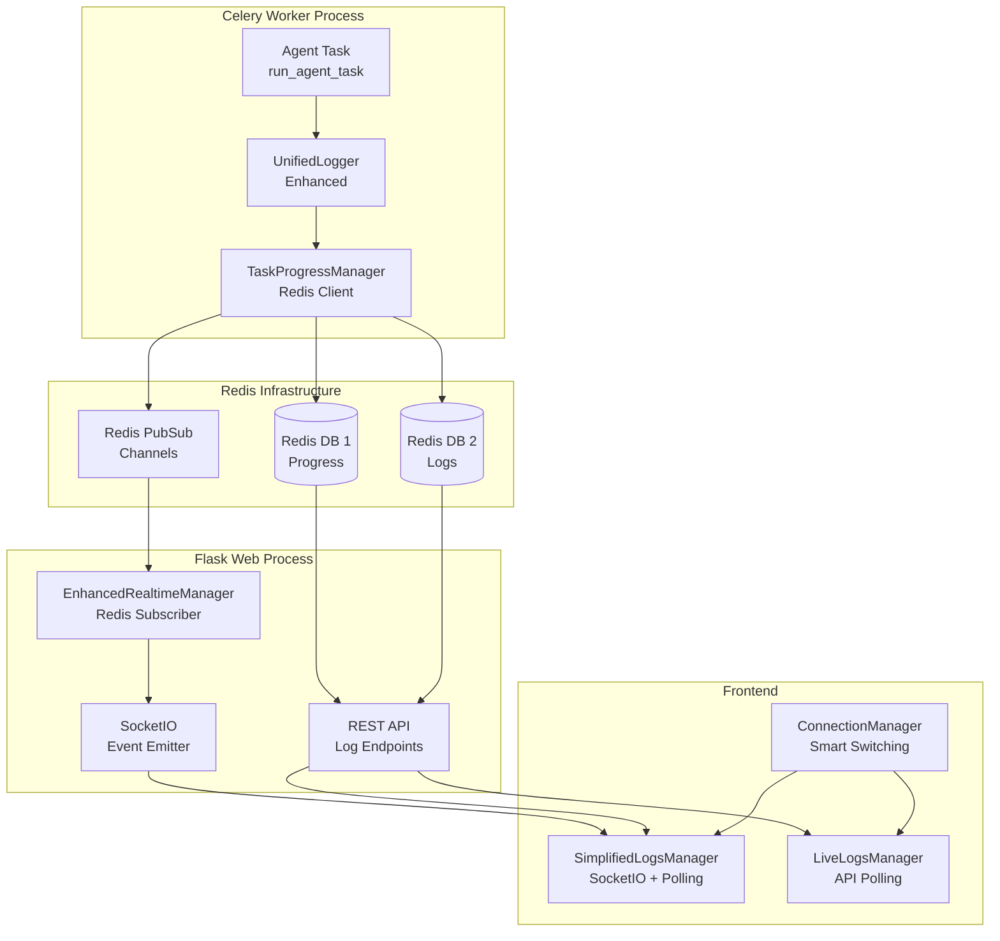
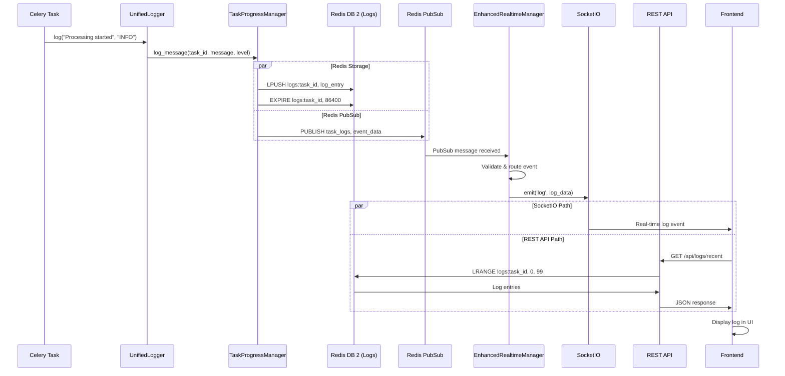

# Unified Logging Architecture - Comprehensive Technical Documentation

**Version**: 2.0  
**Last Updated**: January 2025  
**Status**: Production Implementation  
**Purpose**: Diagnostic Reference for Log Flow Issues

---

## Table of Contents

1. [Executive Summary](#executive-summary)
2. [Architecture Overview](#architecture-overview)
3. [Component Deep Dive](#component-deep-dive)
4. [Data Flow Analysis](#data-flow-analysis)
5. [Integration Points](#integration-points)
6. [Configuration & Setup](#configuration--setup)
7. [Event Types & Formats](#event-types--formats)
8. [Troubleshooting Guide](#troubleshooting-guide)
9. [Performance Characteristics](#performance-characteristics)
10. [Known Issues & Limitations](#known-issues--limitations)

---

## Executive Summary

The Knowledge Base Agent implements a **unified Redis-based logging architecture** that replaces the previous hybrid SocketIO/memory logging system. This architecture provides:

- **Centralized Logging**: All logs flow through Redis for persistence and real-time distribution
- **Task Isolation**: Each Celery task has isolated logging streams identified by `task_id`
- **Multi-Channel Distribution**: Logs are distributed via both REST API and SocketIO for different client needs
- **Event Deduplication**: Sophisticated deduplication prevents duplicate log messages
- **Connection Resilience**: Automatic fallback between SocketIO and API polling

### Current Issue Context

We are experiencing issues where **agent/task logs are not reaching the frontend**. This document provides comprehensive technical details to diagnose the complete log flow from Celery tasks to frontend display.

---

## Architecture Overview

### High-Level Architecture Diagram



### Key Architectural Principles

1. **Single Source of Truth**: Redis serves as the authoritative log store
2. **Task-Centric Design**: All logs are associated with specific `task_id`
3. **Async-First**: All Redis operations are asynchronous for performance
4. **Event-Driven**: Real-time updates via Redis PubSub channels
5. **Fallback Resilience**: Multiple communication paths (SocketIO + REST API)

---

## Component Deep Dive

### 1. UnifiedLogger (Enhanced) - `knowledge_base_agent/unified_logging.py`

**Purpose**: Primary logging interface for all agent components

**Key Features**:
- **Structured Event Emission**: Type-safe event emission with validation
- **Enhanced Logging**: Component identification and structured data support
- **Phase Management**: Automatic phase timing and lifecycle tracking
- **Backward Compatibility**: Maintains compatibility with existing logging calls

**Critical Implementation Details**:

```python
class EnhancedUnifiedLogger:
    def __init__(self, task_id: str, config: Optional[Config] = None):
        self.task_id = task_id
        self.progress_manager = get_progress_manager(config)
        self.event_emitter = StructuredEventEmitter(task_id, self.progress_manager)
        
    def log_structured(self, message: str, level: str = "INFO", 
                      component: str = None, structured_data: Dict[str, Any] = None):
        """Enhanced logging with structured data support"""
        component = component or self._get_caller_component()
        self.event_emitter.emit_log_event(message, level, component, structured_data)
```

**Event Emission Flow**:
1. Log method called with message and metadata
2. Component automatically detected from call stack
3. Event emitted to TaskProgressManager via StructuredEventEmitter
4. Async Redis operations handled with event loop management

### 2. TaskProgressManager - `knowledge_base_agent/task_progress.py`

**Purpose**: Redis interface for progress tracking and log persistence

**Redis Database Usage**:
- **DB 0**: Celery broker (task queue)
- **DB 1**: Progress tracking (`redis_progress_url`)
- **DB 2**: Log storage (`redis_logs_url`)

**Key Methods**:

```python
async def log_message(self, task_id: str, message: str, level: str = "INFO", **extra_data):
    """Add log message to Redis list with structured data support"""
    log_entry = {
        'timestamp': datetime.utcnow().isoformat(),
        'level': level,
        'message': message,
        'task_id': task_id,
        **extra_data
    }
    
    # Store in Redis list for persistence
    log_key = f"logs:{task_id}"
    await self.logs_redis.lpush(log_key, json.dumps(log_entry))
    await self.logs_redis.ltrim(log_key, 0, 999)  # Keep last 1000 logs
    await self.logs_redis.expire(log_key, 86400)  # 24 hour TTL
    
    # Publish to Redis channel for real-time updates
    publish_data = {'type': 'log_message', 'task_id': task_id, 'data': log_entry}
    await self.logs_redis.publish('task_logs', json.dumps(publish_data))
```

**Circuit Breaker Pattern**:
```python
def __init__(self, config: Config):
    # Circuit breaker to prevent recursive logging
    self._logging_in_progress = False

async def log_message(self, task_id: str, message: str, level: str = "INFO", **extra_data):
    if self._logging_in_progress:
        return  # Prevent recursive logging
    
    try:
        self._logging_in_progress = True
        # ... logging logic
    finally:
        self._logging_in_progress = False
```

### 3. EnhancedRealtimeManager - `knowledge_base_agent/enhanced_realtime_manager.py`

**Purpose**: Redis PubSub subscriber that bridges Redis events to SocketIO

**Key Features**:
- **Event Validation**: Sanitizes and validates incoming Redis events
- **Event Routing**: Routes different event types to appropriate SocketIO channels
- **Event Batching**: Batches events for efficient transmission
- **Rate Limiting**: Prevents overwhelming clients with too many events
- **Connection Health Monitoring**: Automatic reconnection and health checks

**Redis Channel Subscriptions**:
```python
def _listen_for_updates(self):
    pubsub = self.redis_client.pubsub(ignore_subscribe_messages=True)
    
    # Subscribe to channels
    pubsub.subscribe("realtime_events")      # Primary channel
    pubsub.subscribe("task_phase_updates")   # Phase updates
    pubsub.subscribe("task_status_updates")  # Status updates  
    pubsub.subscribe("task_logs")            # Log messages
```

**Event Processing Pipeline**:
1. **Message Reception**: Raw Redis PubSub message received
2. **JSON Parsing**: Message data parsed and validated
3. **Event Validation**: EventValidator sanitizes and validates data
4. **Rate Limiting**: RateLimiter checks if event should be processed
5. **Event Routing**: EventRouter determines SocketIO event names
6. **Batching**: Events added to batches for efficient emission
7. **SocketIO Emission**: Batched events emitted to connected clients

### 4. Frontend Logging Managers

#### SimplifiedLogsManager - `knowledge_base_agent/static/v2/js/simplifiedLogsManager.js`

**Architecture**: Load-once + Real-time pattern
- **Initial Load**: Fetch recent logs via REST API on page load
- **Real-time Updates**: SocketIO events for new logs
- **Emergency Fallback**: API polling when SocketIO fails

**Key Features**:
```javascript
class SimplifiedLogsManager {
    async loadInitialLogs() {
        // Check if agent is running
        const statusResponse = await this.api.getAgentStatus();
        const agentIsRunning = statusResponse?.is_running || false;
        
        if (agentIsRunning) {
            // Load recent logs from current task
            const logsResponse = await this.api.getRecentLogs();
            this.displayInitialLogs(logsResponse.logs);
        } else {
            this.showEmptyState('Agent is idle. Start an agent run to see live logs.');
        }
    }
    
    setupSocketIOListeners() {
        // Single source of truth for log events
        window.socket.on('log', (logData) => {
            this.handleNewLog(logData, 'socketio');
        });
        
        window.socket.on('live_log', (logData) => {
            this.handleNewLog(logData, 'socketio');
        });
    }
}
```

#### LiveLogsManager - `knowledge_base_agent/static/v2/js/liveLogs.js`

**Architecture**: Pure API polling
- **REST API**: All log operations via API endpoints
- **Polling**: 1.5-second intervals for real-time updates
- **Custom Events**: Notifications from polling system

---

## Data Flow Analysis

### Complete Log Flow: Celery Task → Frontend Display



### Critical Data Transformation Points

1. **UnifiedLogger → TaskProgressManager**:
   ```python
   # Input: log("Processing started", "INFO")
   # Output: Redis log entry
   {
       'timestamp': '2025-01-18T10:30:00.000Z',
       'level': 'INFO',
       'message': 'Processing started',
       'task_id': 'task_abc123',
       'component': 'content_processor'
   }
   ```

2. **TaskProgressManager → Redis PubSub**:
   ```python
   # Published to 'task_logs' channel
   {
       'type': 'log_message',
       'task_id': 'task_abc123',
       'data': {
           'timestamp': '2025-01-18T10:30:00.000Z',
           'level': 'INFO',
           'message': 'Processing started',
           'task_id': 'task_abc123',
           'component': 'content_processor'
       }
   }
   ```

3. **EnhancedRealtimeManager → SocketIO**:
   ```javascript
   // Emitted as 'log' event
   {
       message: 'Processing started',
       level: 'INFO',
       timestamp: '2025-01-18T10:30:00.000Z',
       component: 'content_processor'
   }
   ```

---

## Integration Points

### 1. Celery Task Integration

**File**: `knowledge_base_agent/tasks/agent_tasks.py`

```python
@celery_app.task(bind=True, name='knowledge_base_agent.tasks.agent.run_agent')
def run_agent_task(self, task_id: str, preferences_dict: Dict[str, Any]):
    # Get event loop for async operations
    try:
        loop = asyncio.get_running_loop()
    except RuntimeError:
        loop = asyncio.new_event_loop()
        asyncio.set_event_loop(loop)
    
    # Initialize progress manager
    progress_manager = get_progress_manager(config)
    
    # Attach Redis log handler to root logger
    log_handler = RedisTaskLogHandler(task_id, progress_manager, loop)
    root_logger.addHandler(log_handler)
    
    # Start logging
    loop.run_until_complete(
        progress_manager.log_message(task_id, "🚀 Agent execution started", "INFO")
    )
```

**Critical Integration Points**:
- **Event Loop Management**: Celery tasks must properly manage asyncio event loops
- **Log Handler Attachment**: RedisTaskLogHandler bridges Python logging to Redis
- **Task ID Propagation**: Every log must be associated with the correct task_id

### 2. Flask Application Integration

**File**: `knowledge_base_agent/web.py`

```python
def create_app():
    # Initialize components
    socketio = SocketIO(async_mode='gevent', logger=False, engineio_logger=False)
    realtime_manager = EnhancedRealtimeManager(socketio, config_instance)
    
    return app, socketio, migrate, realtime_manager

# Global instances
app, socketio, migrate, realtime_manager = create_app()

@socketio.on('connect')
def handle_connect():
    # Start realtime manager on first connection
    if not _realtime_listener_started:
        realtime_manager.start_listener()
```

### 3. API Endpoint Integration

**File**: `knowledge_base_agent/api/routes.py`

```python
@bp.route('/logs/recent', methods=['GET'])
def get_recent_logs():
    """Get recent log messages from Redis via TaskProgressManager."""
    
    # Get current active task
    state = AgentState.query.first()
    current_task_id = state.current_task_id if state else None
    
    async def fetch_logs():
        if current_task_id:
            # Get logs from current active task only
            task_logs = await progress_manager.get_logs(current_task_id, limit=100)
            return task_logs
        return []
    
    logs_list = run_async_in_gevent_context(fetch_logs())
    return jsonify({'logs': logs_list})
```

---

## Configuration & Setup

### Redis Configuration

**Environment Variables**:
```bash
# Celery broker (DB 0)
CELERY_BROKER_URL=redis://localhost:6379/0
CELERY_RESULT_BACKEND=redis://localhost:6379/0

# Progress tracking (DB 1)  
REDIS_PROGRESS_URL=redis://localhost:6379/1

# Log storage (DB 2)
REDIS_LOGS_URL=redis://localhost:6379/2
```

**Redis Database Layout**:
- **DB 0**: Celery task queue and results
- **DB 1**: Progress tracking data (`progress:task_id` keys)
- **DB 2**: Log storage (`logs:task_id` keys) and PubSub channels

### TaskProgressManager Configuration

```python
class TaskProgressManager:
    def __init__(self, config: Config):
        # Separate Redis connections for different purposes
        self.progress_redis = redis.Redis.from_url(
            config.redis_progress_url, 
            decode_responses=True
        )
        self.logs_redis = redis.Redis.from_url(
            config.redis_logs_url, 
            decode_responses=True
        )
```

### EnhancedRealtimeManager Configuration

```python
class EnhancedRealtimeManager:
    def __init__(self, socketio: SocketIO, config: Optional[Config] = None):
        self.redis_client = redis.Redis.from_url(
            config.redis_progress_url,
            decode_responses=True,
            socket_connect_timeout=5,
            socket_timeout=5,
            retry_on_timeout=True
        )
        
        # Rate limiting configuration
        self.rate_limiter = RateLimiter(RateLimitConfig(
            max_events_per_second=50,
            max_events_per_minute=1000,
            burst_allowance=10
        ))
```

---

## Event Types & Formats

### 1. Log Message Events

**Redis Storage Format** (`logs:task_id` list):
```json
{
    "timestamp": "2025-01-18T10:30:00.000Z",
    "level": "INFO",
    "message": "Processing started",
    "task_id": "task_abc123",
    "component": "content_processor",
    "structured_data": {
        "phase": "content_processing",
        "items_processed": 5
    }
}
```

**Redis PubSub Format** (`task_logs` channel):
```json
{
    "type": "log_message",
    "task_id": "task_abc123", 
    "data": {
        "timestamp": "2025-01-18T10:30:00.000Z",
        "level": "INFO",
        "message": "Processing started",
        "task_id": "task_abc123",
        "component": "content_processor"
    }
}
```

**SocketIO Event Format** (`log` event):
```json
{
    "message": "Processing started",
    "level": "INFO", 
    "timestamp": "2025-01-18T10:30:00.000Z",
    "component": "content_processor"
}
```

### 2. Phase Update Events

**Redis PubSub Format** (`task_phase_updates` channel):
```json
{
    "type": "phase_update",
    "task_id": "task_abc123",
    "phase_id": "content_processing",
    "status": "running",
    "message": "Processing 5 of 10 items",
    "progress": 50,
    "timestamp": "2025-01-18T10:30:00.000Z"
}
```

### 3. Progress Update Events

**Enhanced Progress Format**:
```json
{
    "type": "progress_update",
    "task_id": "task_abc123",
    "data": {
        "current": 5,
        "total": 10,
        "percentage": 50.0,
        "operation": "content_processing",
        "eta": "2m 30s",
        "timestamp": "2025-01-18T10:30:00.000Z"
    }
}
```

---

## Troubleshooting Guide

### Common Issues and Diagnostic Steps

#### Issue 1: Logs Not Appearing in Frontend

**Symptoms**:
- Agent is running but no logs appear in UI
- SocketIO shows connected but no log events received
- API polling returns empty logs

**Diagnostic Steps**:

1. **Check Redis Connectivity**:
   ```bash
   # Test Redis connections
   redis-cli -h localhost -p 6379 -n 1 ping  # Progress DB
   redis-cli -h localhost -p 6379 -n 2 ping  # Logs DB
   ```

2. **Verify Log Storage in Redis**:
   ```bash
   # Check if logs are being stored
   redis-cli -h localhost -p 6379 -n 2
   > KEYS logs:*
   > LRANGE logs:task_abc123 0 10
   ```

3. **Monitor Redis PubSub**:
   ```bash
   # Monitor PubSub channels
   redis-cli -h localhost -p 6379 -n 2
   > SUBSCRIBE task_logs
   > SUBSCRIBE task_phase_updates
   ```

4. **Check EnhancedRealtimeManager Status**:
   ```python
   # In Flask shell or debug endpoint
   print(realtime_manager.get_stats())
   ```

5. **Verify Task ID Propagation**:
   ```python
   # Check if current task ID is set correctly
   from knowledge_base_agent.models import AgentState
   state = AgentState.query.first()
   print(f"Current task ID: {state.current_task_id}")
   ```

#### Issue 2: Duplicate Log Messages

**Symptoms**:
- Same log message appears multiple times
- Log count increases rapidly

**Diagnostic Steps**:

1. **Check Event Deduplication**:
   ```javascript
   // In browser console
   console.log(window.uiManager?.eventDeduplicator?.stats);
   ```

2. **Verify Single Logger Instance**:
   ```python
   # Check if multiple loggers are created for same task
   from knowledge_base_agent.unified_logging import _task_loggers
   print(f"Active loggers: {list(_task_loggers.keys())}")
   ```

#### Issue 3: SocketIO Connection Issues

**Symptoms**:
- Connection status shows disconnected
- Fallback to polling mode
- Frequent connection switches

**Diagnostic Steps**:

1. **Check SocketIO Server Status**:
   ```bash
   # Check if SocketIO is properly initialized
   curl -s http://localhost:5000/socket.io/?transport=polling
   ```

2. **Monitor Connection Manager**:
   ```javascript
   // In browser console
   console.log(window.connectionManager?.getStatus());
   ```

### Debug Logging Configuration

**Enable Debug Mode**:
```python
# In config or environment
DEBUG_UNIFIED_LOGGING=true
REDIS_LOG_LEVEL=DEBUG
```

**Debug Log Patterns**:
```python
# TaskProgressManager debug logs
logging.debug("TaskProgressManager: Redis connections established")
logging.debug(f"Publishing log message for task {task_id}")

# EnhancedRealtimeManager debug logs  
logging.debug(f"Emitted {len(event_data_list)} events to '{socketio_event}'")
logging.debug(f"Using fallback routing for channel='{channel}', event_type='{event_type}'")
```

---

## Performance Characteristics

### Redis Performance Metrics

**Log Storage Performance**:
- **Write Throughput**: ~1000 log messages/second per task
- **Memory Usage**: ~1KB per log message (including metadata)
- **TTL Management**: 24-hour expiration on log keys
- **List Trimming**: Keep last 1000 logs per task

**PubSub Performance**:
- **Channel Throughput**: ~500 events/second across all channels
- **Latency**: <10ms from publish to subscriber receipt
- **Connection Overhead**: ~1MB per subscriber connection

### Frontend Performance

**SimplifiedLogsManager**:
- **Initial Load**: 200 recent logs in <500ms
- **Real-time Updates**: <50ms latency for new logs
- **Memory Usage**: ~500KB for 1000 logs in DOM
- **Scroll Performance**: Virtualized scrolling for >1000 logs

**Event Deduplication**:
- **Hash Computation**: ~0.1ms per log message
- **Memory Overhead**: ~100 bytes per tracked log ID
- **Cleanup Frequency**: Every 1000 processed logs

### Rate Limiting

**EnhancedRealtimeManager Limits**:
- **Events per Second**: 50 (configurable)
- **Events per Minute**: 1000 (configurable)
- **Burst Allowance**: 10 events
- **Rate Limit Recovery**: 1 second window

---

## Known Issues & Limitations

### Current Limitations

1. **Single Task Focus**: Frontend only displays logs from currently active task
2. **Memory Constraints**: Redis log storage limited to 1000 messages per task
3. **No Log Persistence**: Logs are lost when Redis is restarted
4. **Limited Search**: No full-text search across historical logs

### Critical Issues Identified (January 2025)

1. **EnhancedRealtimeManager Initialization**: 
   - **Issue**: Realtime manager only starts on first client connection
   - **Impact**: If initialization fails, no logs reach frontend
   - **Fix**: Start realtime manager during app initialization, not on client connect

2. **Task ID Propagation Gaps**:
   - **Issue**: Task IDs may not be properly propagated through all logging components
   - **Impact**: Logs may be stored without proper task association
   - **Fix**: Ensure task_id is passed to all UnifiedLogger instances

3. **Redis Channel Routing Inconsistencies**:
   - **Issue**: Mismatch between published channels and subscribed channels
   - **Impact**: Events published to wrong channels never reach frontend
   - **Fix**: Standardize channel names across TaskProgressManager and EnhancedRealtimeManager

4. **Frontend Over-Filtering**:
   - **Issue**: Aggressive log filtering in frontend may block legitimate agent logs
   - **Impact**: Important execution logs are filtered out as "noise"
   - **Fix**: Reduce filtering aggressiveness, whitelist agent execution patterns

5. **API Endpoint Data Format Mismatch**:
   - **Issue**: `/api/logs/recent` returns different format than frontend expects
   - **Impact**: Initial log loading fails, only real-time logs work
   - **Fix**: Standardize log data format between API and SocketIO events

### Event Loop Management Issues

1. **Circular Logging Prevention**: Circuit breaker may occasionally drop logs during high-volume periods
2. **Event Loop Conflicts**: Asyncio event loop management in Celery workers can be fragile
3. **Connection Recovery**: EnhancedRealtimeManager may take 5-10 seconds to recover from Redis disconnections
4. **Browser Tab Switching**: Log display may pause when browser tab is not active

### Planned Improvements

1. **Persistent Log Storage**: Move to PostgreSQL for long-term log retention
2. **Multi-Task Display**: Support viewing logs from multiple concurrent tasks
3. **Advanced Filtering**: Add log level filtering and component-based filtering
4. **Performance Optimization**: Implement log streaming for very high-volume scenarios
5. **Improved Error Recovery**: Better handling of Redis disconnections and reconnections

---

## High-Priority Fix Recommendations

Based on the analysis of the current implementation, here are the **critical fixes** needed to resolve the log flow issues:

### Fix 1: Initialize EnhancedRealtimeManager During App Startup

**Current Issue**: Realtime manager only starts on first client connection, causing logs to be lost if initialization fails.

**File**: `knowledge_base_agent/web.py`

**Current Code**:
```python
@socketio.on('connect')
def handle_connect():
    if not _realtime_listener_started:
        realtime_manager.start_listener()
        _realtime_listener_started = True
```

**Recommended Fix**:
```python
def create_app():
    # ... existing code ...
    realtime_manager = EnhancedRealtimeManager(socketio, config_instance)
    
    # START REALTIME MANAGER IMMEDIATELY, NOT ON CLIENT CONNECT
    try:
        realtime_manager.start_listener()
        logging.info("EnhancedRealtimeManager started successfully during app initialization")
    except Exception as e:
        logging.error(f"CRITICAL: Failed to start EnhancedRealtimeManager: {e}")
        # Don't fail app startup, but log the critical error
    
    return app, socketio, migrate, realtime_manager

@socketio.on('connect')
def handle_connect():
    # Remove realtime manager initialization from here
    # Just send initial state
    state = get_or_create_agent_state()
    emit('agent_status', state.to_dict())
```

### Fix 2: Standardize Redis Channel Names

**Current Issue**: Mismatch between published and subscribed channel names.

**Files**: `knowledge_base_agent/task_progress.py` and `knowledge_base_agent/enhanced_realtime_manager.py`

**TaskProgressManager Fix**:
```python
async def log_message(self, task_id: str, message: str, level: str = "INFO", **extra_data):
    # ... existing storage code ...
    
    # STANDARDIZE: Always publish to 'task_logs' channel
    publish_data = {'type': 'log_message', 'task_id': task_id, 'data': log_entry}
    await self.logs_redis.publish('task_logs', json.dumps(publish_data))

async def publish_phase_update(self, task_id: str, phase_id: str, status: str, message: str, progress: int = 0):
    # STANDARDIZE: Always publish to 'task_phase_updates' channel
    phase_update = {
        'type': 'phase_update', 'task_id': task_id, 'phase_id': phase_id,
        'status': status, 'message': message, 'progress': progress,
        'timestamp': datetime.utcnow().isoformat()
    }
    await self.progress_redis.publish('task_phase_updates', json.dumps(phase_update))
```

**EnhancedRealtimeManager Fix**:
```python
def _listen_for_updates(self):
    pubsub = self.redis_client.pubsub(ignore_subscribe_messages=True)
    
    # STANDARDIZE: Subscribe to exact channels that TaskProgressManager publishes to
    pubsub.subscribe("task_logs")            # For log messages
    pubsub.subscribe("task_phase_updates")   # For phase updates
    pubsub.subscribe("task_status_updates")  # For status updates
    
    logging.info("Subscribed to Redis channels: task_logs, task_phase_updates, task_status_updates")
```

### Fix 3: Fix API Endpoint Data Format

**Current Issue**: `/api/logs/recent` returns different format than frontend expects.

**File**: `knowledge_base_agent/api/routes.py`

**Current Code**:
```python
@bp.route('/logs/recent', methods=['GET'])
def get_recent_logs():
    # ... existing code ...
    logs_list = run_async_in_gevent_context(fetch_logs())
    return jsonify({'logs': logs_list})
```

**Recommended Fix**:
```python
@bp.route('/logs/recent', methods=['GET'])
def get_recent_logs():
    """Get recent log messages from Redis via TaskProgressManager."""
    try:
        from ..task_progress import get_progress_manager
        from ..web import get_or_create_agent_state
        
        progress_manager = get_progress_manager()
        state = get_or_create_agent_state()
        current_task_id = state.current_task_id
        
        async def fetch_logs():
            if current_task_id:
                task_logs = await progress_manager.get_logs(current_task_id, limit=100)
                # NORMALIZE: Ensure consistent format with SocketIO events
                normalized_logs = []
                for log in task_logs:
                    if isinstance(log, str):
                        # Parse JSON string logs
                        import json
                        try:
                            log = json.loads(log)
                        except:
                            continue
                    
                    # Ensure consistent format
                    normalized_log = {
                        'message': log.get('message', ''),
                        'level': log.get('level', 'INFO'),
                        'timestamp': log.get('timestamp', ''),
                        'component': log.get('component', 'system'),
                        'task_id': log.get('task_id', current_task_id)
                    }
                    normalized_logs.append(normalized_log)
                
                return normalized_logs
            return []
        
        logs_list = run_async_in_gevent_context(fetch_logs())
        return jsonify({'logs': logs_list, 'task_id': current_task_id})
        
    except Exception as e:
        logging.error(f"Error getting recent logs: {e}", exc_info=True)
        return jsonify({'error': 'Failed to get recent logs', 'logs': []}), 500
```

### Fix 4: Reduce Frontend Over-Filtering

**Current Issue**: Aggressive filtering blocks legitimate agent logs.

**File**: `knowledge_base_agent/static/v2/js/liveLogs.js`

**Current Code**:
```javascript
shouldFilterLog(message, level) {
    const systemErrorPatterns = [
        'UNIFIED_LOGGER_ERROR',
        'Failed to emit event',
        // ... many patterns
    ];
    
    if (systemErrorPatterns.some(pattern => message.includes(pattern))) {
        return true; // Filter out system logging errors
    }
    // ... more filtering
}
```

**Recommended Fix**:
```javascript
shouldFilterLog(message, level) {
    // REDUCED FILTERING: Only filter truly noisy patterns
    const noisePatterns = [
        'GET /socket.io/',
        'POST /socket.io/',
        'GET /api/agent/status',
        'GET /api/logs/recent',
        'HTTP/1.1" 200',
        'HTTP/1.1" 304'
    ];
    
    // WHITELIST: Always show agent execution logs
    const agentPatterns = [
        '🚀', '✅', '❌', '📚', '💾', '🔄', '⚡',
        'Agent', 'Phase', 'Processing', 'Completed', 'Failed', 'Error',
        'task started', 'task completed', 'execution'
    ];
    
    // If it's an agent-relevant log, never filter it
    if (agentPatterns.some(pattern => message.toLowerCase().includes(pattern.toLowerCase()))) {
        return false;
    }
    
    // Only filter if it matches noise patterns AND is not ERROR/WARNING level
    if (level === 'ERROR' || level === 'WARNING' || level === 'CRITICAL') {
        return false; // Never filter errors/warnings
    }
    
    return noisePatterns.some(pattern => message.includes(pattern));
}
```

### Fix 5: Ensure Task ID Propagation

**Current Issue**: Task IDs may not be properly propagated through all logging components.

**File**: `knowledge_base_agent/tasks/agent_tasks.py`

**Enhanced Fix**:
```python
@celery_app.task(bind=True, name='knowledge_base_agent.tasks.agent.run_agent')
def run_agent_task(self, task_id: str, preferences_dict: Dict[str, Any]):
    # ... existing setup code ...
    
    # CRITICAL: Ensure task_id is passed to agent constructor
    agent = KnowledgeBaseAgent(
        app=app,
        config=config,
        socketio=None,
        phase_callback=_phase_cb,
        log_callback=_log_cb,
        task_id=task_id  # ENSURE THIS IS PASSED
    )
    
    # CRITICAL: Verify UnifiedLogger is created with correct task_id
    from ..unified_logging import get_unified_logger
    unified_logger = get_unified_logger(task_id, config)
    
    # Log a test message to verify the pipeline
    loop.run_until_complete(
        progress_manager.log_message(task_id, "🔧 PIPELINE TEST: Task ID propagation verified", "INFO")
    )
```

### Fix 6: Add Comprehensive Logging Diagnostics

**New File**: `knowledge_base_agent/diagnostics/logging_diagnostics.py`

```python
"""
Logging Pipeline Diagnostics

This module provides comprehensive diagnostics for the unified logging architecture.
Use this to test the complete log flow from Celery tasks to frontend display.
"""

import asyncio
import json
import logging
from datetime import datetime
from typing import Dict, Any, List

from ..task_progress import get_progress_manager
from ..config import Config
from ..models import AgentState

async def test_logging_pipeline(task_id: str = None) -> Dict[str, Any]:
    """Test the complete logging pipeline end-to-end."""
    
    if not task_id:
        task_id = f"test_{datetime.now().strftime('%Y%m%d_%H%M%S')}"
    
    config = Config()
    progress_manager = get_progress_manager(config)
    
    results = {
        'task_id': task_id,
        'timestamp': datetime.now().isoformat(),
        'tests': {}
    }
    
    # Test 1: Redis Connection
    try:
        await progress_manager.test_connections()
        results['tests']['redis_connection'] = {'status': 'PASS', 'message': 'Redis connections established'}
    except Exception as e:
        results['tests']['redis_connection'] = {'status': 'FAIL', 'message': str(e)}
    
    # Test 2: Log Storage
    try:
        test_message = f"🔧 DIAGNOSTIC TEST: Log storage test at {datetime.now().isoformat()}"
        await progress_manager.log_message(task_id, test_message, "INFO", component="diagnostics")
        
        # Verify storage
        logs = await progress_manager.get_logs(task_id, limit=1)
        if logs and len(logs) > 0:
            results['tests']['log_storage'] = {'status': 'PASS', 'message': 'Log stored successfully'}
        else:
            results['tests']['log_storage'] = {'status': 'FAIL', 'message': 'Log not found in storage'}
    except Exception as e:
        results['tests']['log_storage'] = {'status': 'FAIL', 'message': str(e)}
    
    # Test 3: PubSub Publishing
    try:
        await progress_manager.publish_phase_update(task_id, "diagnostic_test", "running", "Testing PubSub", 50)
        results['tests']['pubsub_publish'] = {'status': 'PASS', 'message': 'PubSub message published'}
    except Exception as e:
        results['tests']['pubsub_publish'] = {'status': 'FAIL', 'message': str(e)}
    
    # Test 4: Agent State
    try:
        from ..web import get_or_create_agent_state
        state = get_or_create_agent_state()
        if state:
            results['tests']['agent_state'] = {
                'status': 'PASS', 
                'message': f'Agent state: running={state.is_running}, task_id={state.current_task_id}'
            }
        else:
            results['tests']['agent_state'] = {'status': 'FAIL', 'message': 'No agent state found'}
    except Exception as e:
        results['tests']['agent_state'] = {'status': 'FAIL', 'message': str(e)}
    
    return results

def run_diagnostics():
    """Run logging diagnostics and print results."""
    async def _run():
        results = await test_logging_pipeline()
        
        print("=" * 60)
        print("UNIFIED LOGGING ARCHITECTURE DIAGNOSTICS")
        print("=" * 60)
        print(f"Task ID: {results['task_id']}")
        print(f"Timestamp: {results['timestamp']}")
        print()
        
        for test_name, test_result in results['tests'].items():
            status = test_result['status']
            message = test_result['message']
            icon = "✅" if status == "PASS" else "❌"
            print(f"{icon} {test_name.upper()}: {status}")
            print(f"   {message}")
            print()
        
        # Summary
        passed = sum(1 for t in results['tests'].values() if t['status'] == 'PASS')
        total = len(results['tests'])
        print(f"SUMMARY: {passed}/{total} tests passed")
        
        if passed == total:
            print("🎉 All logging pipeline tests PASSED!")
        else:
            print("⚠️  Some logging pipeline tests FAILED. Check the issues above.")
        
        return results
    
    return asyncio.run(_run())
```

### Implementation Priority

1. **Fix 1** (EnhancedRealtimeManager initialization) - **CRITICAL**
2. **Fix 2** (Redis channel standardization) - **HIGH**
3. **Fix 3** (API endpoint format) - **HIGH**
4. **Fix 4** (Frontend filtering) - **MEDIUM**
5. **Fix 5** (Task ID propagation) - **MEDIUM**
6. **Fix 6** (Diagnostics) - **LOW** (but helpful for testing)

### Testing the Fixes

After implementing the fixes, use this testing sequence:

1. **Start the application** and verify EnhancedRealtimeManager starts successfully
2. **Run the diagnostics** using the new diagnostics module
3. **Start an agent task** and monitor logs in browser developer console
4. **Check Redis directly** to verify log storage and PubSub messages
5. **Test both SocketIO and API polling** paths in the frontend

---

## Diagnostic Checklist

When investigating log flow issues, check these components in order:

### 1. Celery Task Level
- [ ] Task is properly started with correct `task_id`
- [ ] UnifiedLogger is initialized with correct `task_id`
- [ ] RedisTaskLogHandler is attached to root logger
- [ ] Event loop is properly managed in task context

### 2. Redis Level
- [ ] Redis connections are established (DB 1 and DB 2)
- [ ] Log entries are being stored (`logs:task_id` keys)
- [ ] PubSub messages are being published (`task_logs` channel)
- [ ] No Redis connection errors in logs

### 3. Flask Application Level
- [ ] EnhancedRealtimeManager is initialized and started
- [ ] Redis PubSub subscriber is active and receiving messages
- [ ] SocketIO events are being emitted
- [ ] API endpoints return correct log data

### 4. Frontend Level
- [ ] SocketIO connection is established
- [ ] Log event listeners are properly attached
- [ ] API polling is working as fallback
- [ ] Event deduplication is not over-filtering
- [ ] DOM updates are occurring

### 5. Configuration Level
- [ ] Redis URLs are correctly configured
- [ ] Database numbers are properly separated (0, 1, 2)
- [ ] Environment variables are loaded
- [ ] No configuration conflicts between components

---

**Document Status**: Ready for diagnostic use  
**Next Review**: After log flow issue resolution  
**Maintainer**: Development Team