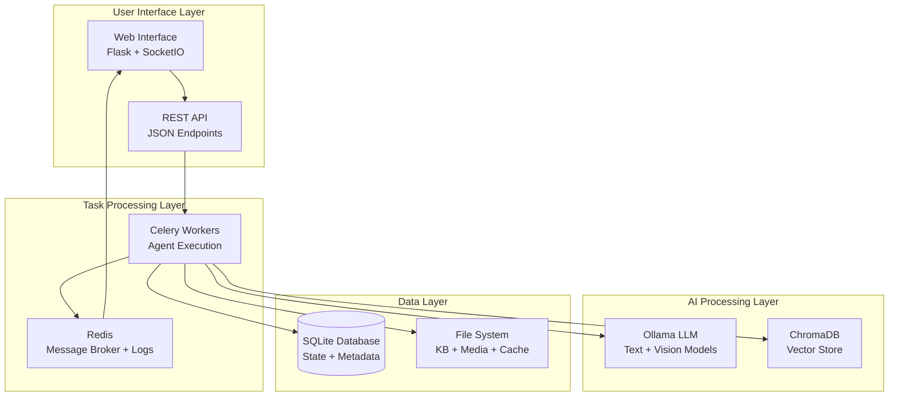
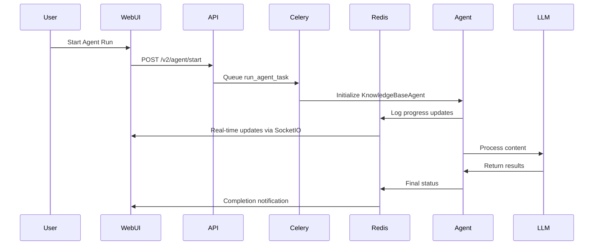
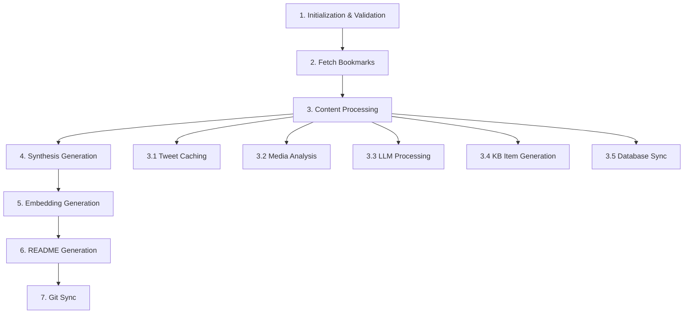
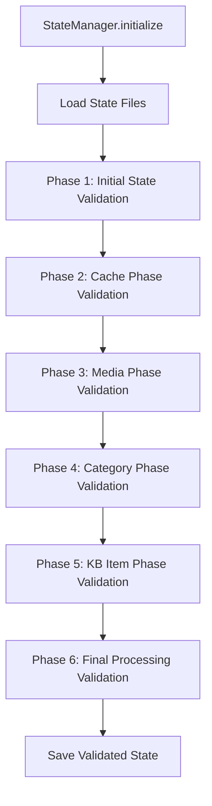
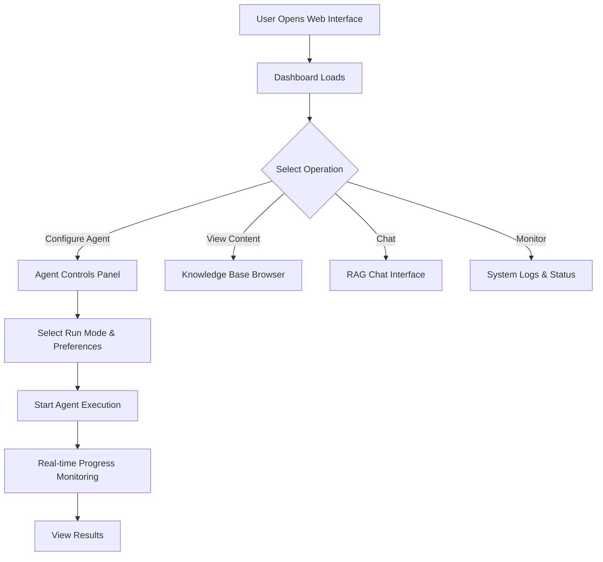

# Knowledge Base Agent - Master Architecture Guide

**Version**: 2.0  
**Last Updated**: January 2025  
**Status**: Production Ready

---

## Table of Contents

1. [Executive Summary](#executive-summary)
2. [System Overview](#system-overview)
3. [Architecture Principles](#architecture-principles)
4. [System Architecture](#system-architecture)
5. [Processing Pipeline](#processing-pipeline)
6. [User Journey & Interface](#user-journey--interface)
7. [Module Architecture](#module-architecture)
8. [Database Design](#database-design)
9. [Configuration Management](#configuration-management)
10. [Real-time Communication](#real-time-communication)
11. [Development Guidelines](#development-guidelines)
12. [Deployment & Operations](#deployment--operations)
13. [Performance & Monitoring](#performance--monitoring)

---

## Executive Summary

The Knowledge Base Agent is a production-ready AI-driven system that automates the creation and maintenance of structured knowledge bases from Twitter bookmarks. Built on a modern Celery + Redis + Flask architecture, it processes social media content through AI models to generate categorized, searchable knowledge repositories with conversational AI capabilities.

### Key Capabilities

- **Automated Content Processing**: Fetches, processes, and categorizes Twitter bookmarks using AI models
- **Intelligent Categorization**: Uses LLM models for semantic categorization and content analysis
- **Knowledge Base Generation**: Creates structured Markdown documentation with media processing
- **Conversational AI**: RAG-powered chat interface for querying the knowledge base
- **Synthesis Generation**: Creates comprehensive learning documents from related content
- **Real-time Monitoring**: Live progress tracking and system monitoring
- **Production Architecture**: Celery task queue with Redis for scalability and reliability

---

## System Overview

### Current Architecture Status

The system has successfully migrated from a Flask/multiprocessing architecture to a production-ready **Celery + Redis + Flask** stack:

- ✅ **Celery Task Queue**: All agent operations run in isolated worker processes
- ✅ **Redis Integration**: Message brokering, progress tracking, and real-time logging
- ✅ **Unified Logging**: Centralized logging system with task-specific isolation
- ✅ **REST API**: Comprehensive API coverage for all operations
- ✅ **Real-time UI**: SocketIO-powered interface with live updates
- ✅ **Database Persistence**: SQLite with SQLAlchemy for state management

### Technology Stack

| Component | Technology | Purpose |
|-----------|------------|---------|
| **Task Queue** | Celery 5.3+ | Background task processing |
| **Message Broker** | Redis | Task queuing and real-time communication |
| **Web Framework** | Flask + SocketIO | API and real-time web interface |
| **Database** | SQLite + SQLAlchemy | Data persistence and state management |
| **AI Models** | Ollama (Local LLM) | Content processing and generation |
| **Vector Store** | ChromaDB | Semantic search for RAG chat |
| **Browser Automation** | Playwright | Twitter bookmark fetching |
| **Frontend** | HTML/CSS/JS (SPA-like) | Dynamic user interface |

---

## Architecture Principles

### 1. Clean Separation of Concerns

The system follows strict architectural boundaries:

- **StateManager**: Handles ALL validation through 6 organized phases
- **PhaseExecutionHelper**: Creates execution plans for processing phases
- **StreamlinedContentProcessor**: Pure orchestrator with zero validation logic
- **Individual Processing Modules**: Handle specific tasks (caching, media, LLM, etc.)

### 2. Task-Centric Design

All operations are designed around task IDs for proper isolation:

```python
# Always pass task_id through the system
def __init__(self, config: Config, task_id: Optional[str] = None):
    self.task_id = task_id
    if task_id:
        from .unified_logging import get_unified_logger
        self.unified_logger = get_unified_logger(task_id, config)
```

### 3. Unified Logging Architecture

**CRITICAL**: The system uses a unified Redis-based logging architecture:

```python
# ✅ CORRECT: Use unified logging
if self.unified_logger:
    self.unified_logger.log(message, level)

# ❌ FORBIDDEN: Direct SocketIO emissions
if self.socketio:
    self.socketio.emit('log', log_data)  # NEVER DO THIS
```

### 4. Path Portability

All paths are managed relative to PROJECT_ROOT for deployment portability:

```python
# ✅ CORRECT: Use relative paths in config
data_processing_dir_rel: Path = Field(..., alias="DATA_PROCESSING_DIR")

# ✅ CORRECT: Resolve at runtime
self.data_processing_dir = (self.project_root / self.data_processing_dir_rel).resolve()

# ❌ FORBIDDEN: Hardcoded absolute paths
data_dir = "/home/user/project/data"
```

---

## System Architecture

### High-Level Architecture Diagram



### Component Interaction Flow



---

## Processing Pipeline

### 7-Phase Execution Model

The agent processes content through a structured pipeline:



### Phase Execution Flow

1. **PhaseExecutionHelper** analyzes all tweet states
2. Creates execution plans for each phase
3. **StreamlinedContentProcessor** executes phases based on plans
4. **StateManager** validates and tracks progress
5. **UnifiedLogger** handles all logging and progress updates

### State Management Validation

StateManager uses 6 distinct validation phases:



---

## User Journey & Interface

### Web Interface Architecture

The system provides a modern SPA-like web interface:

- **Master Layout**: `_layout.html` serves as the base template
- **Dynamic Loading**: `layout.js` handles AJAX content loading
- **Real-time Updates**: SocketIO provides live progress and status updates
- **Agent Controls**: Comprehensive preference system with visual execution plan

### User Flow



### Agent Controls System

The interface provides comprehensive control over agent execution:

#### Run Mode Favorites
- **Full Pipeline**: Complete processing from bookmarks to git sync
- **Fetch Only**: Only retrieve new bookmarks
- **Synthesis Only**: Generate synthesis documents from existing content
- **Embedding Only**: Generate/update vector embeddings for RAG
- **Git Sync Only**: Push existing changes to repository

#### Skip & Force Options
- **Skip Options**: Bypass specific phases (Full Pipeline mode only)
- **Force Options**: Force reprocessing of specific phases (combinable)
- **Real-time Updates**: Execution plan updates instantly with preference changes

---

## Module Architecture

### Core Components

#### KnowledgeBaseAgent (`agent.py`)
- **Purpose**: Central orchestrator managing workflow and communication
- **Key Features**: Task coordination, state persistence, progress callbacks
- **Celery Integration**: Runs in isolated worker processes with task_id tracking

#### StateManager (`state_manager.py`)
- **Purpose**: Centralized state management with organized validation
- **6 Validation Phases**: Ensures data integrity through systematic validation
- **Key Functions**: `initialize()`, `update_tweet_data()`, `get_processing_state()`

#### PhaseExecutionHelper (`phase_execution_helper.py`)
- **Purpose**: Creates execution plans for processing phases
- **Key Components**: `ProcessingPhase` enum, `PhaseExecutionPlan` dataclass
- **Design**: Eliminates validation logic from ContentProcessor

#### StreamlinedContentProcessor (`content_processor.py`)
- **Purpose**: Pure orchestrator with zero validation logic
- **Architecture**: Reduced from 1351 to 660 lines by removing validation
- **Design Principles**: Uses execution plans, delegates validation to StateManager

### Processing Modules

| Module | Purpose | Key Functions |
|--------|---------|---------------|
| `tweet_cacher.py` | Tweet data fetching and caching | `cache_tweets()` |
| `media_processor.py` | Media download and description | `process_media()` |
| `ai_categorization.py` | AI-powered categorization | `categorize_and_name_content()` |
| `kb_item_generator.py` | Knowledge base item generation | `create_knowledge_base_item()` |
| `markdown_writer.py` | Filesystem operations | `write_kb_item()` |
| `synthesis_generator.py` | Synthesis document creation | `generate_subcategory_synthesis()` |
| `embedding_manager.py` | Vector store management | `generate_and_store_embeddings()` |

### Web Application Components

#### Flask Application (`web.py`)
- **Purpose**: Web server with SocketIO for real-time updates
- **Key Features**: SPA-like architecture, Celery task queuing, real-time manager
- **Architecture**: Serves HTML, delegates processing to Celery workers

#### API Routes (`api/routes.py`)
- **Purpose**: RESTful API for all system operations
- **Key Endpoints**: Agent control, preferences, system info, content access
- **Design**: Clean separation between HTML serving and JSON APIs

#### Chat System (`chat_manager.py`)
- **Purpose**: RAG-powered conversational AI
- **Architecture**: Query → Vector Search → Context Augmentation → LLM Response
- **Integration**: Uses EmbeddingManager for semantic search

#### Knowledge Base Display System (`static/v2/js/kb.js`)
- **Purpose**: Frontend interface for browsing and viewing knowledge base items
- **Architecture**: Tree-based navigation with detailed item rendering
- **Key Features**: 
  - Hierarchical category/subcategory organization
  - Rich content display with media support
  - Search functionality across items and syntheses
  - Multiple view modes (grid, list, detail)
  - Export capabilities

**Content Rendering Pipeline:**
```mermaid
graph TD
    A[API Request /api/items/{id}] --> B[Database Query]
    B --> C[Content Processing]
    C --> D[Media Path Resolution]
    D --> E[Markdown to HTML Conversion]
    E --> F[Frontend Rendering]
    
    C --> C1[Raw JSON Content Parsing]
    C --> C2[Media Files Processing]
    C --> C3[Metadata Extraction]
```

**Display Hierarchy:**
- **Overview**: Statistics and recent items
- **Category View**: Items grouped by main/sub categories
- **Item Detail**: Full content with media, metadata, and source links
- **Search Results**: Filtered items based on query

---

## Database Design

### Core Models

#### KnowledgeBaseItem
```python
class KnowledgeBaseItem(db.Model):
    id = db.Column(db.Integer, primary_key=True)
    tweet_id = db.Column(db.String(50), unique=True)
    title = db.Column(db.String(200), nullable=False)
    main_category = db.Column(db.String(100), nullable=False)
    sub_category = db.Column(db.String(100), nullable=False)
    content = db.Column(db.Text, nullable=False)
    file_path = db.Column(db.String(500))
    created_at = db.Column(db.DateTime, nullable=False)
    # ... additional fields
```

#### SubcategorySynthesis
```python
class SubcategorySynthesis(db.Model):
    id = db.Column(db.Integer, primary_key=True)
    main_category = db.Column(db.String(100), nullable=False)
    sub_category = db.Column(db.String(100), nullable=False)
    synthesis_title = db.Column(db.String(255), nullable=False)
    synthesis_content = db.Column(db.Text, nullable=False)
    item_count = db.Column(db.Integer, default=0)
    # ... additional fields
```

#### AgentState
```python
class AgentState(db.Model):
    id = db.Column(db.Integer, primary_key=True)
    is_running = db.Column(db.Boolean, default=False)
    current_phase_id = db.Column(db.String(100))
    current_phase_message = db.Column(db.String(500))
    current_task_id = db.Column(db.String(36))  # Celery integration
    # ... additional fields
```

#### CeleryTaskState
```python
class CeleryTaskState(db.Model):
    id = db.Column(db.Integer, primary_key=True)
    task_id = db.Column(db.String(36), unique=True)
    celery_task_id = db.Column(db.String(36))
    task_type = db.Column(db.String(50))
    status = db.Column(db.String(20))
    preferences = db.Column(db.JSON)
    # ... additional fields
```

---

## Configuration Management

### Environment Variables

The system uses comprehensive environment-based configuration managed through `config.py`. All variables are defined with Pydantic Field aliases for type safety and validation.

#### Core AI Model Configuration
| Variable | Description | Default | Required |
|----------|-------------|---------|----------|
| `OLLAMA_URL` | Ollama API endpoint | - | Yes |
| `TEXT_MODEL` | Primary text generation model | - | Yes |
| `VISION_MODEL` | Vision processing model | - | Yes |
| `EMBEDDING_MODEL` | Embedding generation model | - | Yes |
| `FALLBACK_MODEL` | Fallback model if primary fails | - | Yes |
| `CHAT_MODEL` | Chat model (defaults to TEXT_MODEL) | TEXT_MODEL | No |
| `CATEGORIZATION_MODEL` | AI categorization model | TEXT_MODEL | No |
| `SYNTHESIS_MODEL` | Synthesis generation model | TEXT_MODEL | No |

#### AI Model Thinking/Reasoning
| Variable | Description | Default | Required |
|----------|-------------|---------|----------|
| `TEXT_MODEL_THINKING` | Enable reasoning mode for text model | false | No |
| `CATEGORIZATION_MODEL_THINKING` | Enable reasoning for categorization | false | No |
| `ENABLE_CATEGORIZATION_THINKING` | Use specific thinking model for categorization | false | No |
| `CATEGORIZATION_THINKING_MODEL_NAME` | Name of thinking model for categorization | - | No |
| `ENABLE_SYNTHESIS_THINKING` | Use specific thinking model for synthesis | false | No |
| `SYNTHESIS_THINKING_MODEL_NAME` | Name of thinking model for synthesis | - | No |

#### Celery & Redis Configuration
| Variable | Description | Default | Required |
|----------|-------------|---------|----------|
| `USE_CELERY` | Enable Celery task queue | true | No |
| `CELERY_BROKER_URL` | Redis broker URL | redis://localhost:6379/0 | No |
| `CELERY_RESULT_BACKEND` | Result backend URL | redis://localhost:6379/0 | No |
| `CELERY_TASK_SERIALIZER` | Task serializer format | json | No |
| `CELERY_ACCEPT_CONTENT` | Accepted content types | ["json"] | No |
| `CELERY_RESULT_SERIALIZER` | Result serializer format | json | No |
| `REDIS_PROGRESS_URL` | Progress tracking Redis | redis://localhost:6379/1 | No |
| `REDIS_LOGS_URL` | Log streaming Redis | redis://localhost:6379/2 | No |
| `CELERY_TASK_TRACK_STARTED` | Track when tasks start | true | No |
| `CELERY_TASK_TIME_LIMIT` | Max task execution time (seconds) | 7200 | No |
| `CELERY_WORKER_PREFETCH_MULTIPLIER` | Worker prefetch count | 1 | No |

#### GPU & Performance Optimization
| Variable | Description | Default | Required |
|----------|-------------|---------|----------|
| `GPU_TOTAL_MEM` | Total GPU memory in MB | 0 | No |
| `NUM_GPUS_AVAILABLE` | Number of available GPUs | 1 | No |
| `OLLAMA_NUM_GPU` | GPU layers to load (-1=auto) | -1 | No |
| `OLLAMA_MAIN_GPU` | Main GPU device to use | 0 | No |
| `OLLAMA_LOW_VRAM` | Enable low VRAM mode | false | No |
| `OLLAMA_GPU_SPLIT` | GPU memory split config | "" | No |
| `OLLAMA_KEEP_ALIVE` | Model memory retention | 5m | No |
| `OLLAMA_USE_MMAP` | Use memory mapping | true | No |
| `OLLAMA_USE_MLOCK` | Lock model in memory | false | No |
| `OLLAMA_NUM_THREADS` | CPU threads (0=auto) | 0 | No |

#### Content Processing Settings
| Variable | Description | Default | Required |
|----------|-------------|---------|----------|
| `REQUEST_TIMEOUT` | HTTP request timeout (seconds) | 180 | No |
| `CONTENT_GENERATION_TIMEOUT` | Content generation timeout | 300 | No |
| `MAX_CONTENT_LENGTH` | Maximum content length | 5000 | No |
| `MIN_CONTENT_LENGTH` | Minimum content length | 50 | No |
| `BATCH_SIZE` | Processing batch size | 1 | No |
| `MAX_RETRIES` | Maximum retry attempts | 5 | No |
| `MAX_CONCURRENT_REQUESTS` | Max concurrent requests | 1 | No |

### Path Management

All paths are managed relative to PROJECT_ROOT:

```python
# Configuration defines relative paths
data_processing_dir_rel: Path = Field(..., alias="DATA_PROCESSING_DIR")

# Runtime resolution to absolute paths
self.data_processing_dir = (self.project_root / self.data_processing_dir_rel).resolve()
```

---

## Real-time Communication

### Simplified Architecture: Load-Once + Real-time Updates

The system uses a clean, simplified architecture following modern patterns used by applications like Slack and Discord:

```mermaid
graph TD
    A[Page Load] --> B{Agent Running?}
    B -->|Yes| C[REST API: Get Recent Logs]
    B -->|No| D[Show "Agent Idle" Message]
    C --> E[Display Initial Logs]
    E --> F[SocketIO: Listen for New Logs]
    F --> G[Append New Logs Real-time]
    
    H[SocketIO Disconnected] --> I[Show Warning]
    I --> J[Start Emergency Polling]
    J --> K[SocketIO Reconnected]
    K --> L[Stop Polling, Resume Real-time]
```

#### Communication Flow

1. **Initial Load**: Fetch recent logs via REST API (last 200 lines) on page load
2. **Real-time Updates**: Use SocketIO events for new logs as they arrive
3. **Emergency Fallback**: Polling only when SocketIO connection fails

#### Key Components

- **SimplifiedLogsManager**: Clean logs management with load-once + real-time pattern
- **SimpleConnectionMonitor**: SocketIO health tracking and fallback management
- **TaskProgressManager**: Manages progress and logging using Redis
- **EnhancedRealtimeManager**: Bridges Celery tasks and SocketIO clients
- **UnifiedLogger**: Single interface for all logging and progress updates

#### Benefits of Simplified Architecture

- ✅ **No Duplicates**: Single source of truth eliminates duplicate log messages
- ✅ **Better Performance**: No unnecessary continuous polling
- ✅ **Simpler Code**: No complex deduplication logic needed
- ✅ **Better UX**: Fast initial load + real-time updates
- ✅ **Mobile Friendly**: Works great when switching devices
- ✅ **Clear Status**: Always know connection state (🟢 Connected, 🟡 Polling, 🔴 Disconnected)

---

## Development Guidelines

### 1. State Management
- **Always use StateManager** for validation and state tracking
- **Never bypass validation phases** - they ensure data integrity
- **Use PhaseExecutionHelper** for determining what needs processing

### 2. Logging and Progress
- **Use UnifiedLogger** for all logging and progress updates
- **Never emit SocketIO directly** from components
- **Always associate logs with task_id** when available

### 3. Path Handling
- **Define paths as relative** in configuration
- **Resolve paths at runtime** using PROJECT_ROOT
- **Never hardcode absolute paths** in code

### 4. Error Handling
- **Use custom exceptions** from exceptions.py
- **Provide meaningful error messages** with context
- **Log errors appropriately** through unified logging system

### 5. Testing
- **Test individual components** in isolation
- **Use execution plans** for testing processing logic
- **Mock external dependencies** (Ollama, Redis, etc.)

### Extension Patterns

#### Adding New Processing Phases
1. Add phase to `ProcessingPhase` enum in PhaseExecutionHelper
2. Implement phase logic in PhaseExecutionHelper
3. Add execution method in StreamlinedContentProcessor
4. Update StateManager validation if needed

#### Adding New Models
1. Define model in models.py with proper relationships
2. Create migration using Flask-Migrate
3. Update API endpoints in api/routes.py
4. Add frontend integration if needed

---

## Deployment & Operations

### Local Development Setup

```bash
# 1. Install dependencies
pip install -r requirements.txt

# 2. Start Redis server
redis-server

# 3. Start Celery worker
celery -A knowledge_base_agent.celery_app worker --loglevel=info --queues agent,processing,chat

# 4. Start Flask application
export FLASK_APP=knowledge_base_agent.web:app
flask run -p 5000

# 5. Optional: Start Flower for monitoring
celery -A knowledge_base_agent.celery_app flower --port=5555
```

### Environment Configuration

Create `.env` file with required variables:

```bash
# Core Configuration
OLLAMA_URL=http://localhost:11434
TEXT_MODEL=llama3.1:70b
VISION_MODEL=llava:13b
EMBEDDING_MODEL=mxbai-embed-large

# Celery Configuration
USE_CELERY=true
CELERY_BROKER_URL=redis://localhost:6379/0
CELERY_RESULT_BACKEND=redis://localhost:6379/0
REDIS_PROGRESS_URL=redis://localhost:6379/1
REDIS_LOGS_URL=redis://localhost:6379/2

# GitHub Configuration (if using Git sync)
GITHUB_TOKEN=your_token_here
GITHUB_USER_NAME=your_username
GITHUB_REPO_URL=https://github.com/user/repo
GITHUB_USER_EMAIL=your_email@example.com

# Twitter Configuration
X_USERNAME=your_twitter_username
X_PASSWORD=your_twitter_password
X_BOOKMARKS_URL=https://twitter.com/i/bookmarks
```

### Production Considerations

- **Redis Persistence**: Configure Redis with appropriate persistence settings
- **Worker Scaling**: Run multiple Celery workers for increased throughput
- **Monitoring**: Use Flower for task monitoring and management
- **Logging**: Configure log rotation and retention policies
- **Security**: Use environment variables for sensitive configuration

---

## Performance & Monitoring

### System Monitoring

#### Celery Task Monitoring
```bash
# Monitor active tasks
python celery_monitor.py active-tasks

# Check for stuck tasks
python celery_monitor.py stuck-tasks

# Clear old completed tasks
python celery_monitor.py clear-old-tasks
```

#### Performance Metrics
- **Processing Time Tracking**: Statistics collection for ETC calculations
- **Resource Usage Monitoring**: GPU memory and system resource tracking
- **Processing Queue Analytics**: Analysis of tweet processing states and bottlenecks

#### Real-time Monitoring
- **Live Logs Window**: Filtered real-time log display (INFO+ level messages)
- **GPU Statistics**: Real-time GPU memory and utilization monitoring
- **Agent Status Synchronization**: Multi-client state synchronization via SocketIO
- **Phase Progress Updates**: Real-time phase status and progress reporting

### Optimization Guidelines

#### GPU Optimization
- **Configure GPU layers** per model type using `OLLAMA_*_GPU_LAYERS` variables
- **Use parallel processing** based on available GPU memory
- **Monitor GPU usage** with built-in monitoring tools

#### Database Optimization
- **Use proper indexes** on frequently queried fields
- **Batch database operations** when possible
- **Regular cleanup** of old task states and logs

#### Redis Optimization
- **Use separate Redis databases** for different data types (broker=0, progress=1, logs=2)
- **Set appropriate TTL** on temporary data
- **Monitor Redis memory usage** and configure eviction policies

---

## Migration History & Legacy Components

### Completed Migrations

#### ✅ Celery Migration (Completed)
- **From**: Flask/multiprocessing architecture
- **To**: Celery + Redis distributed task processing
- **Benefits**: Horizontal scaling, task persistence, automatic retries, monitoring

#### ✅ Unified Logging Migration (Completed)
- **From**: Hybrid SocketIO/memory logging with inconsistent patterns
- **To**: Unified Redis-based architecture with task-specific isolation
- **Benefits**: Persistent logs, task isolation, consistent async handling

### Decommissioned Components

The following legacy components have been removed:

- **In-Memory Log Buffer**: Replaced with Redis-based persistent logging
- **Direct SocketIO Emissions**: Replaced with UnifiedLogger system
- **Multiprocessing Background Workers**: Replaced with Celery tasks
- **Legacy API Endpoints**: Consolidated into REST API architecture

### Current Architecture Status

- ✅ **Production Ready**: All migrations completed and validated
- ✅ **Scalable**: Horizontal scaling through Celery workers
- ✅ **Reliable**: Task persistence and automatic retry mechanisms
- ✅ **Monitorable**: Comprehensive logging and monitoring systems
- ✅ **Maintainable**: Clean separation of concerns and modular design

---

## Conclusion

The Knowledge Base Agent represents a mature, production-ready system for automated knowledge base creation and management. Built on modern architectural principles with a robust Celery + Redis + Flask stack, it provides:

- **Scalable Processing**: Distributed task processing with horizontal scaling capabilities
- **Intelligent Content Processing**: AI-powered categorization and content generation
- **Real-time Monitoring**: Comprehensive progress tracking and system monitoring
- **Conversational Interface**: RAG-powered chat for knowledge base interaction
- **Production Reliability**: Task persistence, automatic retries, and comprehensive error handling

The system's clean architecture, comprehensive documentation, and modern technology stack make it suitable for both development and production environments, with clear paths for extension and customization.

---

**Document Version**: 2.0  
**Architecture Status**: Production Ready  
**Last Validation**: January 2025