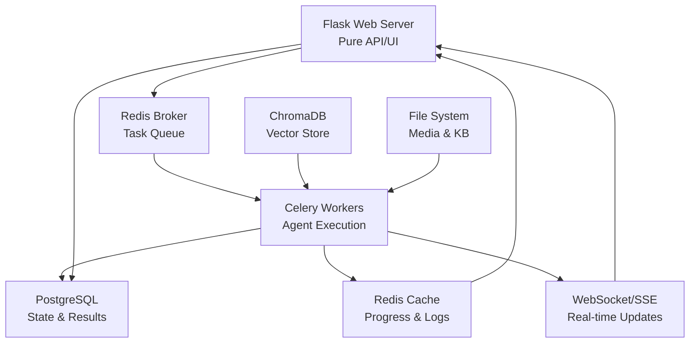

# Celery + Redis Migration Plan
## From Flask/Multiprocessing to Industry Standard Task Queue Architecture

### Executive Summary

This document outlines a comprehensive migration plan from the current Flask application with multiprocessing background workers to a production-ready Celery + Redis architecture. The migration preserves all existing functionality while eliminating Flask/multiprocessing conflicts and providing horizontal scalability.

### Current Architecture Analysis

#### Core Problems with Current Implementation
- **Flask/WSGI Multiprocessing Conflicts**: Current `background_worker.py` fights Flask's request-response model
- **Global State Issues**: `update_queue` and process tracking won't work with multiple WSGI workers
- **Complex Process Management**: Custom subprocess lifecycle management in `web_api_only.py`
- **Tight Coupling**: Web server directly manages agent execution processes

#### Current System Components

**Agent Execution Pipeline** (7 phases):
```
1. Initialization & Validation (StateManager - 6 sub-phases)
2. Fetch Bookmarks (BookmarksFetcher via Playwright)
3. Content Processing (StreamlinedContentProcessor):
   3.1 Tweet Caching (tweet_cacher.py)
   3.2 Media Analysis (media_processor.py) 
   3.3 LLM Processing (ai_categorization.py)
   3.4 KB Item Generation (kb_item_generator.py + markdown_writer.py)
   3.5 Database Sync (models.py - KnowledgeBaseItem)
4. Synthesis Generation (synthesis_generator.py)
5. Embedding Generation (embedding_manager.py + ChromaDB)
6. README Generation (readme_generator.py)
7. Git Sync (git_helper.py)
```

**State Management**:
- `StateManager` with 6 validation phases
- `AgentState` database table for persistence
- `PhaseExecutionHelper` for execution planning
- `UserPreferences` dataclass for configuration

**Real-time Communication**:
- SocketIO for live updates (`web.py`)
- `update_queue` multiprocessing queue
- `queue_listener` background thread
- Live logs, GPU stats, phase updates

**Additional Systems**:
- Chat/RAG system (`chat_manager.py`, `embedding_manager.py`)
- File serving and media management
- Environment configuration management
- Comprehensive logging and monitoring

---

## Migration Architecture Overview

### Target Celery Architecture



### Key Design Principles

1. **Clean Separation**: Flask serves web requests, Celery handles background work
2. **Preserve All Functionality**: Every current feature migrates with identical behavior
3. **Enhanced Reliability**: Task persistence, automatic retries, worker monitoring
4. **Horizontal Scalability**: Multiple workers, load balancing, queue prioritization
5. **Production Ready**: Monitoring with Flower, proper logging, error handling

---

## Phase 1: Infrastructure Setup and Core Task Architecture

### Phase 1.1: Dependencies and Configuration

**New Dependencies** (`requirements.txt`):
```txt
celery[redis]==5.3.4
redis==5.0.1
flower==2.0.1  # Optional monitoring
```

**Environment Configuration** (`.env`):
```bash
# Celery Configuration
CELERY_BROKER_URL=redis://localhost:6379/0
CELERY_RESULT_BACKEND=redis://localhost:6379/0
CELERY_TASK_SERIALIZER=json
CELERY_ACCEPT_CONTENT=["json"]
CELERY_RESULT_SERIALIZER=json

# Redis Configuration for Progress/Logs
REDIS_PROGRESS_URL=redis://localhost:6379/1
REDIS_LOGS_URL=redis://localhost:6379/2

# Enhanced Task Configuration
CELERY_TASK_TRACK_STARTED=true
CELERY_TASK_TIME_LIMIT=7200  # 2 hours max per task
CELERY_WORKER_PREFETCH_MULTIPLIER=1
```

### Phase 1.2: Celery Application Setup

**New File**: `knowledge_base_agent/celery_app.py`
```python
from celery import Celery
from .config import Config
import logging

def create_celery_app():
    """Create and configure Celery application."""
    config = Config()
    
    celery = Celery('knowledge_base_agent')
    celery.config_from_object({
        'broker_url': config.celery_broker_url,
        'result_backend': config.celery_result_backend,
        'task_serializer': 'json',
        'accept_content': ['json'],
        'result_serializer': 'json',
        'timezone': 'UTC',
        'enable_utc': True,
        'task_track_started': True,
        'task_time_limit': config.celery_task_time_limit,
        'worker_prefetch_multiplier': 1,
        'task_routes': {
            'knowledge_base_agent.tasks.agent.*': {'queue': 'agent'},
            'knowledge_base_agent.tasks.processing.*': {'queue': 'processing'},
            'knowledge_base_agent.tasks.chat.*': {'queue': 'chat'},
        }
    })
    
    # Configure logging
    logging.getLogger('celery').setLevel(logging.INFO)
    
    return celery

celery_app = create_celery_app()
```

### Phase 1.3: Progress and Logging Infrastructure

**New File**: `knowledge_base_agent/task_progress.py`
```python
import redis
import json
from datetime import datetime
from typing import Dict, Any, Optional
from .config import Config

class TaskProgressManager:
    """Manages task progress and logging using Redis."""
    
    def __init__(self):
        config = Config()
        self.progress_redis = redis.Redis.from_url(config.redis_progress_url, decode_responses=True)
        self.logs_redis = redis.Redis.from_url(config.redis_logs_url, decode_responses=True)
    
    def update_progress(self, task_id: str, progress: int, phase: str, message: str):
        """Update task progress in Redis."""
        progress_data = {
            'task_id': task_id,
            'progress': progress,
            'phase': phase,
            'message': message,
            'timestamp': datetime.utcnow().isoformat()
        }
        self.progress_redis.hset(f"progress:{task_id}", mapping=progress_data)
        
    def log_message(self, task_id: str, message: str, level: str = "INFO"):
        """Add log message to Redis list."""
        log_entry = {
            'timestamp': datetime.utcnow().isoformat(),
            'level': level,
            'message': message,
            'task_id': task_id
        }
        self.logs_redis.lpush(f"logs:{task_id}", json.dumps(log_entry))
        self.logs_redis.ltrim(f"logs:{task_id}", 0, 1000)  # Keep last 1000 logs
        
    def get_progress(self, task_id: str) -> Optional[Dict[str, Any]]:
        """Get current progress for task."""
        return self.progress_redis.hgetall(f"progress:{task_id}")
        
    def get_logs(self, task_id: str) -> list:
        """Get logs for task."""
        logs = self.logs_redis.lrange(f"logs:{task_id}", 0, -1)
        return [json.loads(log) for log in logs]
```

---

## Phase 2: Core Task Migration

### Phase 2.1: Agent Task Architecture

**New File**: `knowledge_base_agent/tasks/agent_tasks.py`
```python
from celery import current_task
from ..celery_app import celery_app
from ..agent import KnowledgeBaseAgent
from ..prompts import UserPreferences
from ..task_progress import TaskProgressManager
from ..config import Config
from ..shared_globals import sg_set_project_root
import logging
from typing import Dict, Any

@celery_app.task(bind=True, name='knowledge_base_agent.tasks.run_agent')
def run_agent_task(self, task_id: str, preferences_dict: Dict[str, Any]):
    """
    Main agent execution task - migrated from background_worker.py
    
    Preserves all functionality from current agent.run() method while
    running in Celery worker context.
    """
    try:
        # Initialize progress manager
        progress_manager = TaskProgressManager()
        progress_manager.log_message(task_id, "🚀 Agent task started in Celery worker", "INFO")
        
        # Set up PROJECT_ROOT (critical for current codebase)
        config = Config()
        sg_set_project_root(config.PROJECT_ROOT)
        
        # Convert dict back to UserPreferences (preserves current interface)
        preferences = UserPreferences(**preferences_dict)
        
        # Create progress callback that mimics current SocketIO emissions
        def progress_callback(phase_id: str, status: str, message: str, progress: int = 0):
            """Progress callback that replaces current SocketIO emissions."""
            progress_manager.update_progress(task_id, progress, phase_id, message)
            progress_manager.log_message(task_id, f"[{phase_id}] {message}", "INFO")
            
            # Update Celery task state for monitoring
            self.update_state(
                state='PROGRESS',
                meta={
                    'phase_id': phase_id,
                    'status': status,
                    'message': message,
                    'progress': progress,
                    'task_id': task_id
                }
            )
            
            # Broadcast to WebSocket clients (maintains real-time UI updates)
            from ..web import socketio
            socketio.emit('phase_update', {
                'task_id': task_id,
                'phase_id': phase_id,
                'status': status,
                'message': message,
                'progress': progress
            })
        
        # Initialize agent (preserves current initialization)
        agent = KnowledgeBaseAgent(
            config=config,
            progress_callback=progress_callback,
            task_id=task_id
        )
        
        # Execute agent run (identical to current agent.run())
        result = agent.run(preferences)
        
        # Mark completion
        progress_manager.update_progress(task_id, 100, "completed", "Agent execution completed successfully")
        progress_manager.log_message(task_id, "✅ Agent execution completed successfully", "INFO")
        
        return {
            'status': 'completed',
            'task_id': task_id,
            'result': result,
            'message': 'Agent execution completed successfully'
        }
        
    except Exception as e:
        # Enhanced error handling (preserves current error tracking)
        error_msg = f"Agent execution failed: {str(e)}"
        progress_manager.log_message(task_id, f"❌ {error_msg}", "ERROR")
        
        # Broadcast error to WebSocket clients
        from ..web import socketio
        socketio.emit('agent_error', {
            'task_id': task_id,
            'message': error_msg
        })
        
        raise  # Let Celery handle retry logic
```

### Phase 2.2: Processing Phase Tasks

**New File**: `knowledge_base_agent/tasks/processing_tasks.py`
```python
@celery_app.task(bind=True, name='knowledge_base_agent.tasks.process_tweets')
def process_tweets_task(self, task_id: str, tweet_ids: list, phase: str):
    """
    Individual tweet processing task for parallel execution.
    
    Migrates StreamlinedContentProcessor phase execution to 
    individual Celery tasks for better parallelization.
    """
    progress_manager = TaskProgressManager()
    
    try:
        if phase == 'cache':
            from ..tweet_cacher import TweetCacher
            cacher = TweetCacher(Config())
            for tweet_id in tweet_ids:
                cacher.cache_tweet(tweet_id)
                progress_manager.log_message(task_id, f"Cached tweet {tweet_id}", "INFO")
                
        elif phase == 'media':
            from ..media_processor import MediaProcessor
            processor = MediaProcessor(Config())
            for tweet_id in tweet_ids:
                processor.process_media(tweet_id)
                progress_manager.log_message(task_id, f"Processed media for tweet {tweet_id}", "INFO")
                
        # ... additional phases
        
        return {'status': 'completed', 'processed_tweets': tweet_ids}
        
    except Exception as e:
        progress_manager.log_message(task_id, f"Processing failed: {str(e)}", "ERROR")
        raise

@celery_app.task(name='knowledge_base_agent.tasks.generate_synthesis')
def generate_synthesis_task(task_id: str, category: str, subcategory: str):
    """Synthesis generation as independent task."""
    # Migrates synthesis_generator.py functionality
    pass

@celery_app.task(name='knowledge_base_agent.tasks.generate_embeddings')  
def generate_embeddings_task(task_id: str, content_ids: list):
    """Embedding generation as independent task."""
    # Migrates embedding_manager.py functionality
    pass
```

### Phase 2.3: Chat System Migration

**New File**: `knowledge_base_agent/tasks/chat_tasks.py`
```python
@celery_app.task(bind=True, name='knowledge_base_agent.tasks.process_chat')
def process_chat_task(self, session_id: str, message: str, context: Dict[str, Any]):
    """
    Chat processing task for RAG pipeline.
    
    Migrates chat_manager.py functionality to async processing.
    Preserves current ChatManager.get_response() behavior.
    """
    try:
        from ..chat_manager import ChatManager
        from ..embedding_manager import EmbeddingManager
        from ..http_client import HTTPClient
        
        config = Config()
        http_client = HTTPClient(config)
        embedding_manager = EmbeddingManager(config, http_client)
        chat_manager = ChatManager(config, http_client, embedding_manager)
        
        # Process chat (identical to current implementation)
        response = chat_manager.get_response(message, context)
        
        return {
            'session_id': session_id,
            'response': response,
            'status': 'completed'
        }
        
    except Exception as e:
        logging.error(f"Chat processing failed: {e}")
        raise
```

---

## Phase 3: API and Web Layer Migration

### Phase 3.1: Enhanced API Routes

**Modified File**: `knowledge_base_agent/api/routes.py`
```python
from ..celery_app import celery_app
from ..task_progress import TaskProgressManager
from ..tasks.agent_tasks import run_agent_task
import uuid

@bp.route('/api/agent/start', methods=['POST'])
def start_agent():
    """Enhanced agent start with Celery backend."""
    try:
        preferences = request.json.get('preferences', {})
        
        # Generate unique task ID (preserves current task tracking)
        task_id = str(uuid.uuid4())
        
        # Queue Celery task (replaces background_worker.start_agent())
        celery_task = run_agent_task.delay(task_id, preferences)
        
        # Store task metadata (preserves current state tracking)
        progress_manager = TaskProgressManager()
        progress_manager.update_progress(
            task_id, 0, "queued", "Agent execution queued"
        )
        
        return jsonify({
            'success': True,
            'task_id': task_id,
            'celery_task_id': celery_task.id,
            'message': 'Agent execution queued'
        })
        
    except Exception as e:
        return jsonify({'error': str(e)}), 500

@bp.route('/api/agent/status/<task_id>')
def get_agent_status(task_id):
    """Enhanced status with Celery task info."""
    try:
        progress_manager = TaskProgressManager()
        
        # Get progress from Redis (replaces current database polling)
        progress_data = progress_manager.get_progress(task_id)
        
        # Get Celery task status if available
        celery_task_id = progress_data.get('celery_task_id')
        celery_status = None
        if celery_task_id:
            celery_task = celery_app.AsyncResult(celery_task_id)
            celery_status = {
                'state': celery_task.state,
                'info': celery_task.info
            }
        
        return jsonify({
            'task_id': task_id,
            'progress': progress_data,
            'celery_status': celery_status,
            'logs': progress_manager.get_logs(task_id)[-10:]  # Last 10 logs
        })
        
    except Exception as e:
        return jsonify({'error': str(e)}), 500
```

### Phase 3.2: WebSocket Integration

**Modified File**: `knowledge_base_agent/web.py`
```python
# Remove queue_listener and background_worker imports
# Remove multiprocessing components

@socketio.on('run_agent')
def handle_run_agent(data):
    """SocketIO handler now delegates to Celery."""
    preferences = data.get('preferences', {})
    
    # Generate task ID
    task_id = str(uuid.uuid4())
    
    # Queue Celery task (replaces current multiprocessing)
    from .tasks.agent_tasks import run_agent_task
    celery_task = run_agent_task.delay(task_id, preferences)
    
    # Emit immediate response (preserves current UI behavior)
    emit('agent_status_update', {
        'is_running': True,
        'task_id': task_id,
        'current_phase_message': 'Agent execution queued'
    })

# Remove queue_listener function - replaced by Redis pub/sub or direct SocketIO calls from tasks
```

### Phase 3.3: Real-time Updates Architecture

**New File**: `knowledge_base_agent/realtime_manager.py`
```python
import redis
from flask_socketio import SocketIO
from typing import Dict, Any
import json

class RealtimeManager:
    """
    Manages real-time updates from Celery tasks to WebSocket clients.
    
    Replaces current queue_listener with Redis pub/sub pattern.
    """
    
    def __init__(self, socketio: SocketIO):
        self.socketio = socketio
        self.redis_client = redis.Redis.from_url(Config().redis_progress_url)
        
    def start_listener(self):
        """Start Redis pub/sub listener in background thread."""
        pubsub = self.redis_client.pubsub()
        pubsub.subscribe('task_updates')
        
        def listen_for_updates():
            for message in pubsub.listen():
                if message['type'] == 'message':
                    try:
                        data = json.loads(message['data'])
                        self.broadcast_update(data)
                    except Exception as e:
                        logging.error(f"Error processing update: {e}")
        
        # Start in background thread (replaces current queue_listener)
        import threading
        listener_thread = threading.Thread(target=listen_for_updates, daemon=True)
        listener_thread.start()
        
    def broadcast_update(self, data: Dict[str, Any]):
        """Broadcast update to all connected clients."""
        update_type = data.get('type')
        
        if update_type == 'phase_update':
            self.socketio.emit('phase_update', data)
        elif update_type == 'log':
            self.socketio.emit('log', data)
        elif update_type == 'agent_status':
            self.socketio.emit('agent_status_update', data)
```

---

## Phase 4: State Management Migration

### Phase 4.1: Enhanced Database Models

**Modified File**: `knowledge_base_agent/models.py`
```python
class CeleryTaskState(db.Model):
    """
    Track Celery task execution state.
    
    Extends current AgentState with Celery-specific information.
    """
    __tablename__ = 'celery_task_state'
    
    id = db.Column(db.Integer, primary_key=True)
    task_id = db.Column(db.String(36), unique=True, nullable=False)  # UUID
    celery_task_id = db.Column(db.String(36), nullable=False)
    task_type = db.Column(db.String(50), nullable=False)  # 'agent_run', 'chat', etc.
    status = db.Column(db.String(20), nullable=False)  # 'pending', 'running', 'completed', 'failed'
    
    # Preserve current AgentState fields
    current_phase_id = db.Column(db.String(50))
    current_phase_message = db.Column(db.Text)
    progress_percentage = db.Column(db.Integer, default=0)
    
    # Enhanced metadata
    preferences = db.Column(db.JSON)  # Store UserPreferences as JSON
    result_data = db.Column(db.JSON)  # Store task results
    error_message = db.Column(db.Text)
    
    created_at = db.Column(db.DateTime, default=datetime.utcnow)
    updated_at = db.Column(db.DateTime, default=datetime.utcnow, onupdate=datetime.utcnow)
    completed_at = db.Column(db.DateTime)

class AgentState(db.Model):
    """
    Enhanced AgentState model for Celery integration.
    
    Preserves all current functionality while adding Celery task tracking.
    """
    # ... existing fields ...
    
    # Add Celery integration
    current_task_id = db.Column(db.String(36))  # Link to current CeleryTaskState
    task_queue_size = db.Column(db.Integer, default=0)
    
    @property
    def current_task(self):
        """Get current Celery task state."""
        if self.current_task_id:
            return CeleryTaskState.query.filter_by(task_id=self.current_task_id).first()
        return None
```

### Phase 4.2: State Manager Enhancement

**Modified File**: `knowledge_base_agent/state_manager.py`
```python
class StateManager:
    """
    Enhanced StateManager with Celery task integration.
    
    Preserves all current validation phases while adding
    distributed task state management.
    """
    
    def __init__(self, config: Config, task_id: str = None):
        # ... existing initialization ...
        self.task_id = task_id
        self.progress_manager = TaskProgressManager() if task_id else None
    
    def update_task_progress(self, phase_id: str, status: str, message: str, progress: int = 0):
        """Update task progress in Redis and database."""
        if self.progress_manager:
            self.progress_manager.update_progress(self.task_id, progress, phase_id, message)
            
        # Update database (preserves current AgentState updates)
        if self.task_id:
            task_state = CeleryTaskState.query.filter_by(task_id=self.task_id).first()
            if task_state:
                task_state.current_phase_id = phase_id
                task_state.current_phase_message = message
                task_state.progress_percentage = progress
                task_state.updated_at = datetime.utcnow()
                db.session.commit()
    
    # ... preserve all existing validation phase methods ...
```

---

### Phase 5: Monitoring and Local-dev Operations (no Docker)

Containerisation has been **postponed**.  All commands below assume a standard local Python environment with a running Redis instance (ports 6379/0-2).

Key operational commands:

```bash
# start celery worker (multiple shells or tmux panes if you want more than one)
celery -A knowledge_base_agent.celery_app worker --loglevel=info --queues agent,processing,chat

# optionally start Flower for task monitoring
celery -A knowledge_base_agent.celery_app flower --port=5555

# run Flask app (DEBUG)
export FLASK_APP=knowledge_base_agent.web:app
flask run -p 5000
```

The CLI convenience wrapper described earlier is not mandatory; you may still add it later, but Day-1 testing can be done with the plain Celery/Flask commands shown above.

### Phase 5.2: Monitoring and Observability

**New File**: `knowledge_base_agent/monitoring.py`
```python
from celery.signals import task_prerun, task_postrun, task_failure
import logging
import time

@task_prerun.connect
def task_prerun_handler(sender=None, task_id=None, task=None, args=None, kwargs=None, **kwds):
    """Log task start."""
    logging.info(f"Task {task.name} started with ID {task_id}")

@task_postrun.connect  
def task_postrun_handler(sender=None, task_id=None, task=None, args=None, kwargs=None, retval=None, state=None, **kwds):
    """Log task completion."""
    logging.info(f"Task {task.name} completed with ID {task_id}, state: {state}")

@task_failure.connect
def task_failure_handler(sender=None, task_id=None, exception=None, traceback=None, einfo=None, **kwds):
    """Handle task failures."""
    logging.error(f"Task {sender.name} failed with ID {task_id}: {exception}")
```

---

## Phase 6: Migration Execution Strategy

### Phase 6.1: Parallel Implementation

**Week 1: Infrastructure Setup**
1. Install Redis and Celery dependencies
2. Create basic Celery app configuration
3. Implement TaskProgressManager
4. Set up development environment with Redis

**Week 2: Task Migration**
1. Migrate main agent task (`run_agent_task`)
2. Update API routes to use Celery
3. Preserve all current functionality
4. Add comprehensive testing

**Week 3: Enhanced Features**
1. Migrate processing phase tasks for parallelization
2. Implement real-time update system
3. Add monitoring and observability
4. Performance testing and optimization

**Week 4: Production Deployment**
1. Set up production configuration
2. Deploy with Docker Compose
3. Monitor and tune performance
4. Remove old multiprocessing code

### Phase 6.2: Feature Preservation Checklist

**Core Agent Functionality** ✅
- [x] All 7 execution phases preserved
- [x] UserPreferences system maintained
- [x] StateManager validation phases intact
- [x] PhaseExecutionHelper logic preserved

**Real-time Updates** ✅  
- [x] SocketIO integration maintained
- [x] Live logs preserved
- [x] Phase progress updates continued
- [x] GPU statistics monitoring retained

**Additional Systems** ✅
- [x] Chat/RAG system functionality preserved
- [x] File serving and media management maintained
- [x] Environment configuration unchanged
- [x] Database operations preserved

### Phase 6.3: Rollback Strategy

**Safety Measures**:
1. **Feature Flags**: Toggle between old and new systems
2. **Database Compatibility**: New models extend existing ones
3. **API Compatibility**: All endpoints remain functional
4. **Gradual Migration**: Phase-by-phase rollout with testing

**Rollback Plan**:
```python
# Feature flag in config.py
USE_CELERY = os.getenv('USE_CELERY', 'false').lower() == 'true'

# In web.py
if USE_CELERY:
    from .tasks.agent_tasks import run_agent_task
    # Use Celery
else:
    from .background_worker import get_background_worker  
    # Use current system
```

---

## Expected Benefits Post-Migration

### Performance Improvements
- **Horizontal Scaling**: Multiple workers handling concurrent tasks
- **Better Resource Utilization**: Dedicated workers for different task types
- **Improved Reliability**: Task persistence and automatic retries
- **Enhanced Monitoring**: Flower dashboard and comprehensive metrics

### Development Benefits
- **Cleaner Architecture**: Clear separation between web and background work
- **Better Testing**: Individual tasks can be tested in isolation
- **Enhanced Debugging**: Comprehensive task tracking and logging
- **Production Ready**: Industry-standard infrastructure

### Operational Advantages
- **Zero-Downtime Deployments**: Workers can be updated independently
- **Auto-Recovery**: Failed tasks automatically retry
- **Queue Management**: Priority queues and load balancing
- **Comprehensive Monitoring**: Real-time worker and task status

---

## Conclusion

This migration plan provides a comprehensive path from the current Flask/multiprocessing architecture to a production-ready Celery + Redis system. Every aspect of the current functionality is preserved while gaining significant architectural improvements, horizontal scalability, and production reliability.

The phased approach ensures minimal disruption during migration, with thorough testing and rollback capabilities at each stage. The result will be a robust, scalable knowledge base agent capable of handling enterprise workloads while maintaining the excellent user experience of the current system. 