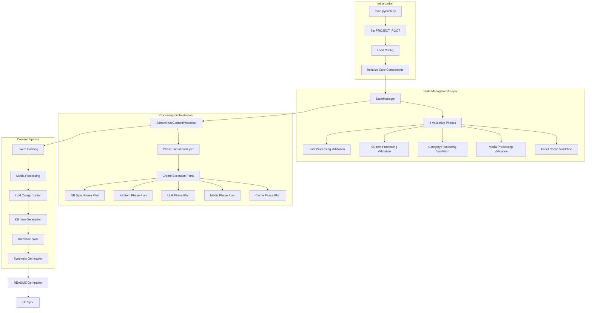
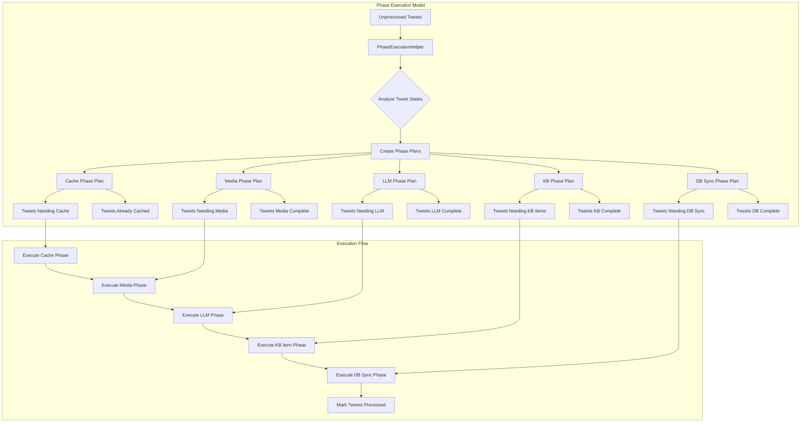

# Implementation Plan for Knowledge Base Agent

## Overview

The Knowledge Base Agent is an AI-driven system designed to automate the process of fetching, processing, categorizing, and generating content for a structured knowledge base. It primarily focuses on processing tweets from Twitter bookmarks, categorizing them using AI models, and generating markdown content for a knowledge repository. This document details the implementation plan, logical flow, and module functionalities to assist in extending, refining, or understanding the agent's design.

## Objectives

- **Automation**: Automate the fetching of Twitter bookmarks, processing of tweet content, and generation of structured knowledge base items.
- **Categorization**: Use AI models to categorize content into a hierarchical structure of main categories and subcategories.
- **Content Generation**: Generate detailed markdown content for each tweet, including text, media, and metadata.
- **State Management**: Maintain a persistent state to track processed and unprocessed content, avoiding redundant operations.
- **Integration**: Synchronize the knowledge base with a GitHub repository for version control and public access.
- **User Interface**: Provide a web interface for initiating agent runs, monitoring progress, and viewing generated content.
- **Portability**: Ensure paths are managed relatively for easier deployment and sharing.
- **Real-time Updates**: Offer real-time logging, phase updates, and agent status synchronization across multiple UI clients.
- **Subcategory Synthesis**: Generate synthesized learning documents for each subcategory that combine insights from all knowledge base items within that subcategory.

## Architectural Highlights

- **Streamlined Processing Architecture**: The system now uses a clean separation of concerns:
  - **StateManager**: Handles ALL validation through organized validation phases (6 phases)
  - **PhaseExecutionHelper**: Creates execution plans for processing phases, eliminating validation logic from ContentProcessor
  - **StreamlinedContentProcessor**: Pure orchestrator with zero validation logic (~660 lines vs 1351 lines previously)

- **Organized State Validation**: StateManager now uses 6 distinct validation phases:
  1. Initial State Validation - data structure integrity
  2. Tweet Cache Phase Validation - cache completeness
  3. Media Processing Phase Validation - media processing validation  
  4. Category Processing Phase Validation - categorization validation
  5. KB Item Processing Phase Validation - KB items validation
  6. Final Processing Validation - automatic completion detection and processing

- **Phase-Based Execution Planning**: PhaseExecutionHelper analyzes tweet states and creates execution plans that determine which tweets need processing for each phase, eliminating redundant validation

- **Relative Path Management**: The system uses a `PROJECT_ROOT` determined at startup. All internal path storage (e.g., in `tweet_cache.json`, database) and configuration path fields are handled relative to this root, ensuring portability. Absolute paths are resolved dynamically.

- **Multi-Client State Synchronization**: The agent backend (`agent.py`, `web.py`) maintains and communicates its operational state (running, idle, current phase) via SocketIO, allowing multiple web clients to have a consistent view.

- **Granular Real-time Feedback**: Detailed logs and processing phase updates are emitted via SocketIO for enhanced monitoring through the web UI.

- **Direct Category Attributes**: The database model (`KnowledgeBaseItem`) stores category information as direct attributes (`main_category`, `sub_category`) rather than a nested structure, simplifying database queries and template access.

- **Reasoning Model Support**: Introduces `TEXT_MODEL_THINKING` config to enable specialized "deep thinking" prompts and chat-based interactions with LLMs (e.g., via `ollama_chat`) for improved output quality in categorization, KB item generation, and README generation.

- **Centralized Timeout Management**: Replaced hardcoded timeouts with configurable values (`content_generation_timeout`, `selenium_timeout`) for better control over LLM calls and browser operations.

- **Historical Performance-Based ETC**: The system now collects processing time statistics for major phases (e.g., LLM Categorization) into `data/processing_stats.json` (managed by `stats_manager.py`) to provide more accurate Estimated Time to Completion (ETC) to the UI.

- **Filtered Debug Logging**: WebSocket handler filters out DEBUG level logs from Live Logs display while maintaining them in log files.

## System Architecture Flow Diagram



## Content Processing Pipeline



## State Management Validation Flow

```mermaid
graph TD
    A[StateManager.initialize()] --> B[Load State Files]
    B --> C[Phase 1: Initial State Validation]
    C --> D[Phase 2: Cache Phase Validation]
    D --> E[Phase 3: Media Phase Validation]
    E --> F[Phase 4: Category Phase Validation]
    F --> G[Phase 5: KB Item Phase Validation]
    G --> H[Phase 6: Final Processing Validation]
    H --> I[Save Validated State]
    
    C --> C1[Ensure Required Keys Exist]
    C1 --> C2[Set Default Values]
    C2 --> C3[Fix Data Structure Issues]
    
    D --> D1[Validate Cache Completeness]
    D1 --> D2[Move Incomplete to Unprocessed]
    
    E --> E1[Check Media Processing Status]
    E1 --> E2[Validate Image Descriptions]
    E2 --> E3[Handle No-Media Cases]
    
    F --> F1[Validate Category Data]
    F1 --> F2[Check Required Category Fields]
    
    G --> G1[Validate KB Item Paths]
    G1 --> G2[Check File Existence]
    G2 --> G3[Validate Tweet ID in README]
    
    H --> H1[Check All Phases Complete]
    H1 --> H2[Move Complete Tweets to Processed]
    H2 --> H3[Update Processing Statistics]
```

## Logical Flow

The logical flow of the Knowledge Base Agent follows a phased approach to ensure systematic processing of content:

1. **Initialization**:
   - Determine and set `PROJECT_ROOT` for relative path resolution (via `main.py`/`web.py` startup, setting values in `config.py` and `shared_globals.py`).
   - Load configuration settings from environment variables (`config.py`).
   - Set up logging for debugging and monitoring (`config.py`, `web.py`).
   - Initialize core components: `KnowledgeBaseAgent` (passing SocketIO instance), `StateManager`, `CategoryManager`, `HTTPClient`. Database and Flask app are initialized in `web.py`.
   - **StateManager runs 6 validation phases** to ensure data integrity and consistency.

2. **Content Fetching (if enabled)**:
   - Fetch Twitter bookmarks using Playwright for browser automation (`fetch_bookmarks.py`).
   - Extract tweet URLs and IDs from bookmarks.
   - Queue new, unprocessed tweets in `StateManager`.

3. **Content Processing (StreamlinedContentProcessor with PhaseExecutionHelper)**:
   - **Phase Planning**: `PhaseExecutionHelper` analyzes all tweet states and creates execution plans for each processing phase
   - **Phase 1: Tweet Caching**: Based on execution plan, cache tweets that need caching. Uses `tweet_cacher.py` to validate and cache full tweet data (text, media URLs, metadata) from URLs, storing results in `tweet_cache.json` managed by `StateManager`. Timeout managed by `config.content_generation_timeout`.
   - **Phase 2: Media Processing**: Process media for tweets identified by execution plan. Uses `media_processor.py` for media download and image description generation.
   - **Phase 3: LLM Processing (Categorization & Naming)**: For tweets needing LLM processing, use AI models (`ai_categorization.py`) to determine `main_category`, `sub_category`, and a filesystem-safe `item_name`. If `TEXT_MODEL_THINKING` is enabled, uses `ollama_chat` with `ReasoningPrompts`. Parallel processing based on `config.num_gpus_available`. This phase collects performance data for ETC.
   - **Phase 4: Knowledge Base Item Generation**: 
     - For tweets needing KB items, `kb_item_generator.py` generates structured JSON content using LLM, then converts to Markdown
     - `markdown_writer.py` handles filesystem operations: creates directory structure, copies media files, writes final Markdown
     - Updates tweet cache with `kb_item_path` and `kb_media_paths`
   - **Phase 5: Database Synchronization**: For tweets needing DB sync, create or update entries in SQL database (`KnowledgeBaseItem` model)
   - **ETC Data Collection**: Records execution time and item counts via `stats_manager.py` for improved future estimates

4. **Subcategory Synthesis Generation (if enabled)**:
   - **Phase 6: Synthesis Generation**: Generate synthesized learning documents for each subcategory by analyzing all knowledge base items within that subcategory. Uses AI models to create comprehensive synthesis documents that extract patterns, insights, and consolidated knowledge from individual items. These synthesis documents are stored both in the filesystem (`kb-generated/main_category/sub_category/_synthesis/`) and database (`SubcategorySynthesis` model) for web interface access.

5. **README Generation (if enabled)**:
   - Update the root `README.md` of the knowledge base with an overview and links to categorized content (`readme_generator.py`). If `TEXT_MODEL_THINKING` is enabled, uses `ollama_chat` and `ReasoningPrompts` for generating introductions and category descriptions. Timeout for LLM calls is managed by `config.content_generation_timeout`.

6. **Synchronization (if enabled)**:
   - Commit changes to a GitHub repository (`git_helper.py`).

7. **Cleanup**:
   - Remove temporary files and close resources.

## Module Functionalities

### Core Components

- **`agent.py` (KnowledgeBaseAgent)**:
  - **Purpose**: Central orchestrator, managing the workflow, state, and communication.
  - **Key Attributes**: `config`, `http_client`, `state_manager`, `category_manager`, `content_processor`, `socketio` (SocketIO instance), `_is_running`, `_current_phase_id`, `_current_phase_message`, `_current_phase_status`, `_current_run_preferences`.
  - **Key Functions**:
    - `initialize()`: Sets up dependencies.
    - `run()`: Executes the main workflow, coordinating phases based on `UserPreferences`. Manages agent running state (`_is_running`, etc.) via `set_initial_run_state()` and `set_final_run_state()`.
    - `process_tweet()`: Processes a single tweet end-to-end. Uses `current_app.app_context()` for Flask context.
    - `socketio_emit_log()`: Helper to emit logs via SocketIO.
    - `socketio_emit_phase_update()`: Helper to emit phase updates and set internal agent phase.
    - Getter methods for agent state (e.g., `is_agent_running()`, `get_current_phase_info()`).
  - **Interaction**: Coordinates with most other modules. Passes `socketio` instance and `socketio_emit_phase_update` method to `StreamlinedContentProcessor`.

- **`config.py` (Config)**:
  - **Purpose**: Manages system-wide configuration (Pydantic `BaseSettings`) loaded from `.env` and environment variables.
  - **Key Features**:
    - Defines `PROJECT_ROOT` (Path object), determined at startup and settable.
    - Path fields (e.g., `data_processing_dir_rel`) are defined as relative and resolved to absolute paths against `PROJECT_ROOT` via a `model_validator`.
    - Helper methods `resolve_path_from_project_root()` and `get_relative_path()`.
    - Includes flags like `enable_gpu_stats_monitoring`, `text_model_thinking` (for reasoning models).
    - Configuration for timeouts: `content_generation_timeout`, `selenium_timeout`.
    - Supports model configuration via environment variables like `categorization_model`, `gpu_total_memory`, and `categorization_model_thinking`.
    - `num_gpus_available` (from `NUM_GPUS_AVAILABLE` env var) for parallelism.
  - **Interaction**: Used by all modules. `PROJECT_ROOT` is also made available via `shared_globals.py`.

- **`state_manager.py` (StateManager)**:
  - **Purpose**: Manages persistent state with organized validation phases ensuring data integrity.
  - **Architecture**: Uses 6 distinct validation phases run during initialization:
    1. **Initial State Validation**: Ensures all required key-value pairs exist with sane defaults
    2. **Tweet Cache Phase Validation**: Validates cache completeness using TWEET_CACHE_FILE/UNPROCESSED_TWEETS_FILE  
    3. **Media Processing Phase Validation**: Validates media processing with image_descriptions
    4. **Category Processing Phase Validation**: Validates categorization data
    5. **KB Item Processing Phase Validation**: Validates KB items with README.md validation
    6. **Final Processing Validation**: Automatically moves completed tweets from unprocessed to processed
  - **Key Functions**:
    - `initialize()`: Runs all 6 validation phases and provides validation statistics
    - `get_tweet()`, `update_tweet_data()`, `initialize_tweet_cache()`: Manages individual tweet entries in `tweet_cache.json`
    - `get_unprocessed_tweets()`, `mark_tweet_processed()`: Manages processing queues
    - `run_validation_phase()`: Can run individual validation phases on demand
    - `get_validation_stats()`: Provides detailed validation statistics
  - **Data Storage**: Stores rich data for each tweet including `kb_item_path`, `kb_media_paths`, `display_title`, `raw_json_content`
  - **Interaction**: Central to `StreamlinedContentProcessor` and `KnowledgeBaseAgent`. Eliminates need for validation logic elsewhere.

- **`phase_execution_helper.py` (PhaseExecutionHelper)**:
  - **Purpose**: Creates execution plans for processing phases, eliminating validation logic from ContentProcessor.
  - **Key Components**:
    - `ProcessingPhase` enum: CACHE, MEDIA, LLM, KB_ITEM, DB_SYNC
    - `PhaseExecutionPlan` dataclass: Contains tweets needing processing, already complete, and ineligible for each phase
  - **Key Functions**:
    - `create_all_execution_plans()`: Analyzes all tweets and creates execution plans for all phases
    - `create_phase_execution_plan()`: Creates plan for specific phase
    - `analyze_processing_state()`: Provides detailed analysis of tweet processing states
    - `validate_phase_prerequisites()`: Validates prerequisites for phases
  - **Design**: Handles all phase eligibility and processing need determination, replacing ~500 lines of validation logic in ContentProcessor
  - **Interaction**: Used exclusively by `StreamlinedContentProcessor` to determine which tweets need processing

- **`content_processor.py` (StreamlinedContentProcessor)**:
  - **Purpose**: Pure orchestrator focused solely on coordination - contains ZERO validation logic.
  - **Architecture**: Streamlined from 1351 lines to 660 lines by removing all validation logic
  - **Key Functions**:
    - `process_all_tweets()`: Main orchestration method using execution plans from PhaseExecutionHelper
    - `_execute_cache_phase()`, `_execute_media_phase()`, `_execute_llm_phase()`, etc.: Execute individual phases based on execution plans
    - `_finalize_processing()`: Final processing and stats update
  - **Design Principles**:
    - Uses execution plans to eliminate validation logic
    - Delegates all validation to StateManager
    - Delegates all phase planning to PhaseExecutionHelper
    - Pure orchestration with clean separation of concerns
  - **Interaction**: Uses `PhaseExecutionHelper` for execution plans, `StateManager` for state management, individual processing modules for actual work

- **`category_manager.py` (CategoryManager)**:
  - **Purpose**: Manages categories and subcategories.
  - **Key Functions**: `initialize()`, `get_all_categories()`, `ensure_category_exists()`.
  - **Interaction**: Used by `StreamlinedContentProcessor` during AI categorization.

- **`kb_item_generator.py`**:
  - **Purpose**: Generates structured JSON content for a KB article using an LLM, then converts it to Markdown, and populates a `KnowledgeBaseItem` dataclass.
  - **Key Functions**:
    - `create_knowledge_base_item()`: Takes tweet data. Prompts an LLM (using `ollama_chat` and `ReasoningPrompts` if `TEXT_MODEL_THINKING` is true) for structured JSON content (title, intro, sections, etc.). Converts JSON to Markdown. Includes `_ensure_string_from_value` to handle cases where LLM returns lists for string fields. Returns a populated `KnowledgeBaseItem` (from `types.py`) with this Markdown, `raw_json_content`, `display_title`, etc.
  - **Interaction**: Used by `StreamlinedContentProcessor`. Uses `HTTPClient` and `Prompts`.

- **`markdown_writer.py`**:
  - **Purpose**: Handles filesystem operations for KB items: directory creation, media file copying/linking, and writing the final Markdown.
  - **Key Functions**:
    - `write_kb_item()`: Takes a `KnowledgeBaseItem` object. Creates `kb-generated/main_cat/sub_cat/item_name/` directory. Copies media from cache to item's `media/` subfolder, renames media, updates Markdown with relative media links. Writes final Markdown to `README.md`. Returns KB item directory path and relative media paths.
  - **Interaction**: Used by `StreamlinedContentProcessor`.

- **`readme_generator.py`**: Updated to use `ollama_chat` and `ReasoningPrompts` if `TEXT_MODEL_THINKING` is true. Uses `config.content_generation_timeout`.

- **`synthesis_generator.py`**:
  - **Purpose**: Generates synthesized learning documents for subcategories by analyzing all knowledge base items within each subcategory.
  - **Key Functions**:
    - `generate_subcategory_synthesis()`: Analyzes all items in a subcategory, extracts content (excluding media), prompts LLM for synthesis, creates comprehensive learning document.
    - `write_synthesis_document()`: Writes synthesis to filesystem and database.
  - **Interaction**: Used by `StreamlinedContentProcessor` and `KnowledgeBaseAgent`.

### Processing Modules

- **`tweet_cacher.py`**: Handles tweet data fetching and caching. Updated to accept `config: Config` in constructor.
- **`media_processor.py`**: Handles media download and image description generation. Updates tweet data with `media_processed` flag.
- **`ai_categorization.py`**: Handles AI-powered categorization and naming. Updated to use `ollama_chat` and `ReasoningPrompts` if `TEXT_MODEL_THINKING` is true.

### Utility Modules

- **`http_client.py` (HTTPClient)**: Added `ollama_chat` method for `/api/chat` endpoint. Uses `config.content_generation_timeout` for both `ollama_generate` and `ollama_chat`.
- **`fetch_bookmarks.py` / `playwright_fetcher.py`**: Updated to use `config.selenium_timeout` (converted to ms) for page navigation and selector waits.
- **`text_processor.py`**: Minimal utility functions. Most categorization logic moved to `ai_categorization.py`.
- **`image_interpreter.py`**: Image processing utilities.
- **`video_interpreter.py`**: Video processing utilities.
- **`git_helper.py` (GitSyncHandler)**: Git operations for repository synchronization.
- **`progress.py` (ProcessingStats)**: Progress tracking utilities.
- **`exceptions.py`**: Custom exception classes.

### Web Application

- **`web.py`**:
  - **Purpose**: Flask/SocketIO web application for UI, agent control, and content viewing.
  - **Key Features**:
    - Initializes Flask app, SocketIO, SQLAlchemy (`db.init_app(app)`), and Flask-Migrate (`migrate.init_app(app, db)`).
    - **WebSocket Logging Filter**: `WebSocketHandler` now filters out DEBUG level logs from Live Logs display while maintaining them in log files.
    - Routes for main page, item details, media serving, and synthesis viewing
    - SocketIO handlers for real-time communication
    - GPU stats monitoring and emission
    - Agent state synchronization across multiple clients
  - **Interaction**: Determines `PROJECT_ROOT` on startup, instantiates `KnowledgeBaseAgent`.

- **`main.py`**: Entry point for command-line execution
- **`routes.py`**: Additional web routes

### Data and Configuration

- **`prompts.py`**:
  - **Purpose**: Centralized storage for all LLM prompts.
  - **Key Features**:
    - `LLMPrompts` class for standard generation/completion prompts.
    - `ReasoningPrompts` class for chat-based, "deep thinking" prompts (used when `TEXT_MODEL_THINKING` is true).
    - `UserPreferences` dataclass with flags for controlling processing behavior
    - Synthesis generation prompts for creating comprehensive learning documents
  - **Interaction**: Used by all LLM-calling modules.

- **`types.py`**:
  - **Purpose**: Defines dataclasses for structured data
  - **Key Types**:
    - `KnowledgeBaseItem`: Represents a fully processed knowledge base item with all metadata
    - `SubcategorySynthesis`: Represents synthesis documents for subcategories
  - **Interaction**: Used throughout the system for type safety and structured data handling.

- **`models.py` (SQLAlchemy Models)**:
  - **`KnowledgeBaseItem` model**: Database model with direct category attributes, media paths, and content references
  - **`SubcategorySynthesis` model**: Database model for synthesis documents
  - **Design**: Categories stored as direct attributes for simplified queries

### System Utilities

- **`shared_globals.py`**: Global state management including `PROJECT_ROOT` and `stop_flag`
- **`stats_manager.py`**: Processing statistics management for ETC calculations
- **`gpu_utils.py`**: GPU monitoring and statistics
- **`file_utils.py`**, **`naming_utils.py`**, **`path_utils.py`**, **`tweet_utils.py`**: Various utility functions

### Directory Structure

```
knowledge_base_agent/
├── agent.py                    # Main orchestrator
├── config.py                   # Configuration management  
├── state_manager.py            # State validation & management
├── content_processor.py        # Streamlined processing orchestrator
├── phase_execution_helper.py   # Phase planning & execution logic
├── web.py                      # Web application
├── main.py                     # CLI entry point
├── 
├── # Processing Modules
├── tweet_cacher.py            # Tweet data fetching
├── media_processor.py         # Media processing
├── ai_categorization.py       # AI categorization
├── kb_item_generator.py       # KB item generation
├── markdown_writer.py         # Filesystem operations
├── synthesis_generator.py     # Synthesis generation
├── readme_generator.py        # README generation
├── 
├── # Core Utilities  
├── http_client.py             # HTTP/LLM client
├── category_manager.py        # Category management
├── git_helper.py              # Git operations
├── 
├── # Data & Configuration
├── prompts.py                 # LLM prompts
├── types.py                   # Data structures
├── models.py                  # Database models
├── progress.py                # Progress tracking
├── 
├── # System Utilities
├── shared_globals.py          # Global state
├── stats_manager.py           # Performance stats
├── gpu_utils.py               # GPU monitoring
├── exceptions.py              # Custom exceptions
├── 
├── # File Utilities
├── file_utils.py              # File operations
├── naming_utils.py            # Naming utilities  
├── path_utils.py              # Path utilities
├── tweet_utils.py             # Tweet utilities
├── text_processor.py          # Text processing
├── image_interpreter.py       # Image processing
├── video_interpreter.py       # Video processing
├── 
├── # Web Components
├── routes.py                  # Additional routes
├── templates/                 # Web templates
├── static/                    # Static assets
├── 
├── # External Integration
├── fetch_bookmarks.py         # Twitter bookmark fetching
├── playwright_fetcher.py      # Browser automation
└── utils/                     # Additional utilities
    ├── gpu_check.py           # GPU detection
    └── __init__.py
```

## Key Interactions and Dependencies

- **Agent as Central Hub**: `KnowledgeBaseAgent` in `agent.py` remains central orchestrator
- **Streamlined Architecture**: Clear separation between StateManager (validation), PhaseExecutionHelper (planning), and StreamlinedContentProcessor (orchestration)
- **Path Management**: `PROJECT_ROOT` determined at startup, managed through `config.py` and `shared_globals.py`
- **State Validation**: StateManager's 6 validation phases ensure data integrity before processing begins
- **Phase Execution**: PhaseExecutionHelper creates smart execution plans that eliminate validation logic from ContentProcessor
- **Content Pipeline**: Clean flow from tweet data → LLM processing → KB item generation → filesystem → database
- **Real-time Communication**: SocketIO provides real-time updates and multi-client synchronization

## NEW FEATURE: Subcategory Synthesis Generation

### Overview

The synthesis generation feature creates comprehensive learning documents for each subcategory by analyzing all knowledge base items within that subcategory. This feature extracts patterns, consolidates insights, and generates domain-expert-level synthesis documents that provide a higher-level understanding of topics.

### Architecture

#### Storage Strategy
- **Filesystem**: Synthesis documents stored in `kb-generated/main_category/sub_category/_synthesis/README.md`
- **Database**: `SubcategorySynthesis` model for web interface access and metadata
- **Git Integration**: Synthesis documents included in git commits alongside regular KB items

#### Data Sources
- **Primary**: Content from all `KnowledgeBaseItem`s within a subcategory (excluding actual media files)
- **Supplementary**: Category metadata, item relationships, and existing synthesis documents for updates

#### Processing Flow
1. **Collection Phase**: Gather all items within each subcategory from database
2. **Content Extraction**: Extract markdown content, titles, and key insights (excluding media)
3. **LLM Synthesis**: Use TEXT_MODEL to generate comprehensive synthesis document
4. **Output Generation**: Create structured markdown with proper formatting and links
5. **Storage**: Write to filesystem and database simultaneously

### Implementation Details

#### New Database Model: `SubcategorySynthesis`
```python
class SubcategorySynthesis(db.Model):
    __tablename__ = 'subcategory_synthesis'
    
    id = db.Column(db.Integer, primary_key=True)
    main_category = db.Column(db.String(100), nullable=False)
    sub_category = db.Column(db.String(100), nullable=False)
    synthesis_title = db.Column(db.String(255), nullable=False)
    synthesis_content = db.Column(db.Text, nullable=False)
    raw_json_content = db.Column(db.Text, nullable=True)
    item_count = db.Column(db.Integer, nullable=False, default=0)
    file_path = db.Column(db.String(500), nullable=True)
    created_at = db.Column(db.DateTime, nullable=False)
    last_updated = db.Column(db.DateTime, nullable=False)
    
    __table_args__ = (db.UniqueConstraint('main_category', 'sub_category'),)
```

#### Enhanced UserPreferences
```python
@dataclass
class UserPreferences:
    # ... existing fields ...
    skip_synthesis_generation: bool = False  # Skip synthesis generation phase
    force_regenerate_synthesis: bool = False  # Force regeneration of existing synthesis docs
    synthesis_mode: str = "comprehensive"  # Options: 'comprehensive', 'technical_deep_dive', 'practical_guide'
```

#### Integration Points

##### Phase Integration
- **New Phase ID**: `synthesis_generation` added to agent pipeline
- **Phase Position**: After content processing, before README generation
- **Conditional Execution**: Based on `skip_synthesis_generation` preference
- **Force Regeneration**: Controlled by `force_regenerate_synthesis` preference

##### Web Interface Integration
- **New Route**: `/synthesis/<main_category>/<sub_category>` for viewing synthesis documents
- **Sidebar Integration**: Links to synthesis documents in category navigation
- **API Endpoints**: RESTful access to synthesis documents

#### Run Options

##### Standalone Synthesis Run
- **Run Mode**: `synthesis_only` - Generate only synthesis documents without processing individual items
- **Use Case**: Periodic synthesis updates without reprocessing existing content
- **Efficiency**: Leverages existing processed items for faster synthesis generation

##### Integrated Pipeline Run
- **Standard Integration**: Synthesis generation as part of full pipeline
- **Selective Generation**: Only generate synthesis for subcategories with new/updated items
- **Incremental Updates**: Update existing synthesis documents when new items are added to subcategories

### Synthesis Document Structure

#### Generated Document Format
```markdown
# [Subcategory] Synthesis: [Generated Title]

## Overview
[Executive summary of the subcategory's scope and key themes]

## Core Concepts
[Fundamental concepts and principles identified across items]

## Technical Patterns
[Common technical patterns, architectures, and approaches]

## Key Insights
[Important insights and learnings synthesized from all items]

## Implementation Considerations
[Practical considerations for applying the knowledge]

## Advanced Topics
[Deep technical topics for expert-level understanding]

## Related Resources
[Links to related items within the knowledge base]

## Source Items
[List of knowledge base items used in this synthesis]

---
*This synthesis was generated from [X] knowledge base items in the [subcategory] category.*
*Last updated: [timestamp]*
```

#### Synthesis Quality Features
- **Cross-Item Pattern Recognition**: Identify common patterns across multiple items
- **Conceptual Hierarchy**: Organize information from basic to advanced concepts
- **Technical Depth**: Maintain expert-level technical accuracy and depth
- **Practical Application**: Include implementation guidance and best practices
- **Knowledge Gaps**: Identify areas where additional content would be valuable

### Configuration and Deployment

#### Environment Variables
```bash
# Synthesis-specific configuration
SYNTHESIS_MODEL="llama3.1:70b"  # Dedicated model for synthesis (optional)
SYNTHESIS_MODEL_THINKING=true   # Enable reasoning for synthesis model
SYNTHESIS_MIN_ITEMS=3           # Minimum items required for synthesis generation
SYNTHESIS_MAX_ITEMS=50          # Maximum items to include in single synthesis
```

#### Performance Considerations
- **Batch Processing**: Process multiple subcategories in parallel based on GPU availability
- **Content Optimization**: Truncate individual item content to focus on key information
- **Caching Strategy**: Cache synthesis documents to reduce regeneration frequency
- **ETC Integration**: Include synthesis generation in performance statistics and time estimation

### Future Enhancements

#### Advanced Synthesis Features
- **Cross-Category Analysis**: Identify relationships between different subcategories
- **Temporal Analysis**: Track how knowledge in subcategories evolves over time
- **Quality Metrics**: Measure synthesis quality and completeness
- **Interactive Synthesis**: Allow users to request specific synthesis focuses or perspectives

#### Integration Opportunities
- **Search Enhancement**: Use synthesis documents to improve search relevance
- **Recommendation Engine**: Suggest related subcategories based on synthesis analysis
- **Export Options**: Generate different synthesis formats (PDF, slides, etc.)
- **Collaborative Features**: Allow community contributions to synthesis documents

## Documentation
- **`docs/reasoning_models.md`**: Documents the reasoning model feature, its configuration, and impact.
- **`docs/environment_variables.md`**: Comprehensive environment variable documentation.
- **`docs/synthesis_generation.md`**: Comprehensive documentation for the synthesis generation feature (planned).

## Implementation Plan for Extension and Refinement

### Current Architecture Benefits
1. **Clean Separation of Concerns**: StateManager handles validation, PhaseExecutionHelper handles planning, StreamlinedContentProcessor handles orchestration
2. **Reduced Complexity**: ContentProcessor reduced from 1351 to 660 lines with zero validation logic
3. **Improved Maintainability**: Each component has a single, clear responsibility
4. **Better Testability**: Individual components can be tested in isolation
5. **Scalable Design**: New phases can be added easily through PhaseExecutionHelper

### Extension Guidelines
1. **State Validation**: Add new validation phases to StateManager if needed
2. **Processing Phases**: Add new phases through PhaseExecutionHelper enum and logic
3. **Content Processing**: Add new processing modules and integrate through StreamlinedContentProcessor
4. **Data Models**: Extend types.py and models.py for new data structures

### Quality Assurance
- **Validation Testing**: Ensure StateManager validation phases work correctly
- **Phase Planning Testing**: Verify PhaseExecutionHelper creates correct execution plans
- **Integration Testing**: Test complete pipeline with various tweet states
- **Performance Monitoring**: Track processing time and resource usage

## Getting Started for New Developers
- **Architecture Understanding**: Study the separation between StateManager (validation), PhaseExecutionHelper (planning), and StreamlinedContentProcessor (orchestration)
- **Path Management**: Understand how `PROJECT_ROOT` is set and managed throughout the system
- **Phase Execution**: Learn how PhaseExecutionHelper creates execution plans that eliminate validation logic
- **State Management**: Understand StateManager's 6 validation phases and their purposes
- **Content Pipeline**: Follow the flow from execution plans through individual processing modules
- **Synthesis Integration**: Understand how synthesis generation integrates with the main pipeline

## Conclusion

This implementation plan provides a comprehensive and current overview of the Knowledge Base Agent's streamlined design, including the new validation-based StateManager, phase-execution planning, and pure orchestration architecture. The system now has clear separation of concerns, reduced complexity, and improved maintainability while supporting advanced features like subcategory synthesis generation. The plan serves as a roadmap for extending the agent's capabilities and understanding its refined architecture.