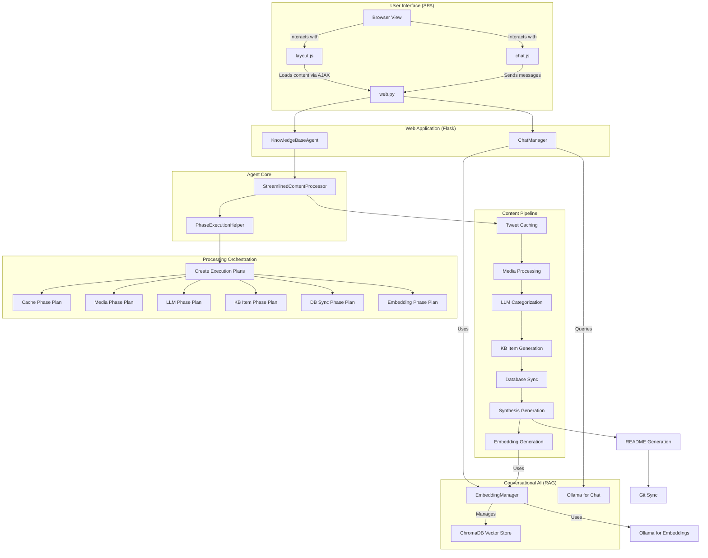
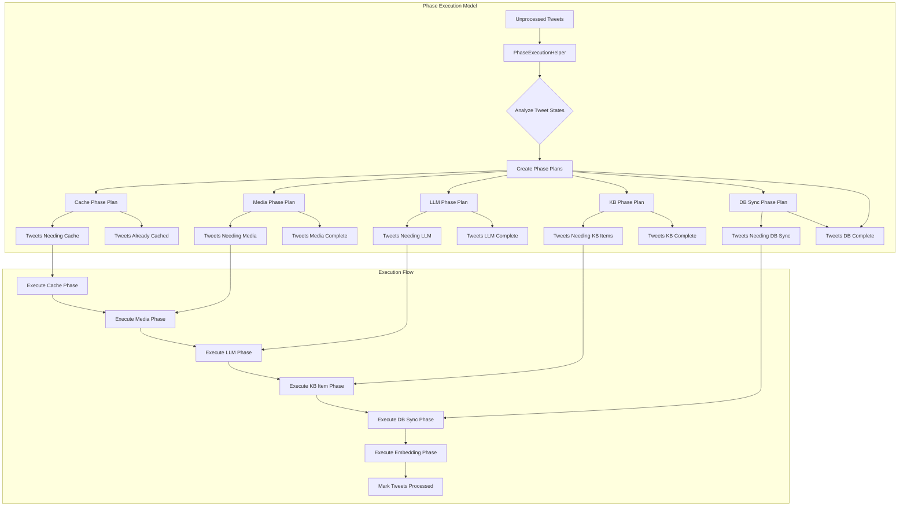
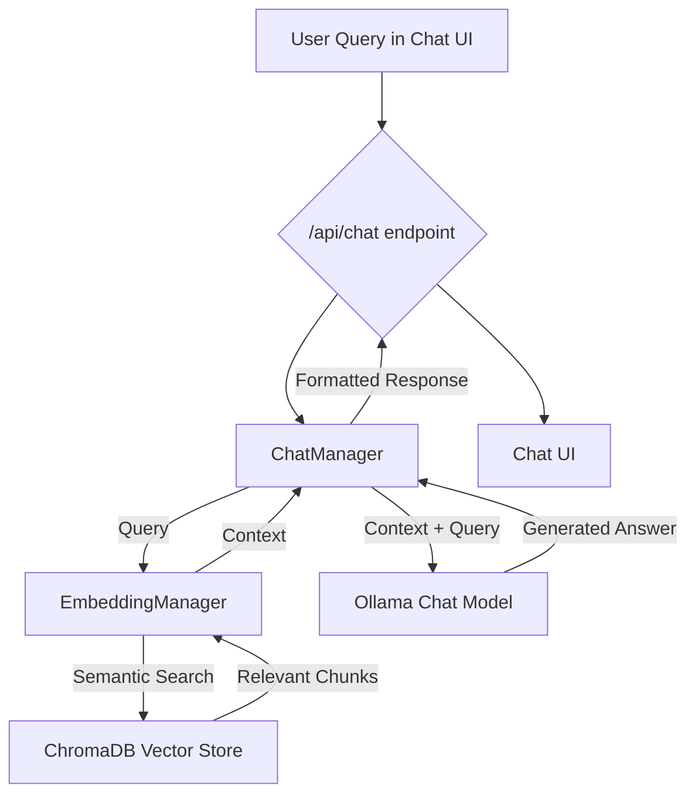

# Implementation Plan for Knowledge Base Agent

## Overview

The Knowledge Base Agent is an AI-driven system designed to automate the process of fetching, processing, categorizing, and generating content for a structured knowledge base. It primarily focuses on processing tweets from Twitter bookmarks, categorizing them using AI models, and generating markdown content for a knowledge repository. This document details the implementation plan, logical flow, and module functionalities to assist in extending, refining, or understanding the agent's design.

## Objectives

- **Automation**: Automate the fetching of Twitter bookmarks, processing of tweet content, and generation of structured knowledge base items.
- **Categorization**: Use AI models to categorize content into a hierarchical structure of main categories and subcategories.
- **Content Generation**: Generate detailed markdown content for each tweet, including text, media, and metadata.
- **State Management**: Maintain a persistent state to track processed and unprocessed content, avoiding redundant operations.
- **Integration**: Synchronize the knowledge base with a GitHub repository for version control and public access.
- **User Interface**: Provide a web interface for initiating agent runs, monitoring progress, and viewing generated content.
- **Portability**: Ensure all paths are managed relative to PROJECT_ROOT - no hardcoded system paths. PROJECT_ROOT is determined at startup and all paths are resolved dynamically for deployment portability.
- **Process Isolation**: Agent execution runs in a Celery worker process for stability, resource isolation, and to prevent blocking the web interface.
- **Real-time Updates**: Offer real-time logging, phase updates, and agent status synchronization via a Redis-backed real-time manager and SocketIO.
- **Subcategory Synthesis**: Generate synthesized learning documents for each subcategory that combine insights from all knowledge base items within that subcategory.

## Architectural Highlights

- **Single-Page Application (SPA-like) UI**: The web interface has been refactored to function like a single-page application. Navigation and content loading are handled dynamically via AJAX (`layout.js`), preventing full-page reloads and providing a smoother user experience. A unified master template (`_layout.html`) ensures a consistent look and feel across all views.
- **Conversational AI with RAG**: A new chat interface (`chat.html`, `chat.js`) allows users to interact with the knowledge base using a Retrieval-Augmented Generation (RAG) model. The `chat_manager.py` orchestrates this process, retrieving relevant context from a ChromaDB vector store managed by `embedding_manager.py`.
- **Pluggable Embedding Generation**: The creation of text embeddings for the knowledge base is now an independent, toggleable phase in the agent's execution plan. This allows for dedicated runs to only generate or update embeddings.
- **Streamlined Processing Architecture**: The system now uses a clean separation of concerns:
  - **StateManager**: Handles ALL validation through organized validation phases (6 phases)
  - **PhaseExecutionHelper**: Creates execution plans for processing phases, eliminating validation logic from ContentProcessor
  - **StreamlinedContentProcessor**: Pure orchestrator with zero validation logic (~660 lines vs 1351 lines previously)

- **Organized State Validation**: StateManager now uses 6 distinct validation phases:
  1. Initial State Validation - data structure integrity
  2. Tweet Cache Phase Validation - cache completeness
  3. Media Processing Phase Validation - media processing validation  
  4. Category Processing Phase Validation - categorization validation
  5. KB Item Processing Phase Validation - KB items validation
  6. Final Processing Validation - automatic completion detection and processing

- **Phase-Based Execution Planning**: PhaseExecutionHelper analyzes tweet states and creates execution plans that determine which tweets need processing for each phase, eliminating redundant validation

- **Relative Path Management**: The system uses a `PROJECT_ROOT` determined at startup. All internal path storage (e.g., in `tweet_cache.json`, database) and configuration path fields are handled relative to this root, ensuring portability. Absolute paths are resolved dynamically.

- **Multi-Client State Synchronization**: The agent backend (`agent.py`, `web.py`) maintains and communicates its operational state (running, idle, current phase) via SocketIO, allowing multiple web clients to have a consistent view.

- **Granular Real-time Feedback**: Detailed logs and processing phase updates are emitted via SocketIO for enhanced monitoring through the web UI.

- **Direct Category Attributes**: The database model (`KnowledgeBaseItem`) stores category information as direct attributes (`main_category`, `sub_category`) rather than a nested structure, simplifying database queries and template access.

- **Reasoning Model Support**: Introduces `TEXT_MODEL_THINKING` config to enable specialized "deep thinking" prompts and chat-based interactions with LLMs (e.g., via `ollama_chat`) for improved output quality in categorization, KB item generation, and README generation.

- **Centralized Timeout Management**: Replaced hardcoded timeouts with configurable values (`content_generation_timeout`, `selenium_timeout`) for better control over LLM calls and browser operations.

- **Historical Performance-Based ETC**: The system now collects processing time statistics for major phases (e.g., LLM Categorization) into `data/processing_stats.json` (managed by `stats_manager.py`) to provide more accurate Estimated Time to Completion (ETC) to the UI.

- **Filtered Debug Logging**: WebSocket handler filters out DEBUG level logs from Live Logs display while maintaining them in log files.

- **Database-Backed State Management**: The agent's core operational state (e.g., running status, current phase, user preferences for the run) is persisted in a dedicated `AgentState` database table. This ensures state consistency across application restarts and provides a single source of truth, eliminating reliance on transient in-memory variables.

- **Asynchronous Task Execution with Celery**: The agent runs in a dedicated Celery worker process, completely isolated from the main Flask web server. This prevents the web UI from becoming unresponsive during long-running tasks and enhances overall stability. A Redis message broker is used for reliable task queuing, and a Redis-based real-time manager handles communication back to the web server for real-time updates.

- **Serializable Tracebacks**: In the event of a crash in the agent's Celery task, full, rich tracebacks are serialized, stored, and made available for debugging, providing comprehensive error details that would otherwise be lost in a separate process.

## Recent Bug Fixes and Improvements

The system has undergone significant debugging and stabilization, resolving several critical issues:

### Frontend UI Fixes
- **SocketIO Connection Issues**: Resolved missing `socket.io.min.js` library that was preventing GPU statistics and real-time updates from working
- **Chat Widget Issues**: Fixed bugs where chat models displayed "[object Object]" instead of proper model names, and resolved chat minimization functionality
- **Past Logs Loading**: Fixed JavaScript timing issues that prevented log file dropdown from populating
- **GPU Statistics Display**: Implemented proper fallback mechanisms and retry logic for GPU stats display
- **Live Logs Filtering**: Enhanced WebSocket logging to filter out noisy DEBUG messages while maintaining important information

### Backend Process Management
- **Agent Subprocess Execution**: Fixed critical issues with agent process spawning, including:
  - Proper Python path configuration in subprocesses
  - Working directory management for portable execution
  - Comprehensive error logging with dedicated log files (`agent_debug_[PID].log`, `agent_error_[PID].log`)
  - Exit code tracking and UI status synchronization
- **Import Conflict Resolution**: Resolved circular import issues by renaming `types.py` to `custom_types.py` to avoid conflicts with Python's built-in types module
- **Database Path Consistency**: Fixed database duplication issues by ensuring consistent use of `instance/knowledge_base.db` path

### Code Quality and Organization
- **Web.py Structure Reorganization**: Complete restructuring with proper separation of imports, helper functions, app initialization, and route definitions
- **Index.js Refactoring**: Comprehensive rewrite eliminating state management conflicts, redundant function calls, and improving performance
- **Path Portability**: All hardcoded paths replaced with PROJECT_ROOT-relative path resolution for deployment portability

### Real-time Communication Enhancements
- **SocketIO Handler Improvements**: Fixed connection authentication issues and added proper error handling
- **Multi-client State Synchronization**: Enhanced agent state broadcasting to keep multiple UI clients synchronized
- **WebSocket Logging Enhancement**: Implemented intelligent filtering to reduce log noise while maintaining debugging capabilities

## System Architecture Flow Diagram



## Content Processing Pipeline



## State Management Validation Flow

```mermaid
graph TD
    A[StateManager.initialize()] --> B[Load State Files]
    B --> C[Phase 1: Initial State Validation]
    C --> D[Phase 2: Cache Phase Validation]
    D --> E[Phase 3: Media Phase Validation]
    E --> F[Phase 4: Category Phase Validation]
    F --> G[Phase 5: KB Item Phase Validation]
    G --> H[Phase 6: Final Processing Validation]
    H --> I[Save Validated State]
    
    C --> C1[Ensure Required Keys Exist]
    C1 --> C2[Set Default Values]
    C2 --> C3[Fix Data Structure Issues]
    
    D --> D1[Validate Cache Completeness]
    D1 --> D2[Move Incomplete to Unprocessed]
    
    E --> E1[Check Media Processing Status]
    E1 --> E2[Validate Image Descriptions]
    E2 --> E3[Handle No-Media Cases]
    
    F --> F1[Validate Category Data]
    F1 --> F2[Check Required Category Fields]
    
    G --> G1[Validate KB Item Paths]
    G1 --> G2[Check File Existence]
    G2 --> G3[Validate Tweet ID in README]
    
    H --> H1[Check All Phases Complete]
    H1 --> H2[Move Complete Tweets to Processed]
    H2 --> H3[Update Processing Statistics]
```

## Logical Flow

The logical flow of the Knowledge Base Agent follows a phased approach to ensure systematic processing of content:

1. **Initialization**:
   - Determine and set `PROJECT_ROOT` for relative path resolution (via `main.py`/`web.py` startup, setting values in `config.py` and `shared_globals.py`).
   - Load configuration settings from environment variables (`config.py`).
   - Set up logging for debugging and monitoring (`config.py`, `web.py`).
   - Initialize core components: `KnowledgeBaseAgent` (passing SocketIO instance), `StateManager`, `CategoryManager`, `HTTPClient`. Database and Flask app are initialized in `web.py`.
   - **StateManager runs 6 validation phases** to ensure data integrity and consistency.

2. **Content Fetching (if enabled)**:
   - Fetch Twitter bookmarks using Playwright for browser automation (`fetch_bookmarks.py`).
   - Extract tweet URLs and IDs from bookmarks.
   - Queue new, unprocessed tweets in `StateManager`.

3. **Content Processing (StreamlinedContentProcessor with PhaseExecutionHelper)**:
   - **Phase Planning**: `PhaseExecutionHelper` analyzes all tweet states and creates execution plans for each processing phase
   - **Phase 1: Tweet Caching**: Based on execution plan, cache tweets that need caching. Uses `tweet_cacher.py` to validate and cache full tweet data (text, media URLs, metadata) from URLs, storing results in `tweet_cache.json` managed by `StateManager`. Timeout managed by `config.content_generation_timeout`.
   - **Phase 2: Media Processing**: Process media for tweets identified by execution plan. Uses `media_processor.py` for media download and image description generation.
   - **Phase 3: LLM Processing (Categorization & Naming)**: For tweets needing LLM processing, use AI models (`ai_categorization.py`) to determine `main_category`, `sub_category`, and a filesystem-safe `item_name`. If `TEXT_MODEL_THINKING` is enabled, uses `ollama_chat` with `ReasoningPrompts`. Parallel processing based on `config.num_gpus_available`. This phase collects performance data for ETC.
   - **Phase 4: Knowledge Base Item Generation**: 
     - For tweets needing KB items, `kb_item_generator.py` generates structured JSON content using LLM, then converts to Markdown
     - `markdown_writer.py` handles filesystem operations: creates directory structure, copies media files, writes final Markdown
     - Updates tweet cache with `kb_item_path` and `kb_media_paths`
   - **Phase 5: Database Synchronization**: For tweets needing DB sync, create or update entries in SQL database (`KnowledgeBaseItem` model)
   - **ETC Data Collection**: Records execution time and item counts via `stats_manager.py` for improved future estimates

4. **Subcategory Synthesis Generation (if enabled)**:
   - **Phase 6: Synthesis Generation**: Generate synthesized learning documents for each subcategory by analyzing all knowledge base items within that subcategory. Uses AI models to create comprehensive synthesis documents that extract patterns, insights, and consolidated knowledge from individual items. These synthesis documents are stored both in the filesystem (`kb-generated/main_category/sub_category/_synthesis/`) and database (`SubcategorySynthesis` model) for web interface access.

5. **Embedding Generation (if enabled)**:
    - **Phase 7: Embedding Generation**: For all KB items and synthesis documents, generate vector embeddings using a configured Ollama model. The `embedding_manager.py` handles the creation and storage of these embeddings in a ChromaDB vector database, making the content searchable for the conversational AI. This phase can be run independently.

6. **README Generation (if enabled)**:
   - Update the root `README.md` of the knowledge base with an overview and links to categorized content (`readme_generator.py`). If `TEXT_MODEL_THINKING` is enabled, uses `ollama_chat` and `ReasoningPrompts` for generating introductions and category descriptions. Timeout for LLM calls is managed by `config.content_generation_timeout`.

7. **Synchronization (if enabled)**:
   - Commit changes to a GitHub repository (`git_helper.py`).

8. **Cleanup**:
   - Remove temporary files and close resources.

## Module Functionalities

### Core Components

- **`agent.py` (KnowledgeBaseAgent)**:
  - **Purpose**: Central orchestrator, managing the workflow, state, and communication.
  - **Key Attributes**: `config`, `http_client`, `state_manager`, `category_manager`, `content_processor`, `progress_callback` (function to send updates).
  - **Key Functions**:
    - `initialize()`: Sets up dependencies, including `ChatManager` and `EmbeddingManager`.
    - `run()`: Executes the main workflow, coordinating phases based on `UserPreferences`.
    - `_update_state_in_db()`: Persists the agent's operational state to the `AgentState` table in the database.
  - **Interaction**: Coordinates with most other modules. When running in a Celery task, it uses the `progress_callback` for all communication.

- **`config.py` (Config)**:
  - **Purpose**: Manages system-wide configuration (Pydantic `BaseSettings`) loaded from `.env` and environment variables.
  - **Key Features**:
    - Defines `PROJECT_ROOT` (Path object), determined at startup and settable.
    - Path fields (e.g., `data_processing_dir_rel`) are defined as relative and resolved to absolute paths against `PROJECT_ROOT` via a `model_validator`.
    - Helper methods `resolve_path_from_project_root()` and `get_relative_path()`.
    - Includes flags like `enable_gpu_stats_monitoring`, `text_model_thinking` (for reasoning models).
    - Configuration for timeouts: `content_generation_timeout`, `selenium_timeout`.
    - Supports model configuration via environment variables like `categorization_model`, `gpu_total_memory`, `categorization_model_thinking`, and new variables for chat and embedding (`chat_model`, `embedding_model`).
    - `num_gpus_available` (from `NUM_GPUS_AVAILABLE` env var) for parallelism.
  - **Interaction**: Used by all modules. `PROJECT_ROOT` is also made available via `shared_globals.py`.

- **`state_manager.py` (StateManager)**:
  - **Purpose**: Manages persistent state with organized validation phases ensuring data integrity.
  - **Architecture**: Uses 6 distinct validation phases run during initialization:
    1. **Initial State Validation**: Ensures all required key-value pairs exist with sane defaults
    2. **Tweet Cache Phase Validation**: Validates cache completeness using TWEET_CACHE_FILE/UNPROCESSED_TWEETS_FILE  
    3. **Media Processing Phase Validation**: Validates media processing with image_descriptions
    4. **Category Processing Phase Validation**: Validates categorization data
    5. **KB Item Processing Phase Validation**: Validates KB items with README.md validation
    6. **Final Processing Validation**: Automatically moves completed tweets from unprocessed to processed
  - **Key Functions**:
    - `initialize()`: Runs all 6 validation phases and provides validation statistics
    - `get_tweet()`, `update_tweet_data()`, `initialize_tweet_cache()`: Manages individual tweet entries in `tweet_cache.json`
    - `get_unprocessed_tweets()`, `mark_tweet_processed()`: Manages processing queues
    - `run_validation_phase()`: Can run individual validation phases on demand
    - `get_validation_stats()`: Provides detailed validation statistics
  - **Data Storage**: Stores rich data for each tweet including `kb_item_path`, `kb_media_paths`, `display_title`, `raw_json_content`
  - **Interaction**: Central to `StreamlinedContentProcessor` and `KnowledgeBaseAgent`. Eliminates need for validation logic elsewhere.

- **`phase_execution_helper.py` (PhaseExecutionHelper)**:
  - **Purpose**: Creates execution plans for processing phases, eliminating validation logic from ContentProcessor.
  - **Key Components**:
    - `ProcessingPhase` enum: CACHE, MEDIA, LLM, KB_ITEM, DB_SYNC
    - `PhaseExecutionPlan` dataclass: Contains tweets needing processing, already complete, and ineligible for each phase
  - **Key Functions**:
    - `create_all_execution_plans()`: Analyzes all tweets and creates execution plans for all phases
    - `create_phase_execution_plan()`: Creates plan for specific phase
    - `analyze_processing_state()`: Provides detailed analysis of tweet processing states
    - `validate_phase_prerequisites()`: Validates prerequisites for phases
  - **Design**: Handles all phase eligibility and processing need determination, replacing ~500 lines of validation logic in ContentProcessor
  - **Interaction**: Used exclusively by `StreamlinedContentProcessor` to determine which tweets need processing

- **`content_processor.py` (StreamlinedContentProcessor)**:
  - **Purpose**: Pure orchestrator focused solely on coordination - contains ZERO validation logic.
  - **Architecture**: Streamlined from 1351 lines to 660 lines by removing all validation logic
  - **Key Functions**:
    - `process_all_tweets()`: Main orchestration method using execution plans from PhaseExecutionHelper
    - `_execute_cache_phase()`, `_execute_media_phase()`, `_execute_llm_phase()`, etc.: Execute individual phases based on execution plans
    - `_finalize_processing()`: Final processing and stats update
  - **Design Principles**:
    - Uses execution plans to eliminate validation logic
    - Delegates all validation to StateManager
    - Delegates all phase planning to PhaseExecutionHelper
    - Pure orchestration with clean separation of concerns
  - **Interaction**: Uses `PhaseExecutionHelper` for execution plans, `StateManager` for state management, individual processing modules for actual work

- **`category_manager.py` (CategoryManager)**:
  - **Purpose**: Manages categories and subcategories.
  - **Key Functions**: `initialize()`, `get_all_categories()`, `ensure_category_exists()`.
  - **Interaction**: Used by `StreamlinedContentProcessor` during AI categorization.

- **`chat_manager.py` (ChatManager)**:
  - **Purpose**: Manages the logic for the conversational RAG pipeline.
  - **Key Functions**: 
    - `get_response()`: Takes a user query, retrieves relevant context from the vector store via `EmbeddingManager`, constructs a prompt, and gets a final response from an Ollama chat model.
  - **Interaction**: Used by `web.py` to handle `/api/chat` requests. Interacts with `EmbeddingManager` and `HTTPClient`.

- **`embedding_manager.py` (EmbeddingManager)**:
  - **Purpose**: Handles all interactions with the ChromaDB vector database and the embedding model.
  - **Key Functions**:
    - `generate_and_store_embeddings()`: Processes all KB items and syntheses, generates embeddings for their content using a configured Ollama model, and upserts them into ChromaDB.
    - `query_vector_store()`: Queries the ChromaDB collection to find documents semantically similar to a user's query string.
  - **Interaction**: Used by `StreamlinedContentProcessor` during the embedding generation phase and by `ChatManager` for RAG context retrieval.

- **`kb_item_generator.py`**:
  - **Purpose**: Generates structured JSON content for a KB article using an LLM, then converts it to Markdown, and populates a `KnowledgeBaseItem` dataclass.
  - **Key Functions**:
    - `create_knowledge_base_item()`: Takes tweet data. Prompts an LLM (using `ollama_chat` and `ReasoningPrompts` if `TEXT_MODEL_THINKING` is true) for structured JSON content (title, intro, sections, etc.). Converts JSON to Markdown. Includes `_ensure_string_from_value` to handle cases where LLM returns lists for string fields. Returns a populated `KnowledgeBaseItem` (from `custom_types.py`) with this Markdown, `raw_json_content`, `display_title`, etc.
  - **Interaction**: Used by `StreamlinedContentProcessor`. Uses `HTTPClient` and `Prompts`.

- **`markdown_writer.py`**:
  - **Purpose**: Handles filesystem operations for KB items: directory creation, media file copying/linking, and writing the final Markdown.
  - **Key Functions**:
    - `write_kb_item()`: Takes a `KnowledgeBaseItem` object. Creates `kb-generated/main_cat/sub_cat/item_name/` directory. Copies media from cache to item's `media/` subfolder, renames media, updates Markdown with relative media links. Writes final Markdown to `README.md`. Returns KB item directory path and relative media paths.
  - **Interaction**: Used by `StreamlinedContentProcessor`.

- **`readme_generator.py`**: Updated to use `ollama_chat` and `ReasoningPrompts` if `TEXT_MODEL_THINKING` is true. Uses `config.content_generation_timeout`.

- **`synthesis_generator.py`**:
  - **Purpose**: Generates synthesized learning documents for subcategories by analyzing all knowledge base items within each subcategory.
  - **Key Functions**:
    - `generate_subcategory_synthesis()`: Analyzes all items in a subcategory, extracts content (excluding media), prompts LLM for synthesis, creates comprehensive learning document.
    - `write_synthesis_document()`: Writes synthesis to filesystem and database.
  - **Interaction**: Used by `StreamlinedContentProcessor` and `KnowledgeBaseAgent`.

### Processing Modules

- **`tweet_cacher.py`**: Handles tweet data fetching and caching. Updated to accept `config: Config` in constructor.
- **`media_processor.py`**: Handles media download and image description generation. Updates tweet data with `media_processed` flag.
- **`ai_categorization.py`**: Handles AI-powered categorization and naming. Updated to use `ollama_chat` and `ReasoningPrompts` if `TEXT_MODEL_THINKING` is true.

### Utility Modules

- **`http_client.py` (HTTPClient)**: Added `ollama_chat` method for `/api/chat` endpoint. Uses `config.content_generation_timeout` for both `ollama_generate` and `ollama_chat`.
- **`fetch_bookmarks.py` / `playwright_fetcher.py`**: Updated to use `config.selenium_timeout` (converted to ms) for page navigation and selector waits.
- **`text_processor.py`**: Minimal utility functions. Most categorization logic moved to `ai_categorization.py`.
- **`image_interpreter.py`**: Image processing utilities.
- **`video_interpreter.py`**: Video processing utilities.
- **`git_helper.py` (GitSyncHandler)**: Git operations for repository synchronization.
- **`progress.py` (ProcessingStats)**: Progress tracking utilities.
- **`exceptions.py`**: Custom exception classes.

### Web Application

- **`web.py`**:
  - **Purpose**: Flask/SocketIO web application for UI, agent control, and content viewing.
  - **Key Features**:
    - **SPA-like Architecture**: Serves the main `index.html` which uses a master `_layout.html` template. Subsequent navigation is handled client-side by `layout.js`.
    - **Asynchronous Task Queuing**: Agent runs are initiated via API calls that queue tasks in Celery.
    - **Real-time Manager**: A dedicated `RealtimeManager` listens for messages from Redis (published by Celery tasks) and broadcasts them to clients via SocketIO.
    - **Robust Error Handling**: The Celery result backend stores task state, including any errors and tracebacks.
    - Initializes Flask app, SocketIO, SQLAlchemy (`db.init_app(app)`), and Flask-Migrate (`migrate.init_app(app, db)`).
    - Initializes `ChatManager` and `EmbeddingManager`.
    - Routes for main pages, API endpoints, and content serving.
  - **Interaction**: Determines `PROJECT_ROOT` on startup, queues Celery tasks. The `RealtimeManager` is the bridge between the background tasks and the clients.

- **`main.py`**: Entry point for command-line execution
- **`routes.py`**: Additional web routes

### Data and Configuration

- **`prompts.py`**:
  - **Purpose**: Centralized storage for all LLM prompts.
  - **Key Features**:
    - `LLMPrompts` class for standard generation/completion prompts.
    - `ReasoningPrompts` class for chat-based, "deep thinking" prompts (used when `TEXT_MODEL_THINKING` is true).
    - `UserPreferences` dataclass with flags for controlling processing behavior
    - Synthesis generation prompts for creating comprehensive learning documents
  - **Interaction**: Used by all LLM-calling modules.

- **`custom_types.py`**:
  - **Purpose**: Defines dataclasses for structured data (renamed from `types.py` to avoid conflicts with Python's built-in types module)
  - **Key Types**:
    - `KnowledgeBaseItem`: Represents a fully processed knowledge base item with all metadata
    - `SubcategorySynthesis`: Represents synthesis documents for subcategories
  - **Interaction**: Used throughout the system for type safety and structured data handling.

- **`models.py` (SQLAlchemy Models)**:
  - **`KnowledgeBaseItem` model**: Database model with direct category attributes, media paths, and content references
  - **`SubcategorySynthesis` model**: Database model for synthesis documents
  - **Design**: Categories stored as direct attributes for simplified queries

### System Utilities

- **`shared_globals.py`**: Global state management including `PROJECT_ROOT` and `stop_flag`
- **`stats_manager.py`**: Processing statistics management for ETC calculations
- **`gpu_utils.py`**: GPU monitoring and statistics
- **`file_utils.py`**, **`naming_utils.py`**, **`path_utils.py`**, **`tweet_utils.py`**: Various utility functions

### Directory Structure

```
knowledge_base_agent/
├── agent.py                    # Main orchestrator
├── config.py                   # Configuration management  
├── state_manager.py            # State validation & management
├── content_processor.py        # Streamlined processing orchestrator
├── phase_execution_helper.py   # Phase planning & execution logic
├── web.py                      # Web application
├── main.py                     # CLI entry point
├── chat_manager.py             # RAG conversational AI logic
├── embedding_manager.py        # ChromaDB and embedding model handler
├── 
├── # Processing Modules
├── tweet_cacher.py            # Tweet data fetching
├── media_processor.py         # Media processing
├── ai_categorization.py       # AI categorization
├── kb_item_generator.py       # KB item generation
├── markdown_writer.py         # Filesystem operations
├── synthesis_generator.py     # Synthesis generation
├── readme_generator.py        # README generation
├── 
├── # Core Utilities  
├── http_client.py             # HTTP/LLM client
├── category_manager.py        # Category management
├── git_helper.py              # Git operations
├── 
├── # Data & Configuration
├── prompts.py                 # LLM prompts
├── custom_types.py            # Data structures
├── models.py                  # Database models
├── progress.py                # Progress tracking
├── 
├── # System Utilities
├── shared_globals.py          # Global state
├── stats_manager.py           # Performance stats
├── gpu_utils.py               # GPU monitoring
├── exceptions.py              # Custom exceptions
├── 
├── # File Utilities
├── file_utils.py              # File operations
├── naming_utils.py            # Naming utilities  
├── path_utils.py              # Path utilities
├── tweet_utils.py             # Tweet utilities
├── text_processor.py          # Text processing
├── image_interpreter.py       # Image processing
├── video_interpreter.py       # Video processing
├── 
├── # Web Components
├── routes.py                  # Additional routes
├── templates/                 # Web templates
│   ├── _layout.html           # Master layout template
│   ├── index.html             # Agent dashboard
│   ├── chat.html              # Chat interface
│   ├── logs.html              # Historical logs view
│   ├── item_detail.html       # KB item view
│   ├── sidebar_content.html   # Shared sidebar
│   └── ...
├── static/                    # Static assets
│   ├── js/
│   │   ├── layout.js          # Handles SPA-like content loading
│   │   ├── chat.js            # Frontend logic for the chat UI
│   │   ├── index.js           # Logic for the main dashboard
│   │   └── ...
│   └── css/
│       ├── styles.css
│       └── chat.css
├── 
├── # External Integration
├── fetch_bookmarks.py         # Twitter bookmark fetching
├── playwright_fetcher.py      # Browser automation
└── utils/                     # Additional utilities
    ├── gpu_check.py           # GPU detection
    └── __init__.py
```

## Key Interactions and Dependencies

- **Agent as Central Hub**: `KnowledgeBaseAgent` in `agent.py` remains central orchestrator
- **Streamlined Architecture**: Clear separation between StateManager (validation), PhaseExecutionHelper (planning), and StreamlinedContentProcessor (orchestration)
- **Path Management**: `PROJECT_ROOT` determined at startup, managed through `config.py` and `shared_globals.py`
- **State Validation**: StateManager's 6 validation phases ensure data integrity before processing begins
- **Phase Execution**: PhaseExecutionHelper creates smart execution plans that eliminate validation logic from ContentProcessor
- **Content Pipeline**: Clean flow from tweet data → LLM processing → KB item generation → filesystem → database
- **Real-time Communication**: SocketIO provides real-time updates and multi-client synchronization
- **SPA-like UI**: The frontend uses AJAX for smooth navigation and content loading, managed by `layout.js`.

## NEW FEATURE: Conversational AI Chat (RAG)

### Overview
The agent now includes a conversational interface that allows users to ask questions about their knowledge base. This feature is powered by a Retrieval-Augmented Generation (RAG) pipeline, which provides contextually relevant, accurate answers based on the processed documents.

### Architecture


#### Core Components
- **`chat_manager.py`**: Orchestrates the RAG process. It receives a user query, uses the `EmbeddingManager` to find relevant text chunks, constructs a prompt with this context, and sends it to a powerful chat model (e.g., Llama 3.1 70B) for a final answer.
- **`embedding_manager.py`**: Manages the vector store. It uses an embedding model (e.g., `mxbai-embed-large`) to convert all knowledge base items and syntheses into vectors and stores them in ChromaDB. It exposes a method to perform semantic search on this vector store.
- **`web.py`**: Provides the `/chat` route to render the UI and the `/api/chat` endpoint to handle chat messages.
- **`chat.html` & `chat.js`**: The frontend components that create the user-facing chat interface and handle communication with the backend.

#### Processing Flow
1. **Embedding Generation**: As a one-time or periodic agent phase, all documents in the knowledge base are processed by `embedding_manager.py`, converted into vector embeddings, and stored in a persistent ChromaDB collection.
2. **User Query**: A user types a message in the chat UI.
3. **Context Retrieval**: The `ChatManager` takes the query and asks the `EmbeddingManager` to search the vector store for the most relevant document chunks.
4. **Prompt Augmentation**: The retrieved chunks are formatted and combined with the original user query into a detailed prompt for the chat model. This grounds the model in the facts from the knowledge base.
5. **Answer Generation**: The augmented prompt is sent to the Ollama chat model, which generates a coherent, context-aware response.
6. **Display**: The final answer is streamed back to the user interface.

### Configuration
New environment variables in `.env` control the chat and embedding models:
```bash
# Chat and Embedding models
CHAT_MODEL="llama3.1:70b-instruct-q4_0"
EMBEDDING_MODEL="mxbai-embed-large"
```

## NEW FEATURE: Subcategory Synthesis Generation

### Overview

The synthesis generation feature creates comprehensive learning documents for each subcategory by analyzing all knowledge base items within that subcategory. This feature extracts patterns, consolidates insights, and generates domain-expert-level synthesis documents that provide a higher-level understanding of topics.

### Architecture

#### Storage Strategy
- **Filesystem**: Synthesis documents stored in `kb-generated/main_category/sub_category/_synthesis/README.md`
- **Database**: `SubcategorySynthesis` model for web interface access and metadata
- **Git Integration**: Synthesis documents included in git commits alongside regular KB items

#### Data Sources
- **Primary**: Content from all `KnowledgeBaseItem`s within a subcategory (excluding actual media files)
- **Supplementary**: Category metadata, item relationships, and existing synthesis documents for updates

#### Processing Flow
1. **Collection Phase**: Gather all items within each subcategory from database
2. **Content Extraction**: Extract markdown content, titles, and key insights (excluding media)
3. **LLM Synthesis**: Use TEXT_MODEL to generate comprehensive synthesis document
4. **Output Generation**: Create structured markdown with proper formatting and links
5. **Storage**: Write to filesystem and database simultaneously

### Implementation Details

#### New Database Model: `SubcategorySynthesis`
```python
class SubcategorySynthesis(db.Model):
    __tablename__ = 'subcategory_synthesis'
    
    id = db.Column(db.Integer, primary_key=True)
    main_category = db.Column(db.String(100), nullable=False)
    sub_category = db.Column(db.String(100), nullable=False)
    synthesis_title = db.Column(db.String(255), nullable=False)
    synthesis_content = db.Column(db.Text, nullable=False)
    raw_json_content = db.Column(db.Text, nullable=True)
    item_count = db.Column(db.Integer, nullable=False, default=0)
    file_path = db.Column(db.String(500), nullable=True)
    created_at = db.Column(db.DateTime, nullable=False)
    last_updated = db.Column(db.DateTime, nullable=False)
    
    __table_args__ = (db.UniqueConstraint('main_category', 'sub_category'),)
```

#### Enhanced UserPreferences
```python
@dataclass
class UserPreferences:
    # ... existing fields ...
    skip_synthesis_generation: bool = False  # Skip synthesis generation phase
    force_regenerate_synthesis: bool = False  # Force regeneration of existing synthesis docs
    synthesis_mode: str = "comprehensive"  # Options: 'comprehensive', 'technical_deep_dive', 'practical_guide'
```

#### Integration Points

##### Phase Integration
- **New Phase ID**: `synthesis_generation` added to agent pipeline
- **Phase Position**: After content processing, before README generation
- **Conditional Execution**: Based on `skip_synthesis_generation` preference
- **Force Regeneration**: Controlled by `force_regenerate_synthesis` preference

##### Web Interface Integration
- **New Route**: `/synthesis/<main_category>/<sub_category>` for viewing synthesis documents
- **Sidebar Integration**: Links to synthesis documents in category navigation
- **API Endpoints**: RESTful access to synthesis documents

#### Run Options

##### Standalone Synthesis Run
- **Run Mode**: `synthesis_only` - Generate only synthesis documents without processing individual items
- **Use Case**: Periodic synthesis updates without reprocessing existing content
- **Efficiency**: Leverages existing processed items for faster synthesis generation

##### Integrated Pipeline Run
- **Standard Integration**: Synthesis generation as part of full pipeline
- **Selective Generation**: Only generate synthesis for subcategories with new/updated items
- **Incremental Updates**: Update existing synthesis documents when new items are added to subcategories

### Synthesis Document Structure

#### Generated Document Format
```markdown
# [Subcategory] Synthesis: [Generated Title]

## Overview
[Executive summary of the subcategory's scope and key themes]

## Core Concepts
[Fundamental concepts and principles identified across items]

## Technical Patterns
[Common technical patterns, architectures, and approaches]

## Key Insights
[Important insights and learnings synthesized from all items]

## Implementation Considerations
[Practical considerations for applying the knowledge]

## Advanced Topics
[Deep technical topics for expert-level understanding]

## Related Resources
[Links to related items within the knowledge base]

## Source Items
[List of knowledge base items used in this synthesis]

---
*This synthesis was generated from [X] knowledge base items in the [subcategory] category.*
*Last updated: [timestamp]*
```

#### Synthesis Quality Features
- **Cross-Item Pattern Recognition**: Identify common patterns across multiple items
- **Conceptual Hierarchy**: Organize information from basic to advanced concepts
- **Technical Depth**: Maintain expert-level technical accuracy and depth
- **Practical Application**: Include implementation guidance and best practices
- **Knowledge Gaps**: Identify areas where additional content would be valuable

### Configuration and Deployment

#### Environment Variables
```bash
# Synthesis-specific configuration
SYNTHESIS_MODEL="llama3.1:70b"  # Dedicated model for synthesis (optional)
SYNTHESIS_MODEL_THINKING=true   # Enable reasoning for synthesis model
SYNTHESIS_MIN_ITEMS=3           # Minimum items required for synthesis generation
SYNTHESIS_MAX_ITEMS=50          # Maximum items to include in single synthesis
```

#### Performance Considerations
- **Batch Processing**: Process multiple subcategories in parallel based on GPU availability
- **Content Optimization**: Truncate individual item content to focus on key information
- **Caching Strategy**: Cache synthesis documents to reduce regeneration frequency
- **ETC Integration**: Include synthesis generation in performance statistics and time estimation

### Future Enhancements

#### Advanced Synthesis Features
- **Cross-Category Analysis**: Identify relationships between different subcategories
- **Temporal Analysis**: Track how knowledge in subcategories evolves over time
- **Quality Metrics**: Measure synthesis quality and completeness
- **Interactive Synthesis**: Allow users to request specific synthesis focuses or perspectives

#### Integration Opportunities
- **Search Enhancement**: Use synthesis documents to improve search relevance
- **Recommendation Engine**: Suggest related subcategories based on synthesis analysis
- **Export Options**: Generate different synthesis formats (PDF, slides, etc.)
- **Collaborative Features**: Allow community contributions to synthesis documents

## Documentation
- **`docs/reasoning_models.md`**: Documents the reasoning model feature, its configuration, and impact.
- **`docs/environment_variables.md`**: Comprehensive environment variable documentation.
- **`docs/synthesis_generation.md`**: Comprehensive documentation for the synthesis generation feature (planned).

## Implementation Plan for Extension and Refinement

### Current Architecture Benefits
1. **Clean Separation of Concerns**: StateManager handles validation, PhaseExecutionHelper handles planning, StreamlinedContentProcessor handles orchestration
2. **Reduced Complexity**: ContentProcessor reduced from 1351 to 660 lines with zero validation logic
3. **Improved Maintainability**: Each component has a single, clear responsibility
4. **Better Testability**: Individual components can be tested in isolation
5. **Scalable Design**: New phases can be added easily through PhaseExecutionHelper

### Extension Guidelines
1. **State Validation**: Add new validation phases to StateManager if needed
2. **Processing Phases**: Add new phases through PhaseExecutionHelper enum and logic
3. **Content Processing**: Add new processing modules and integrate through StreamlinedContentProcessor
4. **Data Models**: Extend custom_types.py and models.py for new data structures

### Quality Assurance
- **Validation Testing**: Ensure StateManager validation phases work correctly
- **Phase Planning Testing**: Verify PhaseExecutionHelper creates correct execution plans
- **Integration Testing**: Test complete pipeline with various tweet states
- **Performance Monitoring**: Track processing time and resource usage

## Debugging and Monitoring

The system provides comprehensive debugging and monitoring capabilities:

### Log File Organization
- **`logs/web.log`**: Main web server log with filtered content for Live Logs display
- **`logs/agent_debug_[PID].log`**: Complete subprocess execution log with detailed debugging information
- **`logs/agent_error_[PID].log`**: Runtime error information and stack traces
- **`logs/agent_import_error_[PID].log`**: Import failure details and Python path information
- **`data/processing_stats.json`**: Performance statistics for ETC calculations

### Real-time Monitoring
- **Live Logs Window**: Filtered real-time log display in web UI (INFO+ level messages only)
- **GPU Statistics**: Real-time GPU memory and utilization monitoring with fallback mechanisms
- **Agent Status Synchronization**: Multi-client state synchronization via SocketIO
- **Phase Progress Updates**: Real-time phase status and progress reporting

### Error Handling and Recovery
- **Subprocess Error Isolation**: Agent crashes don't affect web server stability
- **Database Consistency Checks**: Automatic validation and repair of corrupted state
- **Path Resolution Debugging**: Comprehensive logging of path resolution and PROJECT_ROOT management
- **Import Conflict Detection**: Enhanced error reporting for Python module conflicts

### Performance Monitoring
- **Processing Time Tracking**: Statistics collection for major phases to improve ETC accuracy
- **Resource Usage Monitoring**: GPU memory tracking and system resource monitoring
- **Processing Queue Analytics**: Analysis of tweet processing states and bottlenecks

## Getting Started for New Developers
- **Architecture Understanding**: Study the separation between StateManager (validation), PhaseExecutionHelper (planning), and StreamlinedContentProcessor (orchestration)
- **Path Management**: Understand how `PROJECT_ROOT` is set and managed throughout the system
- **Phase Execution**: Learn how PhaseExecutionHelper creates execution plans that eliminate validation logic
- **State Management**: Understand StateManager's 6 validation phases and their purposes
- **Content Pipeline**: Follow the flow from execution plans through individual processing modules
- **Conversational AI**: Review the RAG architecture in `chat_manager.py` and `embedding_manager.py`.
- **UI Architecture**: Understand how `_layout.html` serves as a master template and how `layout.js` handles dynamic page loading.
- **Synthesis Integration**: Understand how synthesis generation integrates with the main pipeline
- **Debugging Setup**: Familiarize yourself with the logging system and debugging tools available
- **Error Recovery**: Understand the error handling mechanisms and recovery procedures

## Recent Enhancements

### Phase State Synchronization and README Generation Tracking

Recent enhancements to the system include:

#### Sub-phase Status Synchronization
- **Problem Solved**: Sub-phases in the Agent Execution Plan now properly show as "Done" when they complete with no work to do
- **Implementation**: Enhanced the JavaScript `PhaseManager` class in `knowledge_base_agent/static/js/phases.js` with:
  - `_handleSubPhaseCompletion()` method that automatically checks if all sub-phases are completed
  - When all sub-phases (Tweet Caching, Media Analysis, LLM Processing, KB Item Generation, Database Sync) are marked as completed or skipped, the parent Content Processing phase is automatically marked as completed
  - Improved status class management for better visual state handling
- **Benefits**: Provides accurate visual feedback about processing status, even when phases have no work to perform

#### Intelligent README Generation Tracking
- **Problem Solved**: README generation now uses intelligent dependency tracking to avoid unnecessary regeneration
- **Implementation**: Created `knowledge_base_agent/readme_tracker.py` with:
  - `ReadmeDependencyTracker` class that tracks dependencies for README generation
  - Smart analysis of README staleness based on changes to Knowledge Base items
  - Integration with the agent pipeline to only regenerate when needed
- **Configuration**: Added `force_regenerate_readme` flag to `UserPreferences` for manual override
- **Benefits**: Improves pipeline efficiency by skipping README generation when no new KB items have been added

#### Key Files Modified
- `knowledge_base_agent/static/js/phases.js` - Enhanced sub-phase completion handling
- `knowledge_base_agent/readme_tracker.py` - New intelligent dependency tracking
- `knowledge_base_agent/agent.py` - Integrated README dependency tracking
- `knowledge_base_agent/prompts.py` - Added `force_regenerate_readme` preference

#### Testing Results
- README dependency tracker correctly identifies when regeneration is needed
- Sub-phase completion logic properly synchronizes parent phase status
- Performance improvements in pipeline execution when README regeneration is skipped

## Conclusion

This implementation plan provides a comprehensive and current overview of the Knowledge Base Agent's streamlined design, including the new validation-based StateManager, phase-execution planning, and pure orchestration architecture. The system now has clear separation of concerns, reduced complexity, and improved maintainability while supporting advanced features like a conversational RAG-based chat interface, pluggable embedding generation, and subcategory synthesis generation.

The recent debugging and stabilization efforts have resolved critical issues with frontend UI components, backend process management, and real-time communication, resulting in a robust and reliable system. The enhanced logging and monitoring capabilities provide comprehensive debugging tools for ongoing development and maintenance.

Recent enhancements include intelligent phase state synchronization, README generation dependency tracking, comprehensive UI improvements, and advanced agent control systems. The sub-phase status synchronization ensures accurate visual feedback in the Agent Execution Plan, while the README generation tracking prevents unnecessary regeneration when no changes have occurred. The new collapsible Agent Controls interface with real-time execution plan updates provides intuitive control over all aspects of the agent's behavior, and the intelligent log filtering ensures the Live Logs display focuses on relevant information without HTTP request noise.

The plan serves as a roadmap for extending the agent's capabilities and understanding its refined architecture, with particular emphasis on the debugging tools, error recovery mechanisms, performance monitoring systems, comprehensive user interface controls, and the new intelligent tracking features that ensure stable and efficient operation in production environments.

## Agent Controls and Execution Plan Management

### Overview

The Agent Controls system provides comprehensive control over the knowledge base agent's execution through a sophisticated preference system that directly updates the visual execution plan. This system uses the `UserPreferences` dataclass to configure every aspect of the agent's behavior.

### Agent Controls Interface Architecture

#### **Collapsible Design**
- **Always Visible**: Run Agent, Stop Agent, Clear All Options, and Preferences toggle button
- **Collapsible Section**: Run Mode, Skip Options, and Force Options (hidden by default)
- **Dynamic Updates**: All preference changes immediately update the execution plan visualization

#### **Real-time Execution Plan Updates**
The execution plan dynamically updates to show which phases will run, be skipped, or force re-run based on user preferences:
- **Will Run**: Phase will execute normally
- **Skipped**: Phase will be bypassed
- **Force Re-run**: Phase will execute even if already complete

### Phase Definitions

The knowledge base agent processes content through a structured 7-phase pipeline:

1. **Initialization** (and validation) - System startup and state validation
2. **Fetch Bookmarks** - Retrieve new bookmarks from source
3. **Content Processing** - Multi-step content processing pipeline:
   - 3.1 **Tweet Caching** - Download and cache tweet data
   - 3.2 **Media Analysis** - Process and describe media files
   - 3.3 **LLM Processing** - AI categorization and naming
   - 3.4 **KB Item Generation** - Generate knowledge base items
   - 3.5 **Database Sync** - Update database records
4. **Synthesis Generation** - Create synthesis documents for subcategories
5. **Embedding Generation** - Generate vector embeddings for RAG chat
6. **README Generation** - Update root README file
7. **Git Sync** - Push changes to remote repository

### Run Mode Favorites

#### **Full Pipeline (Default)**
- **Phases**: Runs all phases 1-7
- **Use Case**: Complete knowledge base processing from bookmarks to git sync
- **Execution**: All phases execute in sequence

#### **Fetch Only**
- **Phases**: Only runs Phase 2 (Fetch Bookmarks) + Phase 1 (Initialization)
- **Skipped**: Phases 3-7
- **Use Case**: Only fetch new bookmarks without any processing
- **Execution**: Initialization → Fetch Bookmarks

#### **Synthesis Only**
- **Phases**: Only runs Phase 4 (Synthesis Generation) + Phase 1 (Initialization)
- **Skipped**: Phases 2, 3, 5, 6, 7
- **Use Case**: Generate synthesis documents from existing knowledge base items
- **Execution**: Initialization → Synthesis Generation

#### **Embedding Only**
- **Phases**: Only runs Phase 5 (Embedding Generation) + Phase 1 (Initialization)
- **Skipped**: Phases 2, 3, 4, 6, 7
- **Use Case**: Generate or update vector embeddings for RAG chat functionality
- **Execution**: Initialization → Embedding Generation

#### **Git Sync Only**
- **Phases**: Only runs Phase 7 (Git Sync) + Phase 1 (Initialization)
- **Skipped**: Phases 2, 3, 4, 5, 6
- **Use Case**: Push existing changes to remote repository without processing
- **Execution**: Initialization → Git Sync

### Skip Options

Skip options apply only to **Full Pipeline** mode and skip specific phases from the complete 1-7 sequence:

- **Skip Fetch Bookmarks**: Runs all phases 1-7 except Phase 2 (Fetch Bookmarks)
- **Skip Process Content**: Runs all phases 1-7 except Phase 3 (Content Processing)
- **Skip README Generation**: Runs all phases 1-7 except Phase 6 (README Generation) - *Default enabled*
- **Skip Git Push**: Runs all phases 1-7 except Phase 7 (Git Sync)  
- **Skip Synthesis**: Runs all phases 1-7 except Phase 4 (Synthesis Generation)
- **Skip Embedding**: Runs all phases 1-7 except Phase 5 (Embedding Generation)

### Force Options

Force options work as **phase modifiers** that can be combined with any run mode to force reprocessing of specific phases:

#### **Granular Force Modifiers**
- **Force Recache Tweets**: Forces Phase 3.1 (Tweet Caching) to reprocess all cached and uncached tweets
- **Force Reprocess Media**: Forces Phase 3.2 (Media Analysis) to reprocess all media files
- **Force Reprocess LLM**: Forces Phase 3.3 (LLM Processing) to re-categorize all content
- **Force Reprocess KB Items**: Forces Phase 3.4 (KB Item Generation) to regenerate all KB items
- **Force Regenerate Synthesis**: Forces Phase 4 (Synthesis Generation) to recreate all synthesis documents
- **Force Regenerate Embeddings**: Forces Phase 5 (Embedding Generation) to rebuild all embeddings
- **Force Regenerate README**: Forces Phase 6 (README Generation) to recreate README files

#### **Combined Force Modifier**
- **Force Reprocess All Content**: Applies force flags to all eligible phases in the selected run mode

#### **Force Option Behavior**
- **Combinable**: Multiple force options can be selected simultaneously
- **Phase Modifiers**: Only affect phases that are already enabled by the selected run mode
- **Example**: "Synthesis Only" + "Force Regenerate Synthesis" = Only run synthesis with forced reprocessing
- **Example**: "Full Pipeline" + "Force Recache Tweets" + "Force Regenerate Embeddings" = Run all phases with forced tweet caching and embedding regeneration

### Control Hierarchy and Behavior

The Agent Controls follow a layered approach where options build upon each other:

#### **Application Order**
1. **Run Mode Favorites** - Determine base set of phases to execute
2. **Skip Options** - Remove specific phases from the run mode (Full Pipeline only)
3. **Force Options** - Modify enabled phases to force reprocessing

#### **Control Behavior Examples**
- **Selecting "Synthesis Only"**: Only Phases 1 and 4 run, all others skipped
- **Selecting "Full Pipeline" + "Skip Synthesis"**: Phases 1, 2, 3, 5, 6, 7 run, Phase 4 skipped
- **Selecting "Synthesis Only" + "Force Regenerate Synthesis"**: Only Phases 1 and 4 run, with Phase 4 forced to reprocess
- **Selecting "Full Pipeline" + "Force Recache Tweets" + "Force Regenerate Embeddings"**: All phases run with forced reprocessing of tweet caching and embeddings

#### **Mutual Exclusivity and Combination Rules**
- **Run Mode Favorites**: Only one can be active at a time (exclusive selection)
- **Skip Options**: Multiple can be active simultaneously (additive, Full Pipeline only)
- **Force Options**: Multiple can be active simultaneously (additive, only affects enabled phases)

#### **Visual Feedback**
- **Will Run**: Normal phase execution (green indicators)
- **Skipped**: Phase bypassed (gray indicators)  
- **Force Re-run**: Phase forced to reprocess all content (orange/warning indicators)

### Design Consistency and User Experience

#### **Glass Morphism Button System**
The Agent Controls utilize a consistent glass morphism design language:

- **Primary Actions**: `glass-button--primary` (blue gradient) - Run Agent button
- **Run Modes**: `glass-button--secondary` (subtle glass) - mode selection buttons
- **Skip Options**: `glass-button--ghost` (transparent) - lightweight skip controls
- **Force Options**: `glass-button--warning` (orange tint) - force reprocessing controls  
- **Critical Actions**: `glass-button--danger` (red gradient) - Force Reprocess All Content
- **Size Variants**: `--small` and `--large` for hierarchy and space efficiency

#### **Interactive Effects**
- **Hover States**: Subtle lift animation with enhanced border glow
- **Active States**: Pressed-down effect with internal shadow
- **Focus Indicators**: Accessible outline for keyboard navigation
- **Shimmer Animation**: Sliding light effect on hover for premium feel

#### **Collapsible Interface**
- **Always Visible**: Primary controls (Run, Stop, Clear, Preferences toggle)
- **Collapsible Section**: Advanced preferences with smooth height animation
- **Chevron Rotation**: Visual indicator of expand/collapse state
- **Space Efficiency**: Reduces cognitive load while maintaining full functionality

#### **Real-time Responsiveness**  
- **Immediate Updates**: Execution plan updates instantly when preferences change
- **Visual Hierarchy**: Clear distinction between different control types
- **Professional Aesthetics**: Consistent with overall application design language

### Implementation Details

#### **UserPreferences Dataclass**
```python
@dataclass
class UserPreferences:
    # Run mode selection
    run_mode: str = "full_pipeline"
    
    # Skip flags
    skip_fetch_bookmarks: bool = False
    skip_process_content: bool = False
    skip_readme_generation: bool = True  # Default enabled
    skip_git_push: bool = False
    skip_synthesis_generation: bool = False
    skip_embedding_generation: bool = False
    
    # Force flags
    force_recache_tweets: bool = False
    force_regenerate_synthesis: bool = False
    force_regenerate_embeddings: bool = False
    force_regenerate_readme: bool = False
    
    # Granular force flags
    force_reprocess_media: bool = False
    force_reprocess_llm: bool = False
    force_reprocess_kb_item: bool = False
    
    # Legacy combined flag
    force_reprocess_content: bool = False
    
    # Synthesis configuration
    synthesis_mode: str = "comprehensive"
    synthesis_min_items: int = 3
    synthesis_max_items: int = 50
```

#### **ExecutionPlanManager Class**
Handles dynamic visualization updates:
- **Phase Status Management**: Updates visual indicators based on preferences
- **Run Mode Logic**: Applies appropriate phase configurations for each run mode
- **Skip/Force Handling**: Properly handles override logic and conflicts
- **Real-time Updates**: Immediate visual feedback when preferences change

#### **Agent Integration**
The agent uses UserPreferences to:
- **Phase Selection**: Determine which phases to execute
- **Processing Logic**: Apply force reprocessing when specified
- **Skip Logic**: Bypass phases marked for skipping
- **Conflict Resolution**: Handle conflicting preferences appropriately

### User Experience Features

#### **Visual Feedback**
- **Immediate Updates**: Execution plan updates instantly when preferences change
- **Status Indicators**: Clear visual distinction between Will Run, Skipped, and Force Re-run states
- **Sub-phase Alignment**: Sub-phases under Content Processing are right-aligned to show hierarchy
- **Professional Icons**: Consistent FontAwesome icons for all phases

#### **Interaction Design**
- **Exclusive Run Modes**: Only one run mode can be active at a time
- **Toggle Skip/Force Options**: Multiple skip and force options can be combined
- **Special Logic**: Force Reprocess All Content automatically activates granular force flags
- **Validation**: Prevents conflicting configurations (e.g., Synthesis Only + Skip Synthesis)

#### **Responsive Behavior**
- **Collapsible Interface**: Reduces clutter while maintaining full functionality
- **State Persistence**: Preferences are saved and restored between sessions
- **Loading States**: Clear feedback during agent execution
- **Error Handling**: Graceful handling of invalid configurations

## Recent Updates and Bug Fixes

### 2025-07-09: Comprehensive UI and Architecture Improvements

#### **Live Logs and Layout Fixes**
- **Fixed Infinite Height Stretching**: Corrected CSS issues causing Live Logs to expand infinitely
- **Height Synchronization**: Live Logs now properly match Agent Execution Plan height using flex layout
- **Grid Layout Enhancement**: Improved dashboard grid with `align-items: stretch` for equal panel heights
- **Log Filtering**: Implemented intelligent filtering to remove noisy HTTP request logs from Live Logs display

#### **Agent Controls Collapsible Interface**
- **Collapsible Design**: Restructured Agent Controls with always-visible primary buttons and collapsible preferences
- **Smooth Animations**: Added CSS transitions for expand/collapse with rotating chevron icon
- **Space Efficiency**: Reduced interface clutter while maintaining full functionality
- **Toggle Functionality**: JavaScript implementation for seamless expand/collapse behavior

#### **Execution Plan Visual Improvements**
- **Sub-phase Restructuring**: Improved sub-phase layout with proper right-alignment to show hierarchy
- **Icon Consistency**: Fixed icon positioning and ensured consistent FontAwesome usage across all phases
- **Visual Hierarchy**: Added visual connectors and proper indentation for sub-phases
- **Professional Styling**: Enhanced spacing, typography, and visual organization

#### **Dynamic Execution Plan Management**
- **Real-time Updates**: Implemented ExecutionPlanManager class for immediate preference-to-plan synchronization
- **Comprehensive Run Mode Support**: Full implementation of all run modes (Full Pipeline, Fetch Only, Synthesis Only, Embedding Only, Git Sync Only)
- **Skip/Force Logic**: Proper handling of skip options and force flags with visual feedback
- **Conflict Detection**: Validation to prevent incompatible preference combinations

#### **Run Mode Button Fixes**
- **Activation Logic**: Fixed exclusive run mode button behavior to ensure proper highlighting
- **State Management**: Corrected JavaScript logic to always activate clicked run mode buttons
- **Visual Feedback**: Ensured proper active state indication for selected run modes

#### **Force Options as Phase Modifiers**
- **Behavioral Change**: Force options now work as phase modifiers instead of standalone operations
- **Combinable**: Multiple force options can be selected simultaneously
- **Phase Modifier Logic**: Force options only affect phases that are enabled by the selected run mode
- **UI Consistency**: Moved "Force Reprocess All Content" to match other force options styling
- **Button Active States**: Added comprehensive CSS active states for all glass button variants

#### **Enhanced Control System**
- **Renamed Run Modes**: Changed to "Run Mode Favorites" to better reflect their purpose as preset configurations
- **Layered Application**: Controls now apply in order: Run Mode → Skip Options → Force Options
- **Improved Documentation**: Updated help text to clarify that force options modify the selected run mode
- **Better User Experience**: More intuitive and flexible control over agent execution phases

#### **Visual Improvements**
- **Live Logs Panel Height**: Fixed Live Logs to properly fill the System Logs window, matching the Agent Execution Plan layout using flex: 1 and height: 100%
- **Icon Alignment**: Improved phase icon backgrounds with proper borders and centering
- **Sub-phase Icon Positioning**: Moved sub-phase icons to be positioned next to their text rather than on the far left
- **Consistent Button Styling**: Force Reprocess All Content button now uses consistent small button styling with danger (red) coloring
- **Better Visual Hierarchy**: Enhanced spacing and alignment throughout the execution plan display

#### **Enhanced Log Filtering**
- **Comprehensive HTTP Filtering**: Expanded log filtering to remove all HTTP request noise including favicon requests, static assets, page requests, and API polling
- **Agent-Focused Logging**: Live Logs now display only relevant agent execution logs, filtering out web server and infrastructure noise
- **Cleaner Monitoring**: Removed repetitive patterns like template rendering, IP address logs, and generic INFO messages
- **Better Signal-to-Noise**: Live Logs now focus exclusively on agent operations and meaningful events

### 2025-06-18: Fixed Embedding Generation Error for Empty Content

**Issue**: The embedding generation process was failing with "Empty embedding from Ollama API" errors when attempting to process KB items with empty content. This was causing the entire embedding generation phase to fail for specific items (162-165).

**Root Cause**: KB items with empty content strings were being passed to the Ollama embedding API, which cannot generate embeddings for empty text. The error handling was not specific enough to identify this as the root cause.

**Solution Implemented**:

1. **Enhanced Input Validation** (`http_client.py`):
   - Added validation to check for empty or whitespace-only prompts before sending to API
   - Improved error messages to include more debugging information
   - Added logging of prompt content length and preview
   - Better differentiation between None, empty list, and non-list responses from API

2. **Improved Content Filtering** (`embedding_manager.py`):
   - Added check to skip KB items with empty or None content before attempting embedding generation
   - Enhanced error logging with content previews and length information
   - Added import for AIError exception class
   - Fixed return type annotations for optional embeddings

3. **Better Error Recovery**:
   - Empty content items are now logged as skipped rather than causing errors
   - The embedding generation process continues processing other items instead of failing completely
   - Clear differentiation between items with empty content vs. actual API failures

**Code Changes**:
- Modified `ollama_embed()` method in `HTTPClient` with comprehensive input validation
- Updated `generate_all_embeddings()` method in `EmbeddingManager` to skip empty content
- Enhanced `_generate_embedding()` method with better validation and error messages
- Fixed type annotations in helper methods

**Result**: Embedding generation now gracefully handles KB items with empty content, providing clear logs about skipped items while continuing to process valid content successfully.

### 2025-06-18: Resolved Spurious app.db Creation Issue

**Issue**: An empty `app.db` file appeared in the `instance/` directory during debugging session, which was not part of the intended database structure.

**Root Cause**: During debugging, when Python code imported the `web.py` module, it initialized Flask and SQLAlchemy. If there were any path resolution issues or timing problems during this initialization, Flask-SQLAlchemy could fall back to creating a default `app.db` file.

**Solution Implemented**:

1. **Removed Spurious File**: Deleted the empty `app.db` file (confirmed to be 0 bytes and unused).

2. **Improved Database Configuration** (`web.py`):
   - Made database path construction more explicit using `os.path.abspath(__file__)` instead of just `__file__`
   - Added explanatory comments about the path calculation
   - Added debug logging to show the resolved database URI
   - Separated the path construction into a variable for better clarity

3. **Confirmed Protection**: Verified that `.gitignore` already contains `*.db` pattern, ensuring such files won't be accidentally committed.

**Code Changes**:
- Enhanced database URI configuration in `web.py` with more robust path resolution
- Added debug logging for database path verification
- Added inline documentation explaining the path calculation

**Result**: The database configuration is now more robust against fallback behavior, and spurious database files will be properly ignored by git. The intended database (`knowledge_base.db`) remains the only active database file.

### 2025-06-18: Fixed Hardcoded Timeout in Short Name Generation

**Issue**: The `generate_short_name` function was failing with "Ollama request timed out after 30 seconds" when using larger models like `magistral:24b` for synthesis generation.

**Root Cause**: The `generate_short_name` function in `naming_utils.py` had a hardcoded `timeout=30` parameter that bypassed the application's configured `REQUEST_TIMEOUT` setting (which was set to 1000 seconds / ~16 minutes).

**Solution Implemented**:

1. **Removed Hardcoded Timeout**: Changed `timeout=30` to `timeout=None` in the `generate_short_name` function
2. **Use Configuration-Based Timeout**: The function now respects the HTTPClient's configured timeout (derived from `REQUEST_TIMEOUT` environment variable)
3. **Verified Other Timeouts**: Confirmed no other inappropriate hardcoded timeouts exist for LLM operations

**Code Changes**:
- Modified `generate_short_name()` function in `naming_utils.py` to use default timeout instead of hardcoded 30 seconds
- Updated inline comment to reflect the change

**Configuration Context**:
- Default `REQUEST_TIMEOUT`: 180 seconds (3 minutes)
- Current environment setting: 1000 seconds (~16 minutes)
- This provides ample time for large models like `magistral:24b` to generate responses

**Result**: Synthesis generation with short name creation now works properly with large models, respecting the configured timeout instead of failing prematurely after 30 seconds.

### 2025-07-08: Circular Import Resolution and API Consolidation

**Issues Addressed**: 
1. Circular import issues between `web.py`, `main.py`, and `agent.py` were causing import errors during startup
2. Mixed-purpose routes in `web.py` were serving both HTML and JSON, violating separation of concerns
3. Frontend JavaScript was calling old routes with `?format=json` parameters

**Root Causes**: 
1. **Circular Imports**: Heavy imports at module level were creating circular dependencies during module initialization
2. **Mixed-Purpose Routes**: Routes like `/item/<id>` and `/synthesis/<id>` were handling both HTML page serving and JSON API responses
3. **API Fragmentation**: API endpoints were scattered across multiple files instead of being centralized

**Solutions Implemented**:

1. **Function-Level Import Optimization** (`agent.py`):
   - Moved `BookmarksFetcher` imports to `fetch_and_queue_bookmarks()` and `process_bookmarks()` functions
   - Moved `cache_tweets` import to `process_tweet()` function
   - Moved `generate_root_readme`, `generate_static_root_readme` imports to `regenerate_readme()` function
   - Moved `generate_syntheses` import to `generate_synthesis()` function
   - Cleaned up duplicate imports at module level

2. **API Route Consolidation** (`api/routes.py`):
   - Created dedicated JSON API endpoints: `/api/items/<id>` and `/api/synthesis/<id>`
   - Removed JSON handling from HTML routes in `web.py`
   - Centralized all data APIs in the `api` blueprint
   - Maintained clean separation: `web.py` serves HTML, `routes.py` serves JSON

3. **Frontend API Updates**:
   - Updated `knowledge_base_agent/static/v2/js/kb.js` to use new API endpoints
   - Updated `knowledge_base_agent/static/js/kb_display.js` to convert old URLs to new API endpoints
   - Updated `knowledge_base_agent/static/js/synthesis_display.js` to use new API endpoints
   - Removed dependency on `?format=json` parameters

4. **Import Structure Cleanup** (`web.py`, `main.py`):
   - Fixed non-existent imports that were causing errors
   - Moved Flask app imports in `main.py` to avoid circular dependencies
   - Removed hardcoded imports and replaced with function-level imports where appropriate

**Validation Results**:
- ✅ All modules (`web.py`, `main.py`, `agent.py`) import successfully without circular import errors
- ✅ Flask app initialization works correctly
- ✅ Database access functions properly (167 items, 33 syntheses accessible)
- ✅ HTML routes render correctly (main page: 200, chat page: 200)
- ✅ API endpoints are properly consolidated in `routes.py`
- ✅ Frontend JavaScript successfully uses new API endpoints

**Files Modified**:
- `knowledge_base_agent/agent.py` - Function-level imports, duplicate import cleanup
- `knowledge_base_agent/web.py` - Removed mixed-purpose route logic, import fixes
- `knowledge_base_agent/main.py` - Circular import fixes
- `knowledge_base_agent/api/routes.py` - New consolidated API endpoints
- `knowledge_base_agent/static/v2/js/kb.js` - Updated to use `/api/items/` and `/api/synthesis/`
- `knowledge_base_agent/static/js/kb_display.js` - URL conversion for new API endpoints
- `knowledge_base_agent/static/js/synthesis_display.js` - Updated to use new synthesis API

**Architecture Benefits**:
- **Improved Modularity**: Clear separation between HTML serving and JSON APIs
- **Better Maintainability**: All API logic centralized in one location
- **Eliminated Circular Dependencies**: Function-level imports prevent module-level circular references
- **Enhanced Testability**: APIs can be tested independently of HTML rendering
- **Consistent API Design**: All data APIs now follow `/api/` prefix convention

**Result**: The system now has a clean separation of concerns with no circular import issues, centralized API endpoints, and updated frontend code that uses the proper API architecture.

### 2025-07-08 (Part 2): Comprehensive API Consolidation and REST Alternatives

**Issue**: While the main API consolidation was successful, several important functions remained only accessible via SocketIO, limiting API accessibility for automation, testing, and external integrations.

**Root Cause**: Key system functions like agent control (start/stop), state management, preferences, and system information were only available through real-time SocketIO events, lacking REST API alternatives.

**Solution Implemented**:

1. **Agent Control APIs** (`api/routes.py`):
   - Added `/api/agent/status` (GET) - Get current agent state and status from database
   - Added `/api/agent/start` (POST) - Start agent with preferences (REST alternative to SocketIO `run_agent`)
   - Added `/api/agent/stop` (POST) - Stop running agent (REST alternative to SocketIO `stop_agent`)

2. **Enhanced Preferences Management** (`api/routes.py`):
   - Added `/api/preferences` (GET) - Get current user preferences from configuration
   - Enhanced `/api/preferences` (POST) - Validate and save user preferences with proper error handling

3. **System Information APIs** (`api/routes.py`):
   - Added `/api/system/info` (GET) - Comprehensive system information (platform, memory, CPU, GPU, config status)
   - Added `/api/logs/recent` (GET) - Get recent logs from in-memory buffer (REST alternative to SocketIO)
   - Added `/api/logs/clear` (POST) - Clear in-memory log buffer (REST alternative to SocketIO)

4. **Documentation Updates** (`docs/API.md`):
   - Updated Agent & Environment section with all new endpoints
   - Enhanced Logging section with new REST alternatives
   - Marked new endpoints clearly for identification
   - Maintained clear separation between HTML routes and JSON APIs

**Files Modified**:
- `knowledge_base_agent/api/routes.py` - Added 8 new API endpoints
- `docs/API.md` - Updated documentation with new endpoints

**Benefits Achieved**:
- **Complete API Coverage**: All major system functions now accessible via REST APIs
- **Automation Friendly**: External tools can now control agent operations without SocketIO
- **Testing Enhancement**: Unit/integration tests can use standard HTTP calls
- **Fallback Options**: REST endpoints provide reliable alternatives to real-time SocketIO
- **External Integration**: Third-party systems can easily integrate with the knowledge base
- **Consistency**: All APIs follow standard REST conventions with proper error handling

**Result**: The system now provides comprehensive REST API coverage for all major functionality, making it fully accessible for automation, testing, and external integrations while maintaining the existing SocketIO real-time capabilities.

### 2025-07-08 (Part 3): Hybrid Architecture Optimization - REST-First with SocketIO Notifications

**Issue**: While API consolidation was successful, the system had inconsistent behavior between REST and SocketIO endpoints, with business logic duplicated across both interfaces and no clear architectural boundaries.

**Root Cause**: Business logic was embedded directly in SocketIO handlers, creating code duplication, inconsistent behavior, and making testing difficult. The roles of REST vs SocketIO were not clearly defined.

**Solution Implemented**:

1. **Centralized Business Logic** (`web.py`):
   - Created shared business logic functions that both REST and SocketIO endpoints call
   - Functions accept `socketio_emit` parameter to control notification behavior
   - Added comprehensive architecture documentation explaining the hybrid approach
   - Functions: `start_agent_operation()`, `stop_agent_operation()`, `get_gpu_stats_operation()`, `clear_logs_operation()`

2. **SocketIO Handler Refactoring** (`web.py`):
   - Converted SocketIO handlers to thin wrappers that delegate to shared business logic
   - Removed all business logic from SocketIO handlers
   - Added clear documentation for each handler's role as "notification layer"
   - SocketIO handlers now call shared functions with `socketio_emit=True`

3. **REST Endpoint Updates** (`api/routes.py`):
   - Updated REST endpoints to use shared business logic functions
   - REST endpoints call shared functions with `socketio_emit=False`
   - Ensured consistent return structures between REST and SocketIO
   - Added "REST API:" prefixes to endpoint documentation

4. **Architectural Principles Established**:
   - **REST APIs**: Primary interface for all operations and state management
   - **SocketIO**: Pure notification layer for real-time updates and live streaming
   - **Shared Logic**: All operations use centralized business functions
   - **Comprehensive Fallbacks**: Every SocketIO operation has a REST alternative
   - **Clear Boundaries**: Never mix responsibilities between the two interfaces

5. **Documentation Updates** (`docs/API.md`):
   - Updated guiding principles to reflect REST-first architecture
   - Added comprehensive architecture implementation example
   - Documented hybrid architecture benefits and patterns
   - Clarified roles and responsibilities of each interface

**Validation Results**:
- ✅ All shared business logic functions return consistent structures
- ✅ Both REST and SocketIO endpoints use identical business logic
- ✅ SocketIO emission can be controlled independently
- ✅ REST endpoints work without SocketIO dependencies
- ✅ Agent operations (start/stop) work correctly through both interfaces

**Files Modified**:
- `knowledge_base_agent/web.py` - Added shared business logic, refactored SocketIO handlers
- `knowledge_base_agent/api/routes.py` - Updated REST endpoints to use shared logic
- `docs/API.md` - Updated architecture documentation and principles
- `docs/implementation_plan.md` - Documented architectural changes

**Benefits Achieved**:
- **Consistent Behavior**: Identical results from REST and SocketIO interfaces
- **Improved Testability**: All functionality testable through standard HTTP
- **Reduced Code Duplication**: Single implementation for each operation
- **Better Maintainability**: Changes to business logic update both interfaces
- **Enhanced Reliability**: REST fallbacks available when SocketIO fails
- **External Integration**: Complete functionality accessible via REST APIs
- **Clear Architecture**: Well-defined roles and boundaries between interfaces

**Result**: The system now implements a mature hybrid architecture with REST APIs as the primary interface and SocketIO as a pure notification layer, ensuring consistent behavior, comprehensive fallbacks, and excellent external integration capabilities.