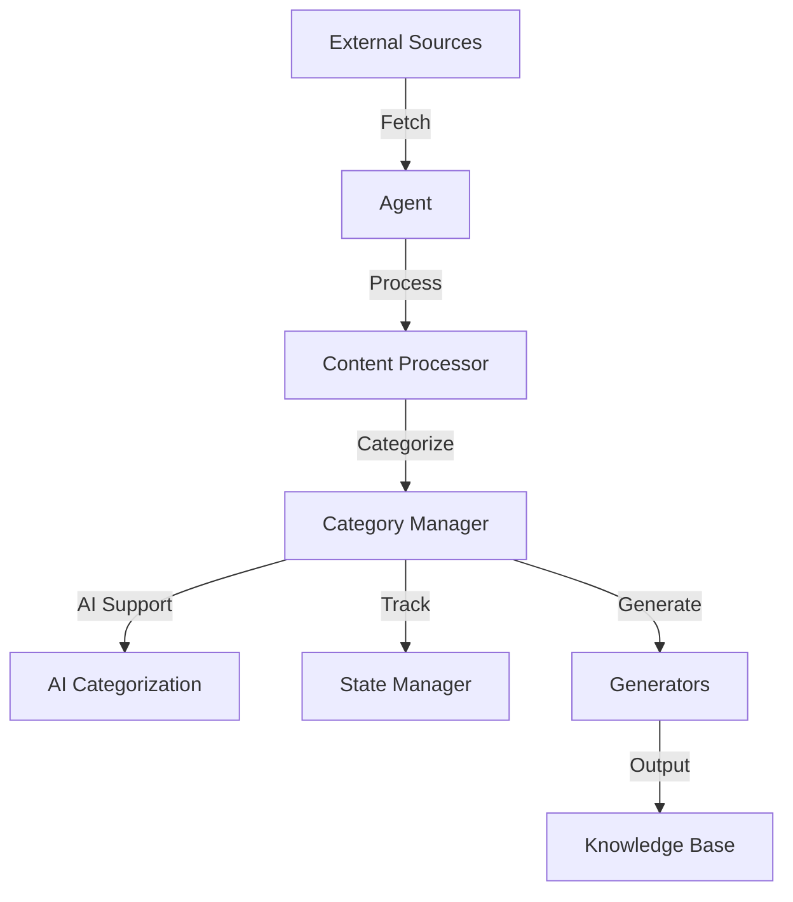

# Knowledge Base Agent Architecture

## Overview

The Knowledge Base Agent is designed to automate the process of fetching, processing, categorizing, and generating content for a structured knowledge base. This document provides a high-level view of the system's components and their interactions.

## Core Components

- **Agent (`agent.py`)**: The central orchestrator that manages the flow of data through the system. It coordinates fetching, processing, and generation tasks.
- **Configuration (`config.py`)**: Holds system-wide settings and customization options, allowing for environment-specific configurations.
- **State Manager (`state_manager.py`)**: Ensures data persistence and tracks the state of processed content to avoid redundancy.
- **Content Processor (`content_processor.py`)**: Handles the formatting and extraction of content from various sources.
- **Category Manager (`category_manager.py`)**: Organizes content into categories, often using AI-driven methods for accuracy.
- **Generators (`pages_generator.py`, `readme_generator.py`)**: Convert processed content into structured outputs like HTML pages or markdown files.

## Utility Modules

- **Fetching Utilities (`http_client.py`, `playwright_fetcher.py`)**: Responsible for retrieving content from external sources such as websites or APIs.
- **Social Media Integration (`tweet_cacher.py`, `fetch_bookmarks.py`)**: Connects to platforms like Twitter to gather relevant data.
- **Text and Media Processing (`text_processor.py`, `media_processor.py`)**: Support content handling with specific formatting or media extraction tasks.
- **AI Categorization (`ai_categorization.py`)**: Leverages AI to enhance content categorization.

## Data Flow

1. **Content Fetching**: External data is retrieved via fetching utilities.
2. **Content Processing**: Raw content is formatted and extracted by the content processor.
3. **Categorization**: The category manager organizes content into logical groups, often with AI assistance.
4. **State Management**: The state manager records progress and ensures no duplicate processing.
5. **Content Generation**: Processed and categorized content is transformed into user-friendly formats by generators.
6. **Output**: Final outputs are stored or published as HTML pages, markdown files, or other formats.

## Interaction Diagram

## Key Interactions

- The `Agent` acts as the central hub, directing data flow between components.
- `State Manager` interacts with most components to maintain data integrity and track progress.
- `Generators` rely on processed and categorized content to produce final outputs.

## Getting Started

For new developers:
- Start with `agent.py` to understand the main workflow.
- Review `config.py` for customization options.
- Check `state_manager.py` to see how data persistence is handled.

This architecture aims to be modular, allowing for easy updates or additions to functionality as needed. 